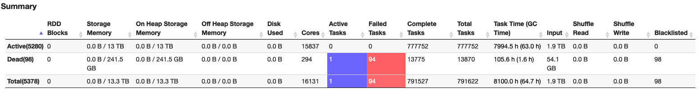

#**5.2 - Spark troubleshooting and performance tuning**

##**5.2.1  -  Spark Structured Streaming applications have high Connection Create Rate to Amazon MSK**

**Symptom**: Amazon MSK cluster has high CPU usage and MSK metrics indicate high connection create rate to the cluster.

**Analysis**: By default, Spark Structured Streaming Kafka connector has a 1:1 mapping relation of MSK TopicPartitions to Spark tasks. Between micro batches, Spark tries to (best effort) assign the same MSK TopicPartitions to the same executors which in turn reuses the Kafka consumers and connections. 

Spark Structured Streaming Kafka connector has an option `minPartitions` which can divide large TopicPartitions to smaller pieces. When `minPartitions` is set to a value larger than the number of TopicPartitions,  Spark creates tasks based on `minPartitions` to increase parallelism (the number of Spark tasks will be approximately `minPartition`). 

* As 1:1 mapping doesn't exist anymore, Spark executors are randomly assigned to process any TopicPartition OffsetRanges. An executor processed TopicPartition X can be assigned to process TopicPartition Y in next micro batch.  A new Kafka consumer/connection needs to be created if Y is on another MSK broker.
* One Spark executor can be assigned to process multiple Spark tasks with the same MSK TopicPartition on different OffsetRanges.  And in Spark 2.x, Kafka consumer cache is disabled when multiple tasks in the same executor read the same TopicPartitions . 

Setting `minPartitions` comes at a cost of initializing Kakfa consumers at each micro batch. This may impact performance especially when using SSL. 

A test was run with following test environment:

**Kafka version 2.8.1**

* 3 kafka.m5.xlarge instances
* test kafka topic has 10 partitions
* only SASL/SCRAM authentication enabled

**EMR 5.36 (Spark 2.4.8)  cluster**

* 30 core nodes - EC2 m5.4xlarge

Spark Structured Streaming test application has 5 cores 5G memory for each executor.

Below figure shows the test result of different `minPartitions` values with MSK’s ConnectionCreationRate and CPUUser usages. As shown in the test result, higher ConnectionCreationRate is related to higher CPU usage.

Test1: 50 minPartitions 16:40-17:30  
Test2: 100 minPartitions 18:00-18:35  
Test3: 200 minPartitions 19:00-19:35  
Test4: no minPartitions 20:06 - 20:30  


**Recommendation**: 

1. Upgrade to the latest EMR version (spark 3.x) to use Sparks [consumer pool cache](https://spark.apache.org/docs/latest/structured-streaming-kafka-integration.html#consumer-caching) feature. This feature allows Spark to cache more than one Kafka consumer with same MSK TopicPartition at each executor, and reuse the consumers in later micro batches. This will allow you to set `minPartitions` while reduce the ConnectionCreationRate.

2. On EMR 5.x (Spark 2.x), only set min partitions when needed - for example, if you have data skew or if your stream is falling behind. Min partitions will allow you to increase parallelism and process records faster but at the expense of high connection rates and CPU.  


##**5.2.2 - spark.driver.maxResultSize error on an EMR heterogeneous cluster but the driver is not collecting data**
**Symptom**: Spark jobs fail from time to time and below error is seen in the log:

`
22/08/22 14:14:24 ERROR FileFormatWriter: Aborting job f6913a46-d2d8-46f0-a545-2d2ba938b113. org.apache.spark.SparkException: Job aborted due to stage failure: Total size of serialized results of 179502 tasks (1024.0 MB) is bigger than spark.driver.maxResultSize (1024.0 MB) at org.apache.spark.scheduler.DAGScheduler.org$apache$spark$scheduler$DAGScheduler$$failJobAndIndependentStages(DAGScheduler.scala:2171)
`

By setting `spark.driver.maxResultSize` to 0(unlimited), the error is gone.  But the Spark job is not collecting data to driver, how can the result returning to driver exceed 1024MB? 

**Analysis**:  Each finished task sends a serialized `WriteTaskResult` object to driver. The object size is usually several kilobytes, e.g.

`22/09/06 22:24:18 INFO Executor: Finished task 0.0 in stage 3.0 (TID 3). 5192 bytes result sent to driver`

From the log, we can see there are 179502 (or more) tasks. For such a number of tasks, the total result size can exceed 1024MB for serialized `WriteTaskResult` objects only.

The job is reading parquet files from S3 and the input folder has 3.5K parquet files with average size ~116MB per file. As default `spark.sql.files.maxPartitionBytes` is 128M, so approximately one file to one Spark task.  The job's processing logic further splits one task to ~11 tasks. Total tasks should be 3.5K * 11 = 38.5K. But why there are 179502 (or more) tasks?

To find root cause, we need to understand how Spark SQL decides the max size of a partition for non-bucketed splittable files.

Spark2 is following below formula (Spark3 has a slightly different formula which is described later)

`maxSplitBytes = Math.min(defaultMaxSplitBytes, Math.max(openCostInBytes, bytesPerCore))`

`maxSplitBytes` is the max bytes per partition.

`defaultMaxSplitBytes` is from `spark.sql.files.maxPartitionBytes` whose default value is 128M.

`openCostInBytes`  is from `spark.sql.files.openCostInBytes` whose default value is 4M.

`bytesPerCore` = (Sum of all data file size + num of file * `openCostInBytes` ) / `defaultParallelism`

`defaultParallelism`’s default value is total number of virtual cores running the job.  It can also be set to a value by defining `spark.default.parallelism`.

When there are a large number of virtual cores allocated to the Spark job by Yarn, `maxSplitBytes` can be smaller than `defaultMaxSplitBytes`, i.e. more tasks will be created.  For this case, from Spark UI, we know total number of vcores is 15837, i.e. `defaultParallelism` is 15837


`bytesPerCore` = (116M * 3500 + 4M * 3500)/15837 = 26.5M

`maxSplitBytes` = min(128M, max(4M, 26.5M)) = 26.5M.  So one 116M parquet file is split into 4~5 Spark tasks.  3.5K * 11 * 5 = 192.5K -- that's why there were 179502 (or more) tasks.

Note that the vcore count is based on Yarn containers, not physical cores.  As Yarn’s default container allocation is based on available memory, this means there can be vcore over subscriptions in a heterogeneous EMR cluster.

For example, if we have a heterogeneous EMR cluster as below:

Core Node: c5.12xlarge(48cores/96GB) — Memory allocated to Yarn: 90112MB  
Task Node: r5.8xlarge(32cores/256GB) — Memory allocated to Yarn: 253952MB

The default EMR executor size is based on core node instance type. In this example, for c5.12xlarge, default executor size is 3 cores 4743M memory. Default `spark.yarn.executor.memoryOverheadFactor` is 0.1875.  A Yarn container has 3 cores, 4743MB*(1+0.1875)= 5632MB memory.

On c5.12xlarge, Yarn can allocate 16 conatainers with 48 vcores in total:  
90112MB/5632MB = 16 containers * 3 core = 48 vcores

While on r5.8xlarge, Yarn can allocate 45 containers with 135 vcores in total:  
253952MB/5632MB = 45 containers * 3 core = 135 vcores - 32cores = 103 vcore oversubscription

**Recommendation**: When Spark reads splittable files, `maxSplitBytes` can be smaller than `spark.sql.files.maxPartitionBytes` if there are a big number of vcores allocated to the job.  Use the formula described here to set `spark.default.parallelism` value properly and have a reasonable `maxSplitBytes`. 


**Spark 3**

Spark 3 provides more options to control`maxSplitBytes` as below 

```scala
  def maxSplitBytes(
      sparkSession: SparkSession,
      selectedPartitions: Seq[PartitionDirectory]): Long = {
    val defaultMaxSplitBytes = sparkSession.sessionState.conf.filesMaxPartitionBytes
    val openCostInBytes = sparkSession.sessionState.conf.filesOpenCostInBytes
    val minPartitionNum = sparkSession.sessionState.conf.filesMinPartitionNum
      .getOrElse(sparkSession.leafNodeDefaultParallelism)
    val totalBytes = selectedPartitions.flatMap(_.files.map(_.getLen + openCostInBytes)).sum
    val bytesPerCore = totalBytes / minPartitionNum

    Math.min(defaultMaxSplitBytes, Math.max(openCostInBytes, bytesPerCore))
  }
```

`filesMinPartitionNum` is from `spark.sql.files.minPartitionNum`. It is the suggested (not guaranteed) minimum number of split file partitions. If not set, the default value is `spark.default.parallelism`.

`leafNodeDefaultParallelism` is from `spark.sql.leafNodeDefaultParallelism`. It is the default parallelism of Spark SQL leaf nodes.

Setting either of the above two parameters has the same effect as `spark.default.parallelism` on `maxSplitBytes`.


