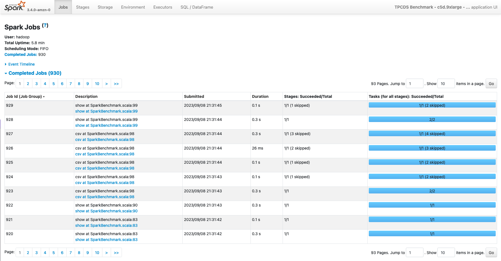
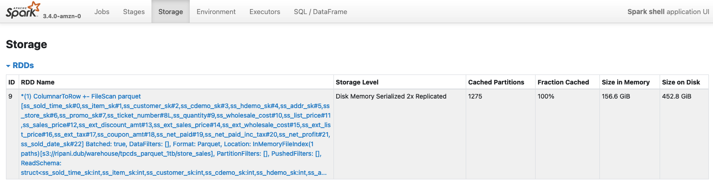

# ** Spark UI and Spark History Server Analysis **

In this section we’re going to explore the Spark Web UI to understand what are the main sections and information it provides, to better understand how we can leverage this tool to review our benchmark results. 

#### Overview

The Spark Web UI is a web interface that can be found on each EMR on EC2 cluster where Spark is installed. The interface can be accessed in two ways: 

* **Spark Driver Web UI** The Spark Driver by default exposes the Spark Web UI using information from the live application. This is the most comprehensive interface, as you can see live data of your applications in terms of disk and memory utilization. You can easily locate and connect to this intefacte by connecting on the YARN Resource Manger and then opening the Application Master URL available for the running Spark application.

* **Spark History Server** This is a service that Spark provides to review completed or running applications on the cluster. The interface is available on the EMR Primary (MASTER) node of the cluster and can be reached at the following address: http://master-public-dns-name:18080/. It’s important to note that this interface uses the Spark Event Logs to populate the information that are available only at runtime (e.g. caching) might not be present in this interface.

#### Spark History Server

Once opened, the service will show us a summary of all the applications that are stored in the default Spark Event Log directory (*hdfs:///var/log/spark/apps*). Each application provides summary information as the Spark version used for the job (typically the same version installed on the cluster), the YARN application ID, it’s name (if you defined in your code) and time details to determine the application duration. Specifically the duration field is a useful field as it provides a metrics for the duration of the application since the Spark driver was launched and terminated, excluding additional submission details that are specific for different deployment models, so it can be useful to compare the Spark runtime across different versions or providers.   

Once selected an application, you’ll be redirected to the corresponding application page where you can have a summarized view of all the Spark Jobs executed in your application. A Spark Job is triggered by a [Spark RDD Action](https://spark.apache.org/docs/latest/rdd-programming-guide.html#actions) (or any Spark Dataset API which internally relies on the previously mentioned API) so it can give you a good indication of which portions of your code took more time to execute and you can also use it to compare two jobs executed in different environments or with different configurations to spot differences in terms of time processing. In those last cases is useful to sort your Jobs by Duration using the interface. 

Additionally, this page provides additional information on the top left page: 

* **User** The user who launched the application. In Amazon EMR this typically match the hadoop user unless you’re using the Hadoop impersonation. 
* **Total Uptime** Time since the Spark application started till the completion of the last Job
* **Scheduling Mode** The [internal scheduler](https://spark.apache.org/docs/latest/job-scheduling.html#scheduling-within-an-application) used within the Spark Application to execute the Spark Jobs. By default Spark uses a FIFO (First In First Out) scheduler.

Lastly, this page allows you you to review the lifecycle of your application, by expanding the **Event Timeline** section where you can review how the different Spark Jobs were executed during the time, as also Spark Executors launch and termination, that can give you useful information to detect slow-downs due to the lack of resources (e.g. you’re using the Spark Dynamic allocation along with a cluster managed scaler and the nodes took too much time to be added to the cluster). 

Finally the top bar on top of the page (see picture), allows you to review additional information related to the Spark Application. 

In the next sections, we’re going to review each of them. 

#### Stages 

As for the Jobs page, you can review also all the Stages that have been processed in your application. This pages can be reached directly from the Web UI, and in this case it will display all the Stages of the application, or you can select a single Spark Job in the **Jobs** section if you’re only interested to the Stages processed in an individual Spark Job.

The main Stage page provides information about duration and submission of a stage, along with related tasks processed and aggregated metrics for input/output data read from the stage, along with related shuffle metrics. 
 

If you expand an individual Stage, you’ll be redirected on a more detailed page where you can examine aggregated metrics of the Tasks processed in the stage. 

#### Storage

The **Storage page** contains information about RDD blocks that have been cached or persisted in memory or on the local disks of the cluster. This page will show some details only if you explicitly invoke a persist or cache operation against a Spark Dataframe. More in detail, the page shows for each RDD: 

* **Name** Typically a logical name identified by the spark relation that created the RDD blocks
* **Storage Level** Where the data has been cached (Memory only) or persisted (Memory / Disk / Memory and Disk)
* **Cache Partitions** Number of RDD partitions cached
* **Fraction Cached** Percentage of the data in the cache
* **Size In Memory** Portion of data that have been stored on the Spark Executor Memory
* **Size On Disk** Portion of data stored on the local disks of the nodes of the cluster

Below an example of a Spark DataFrame persisted both in Memory and on local Disks, with serialized and replicated data (StorageLevel.MEMORY_AND_DISK_SER_2).  

Besides, you can can also access a more detailed paged about the cached element by selecting the RDD of interest. In this case a new page will be opened, with additional information about the distribution and storage footprint of the object along with storage locations of the cached blocks. 

As mentioned, this information are typically available only on a running application, so either if your application is caching some data, you might not be able to see this information if you open a completed application in the Spark History UI.

#### Environment

The **Environment** page display all the main configurations that have been used to execute the Spark Application. Within this section there are seven sections: 

* **Runtime Information** Core details about the Java and Scala versions used to run the job
* **Spark Properties** Contains Spark configurations defined while launching the application and retrieved from the */etc/spark/conf/spark-defaults.conf* configuration file. Additional Spark main configurations that are mandatory to run a job are also visualized with their defaults if not overridden. 
* **Resource Profiles** Contains profiles for the Spark Executors requests that are going to be submitted to the Resource Manager where the job will run (e.g. Hadoop, Kubernetes, etc.)
* **Hadoop Properties** As for the Spark section, it contains Hadoop configurations required by the job as detected by the Hadoop configurations files, typically stored in */etc/hadoop/conf/*.
* **System Properties** Environmental variables and java properties that are configured in the Spark Drivers and Executors.
* **Metric Properties** Spark metrics configurations as defined while launching the application, or inferred from the */etc/spark/conf/metrics.properties* configuration file.
* **Classpath Entries** Contains JAR dependencies used by Spark and the Application

#### Executors

Within the **Executors** page, you can find aggregated statistics and details about all the Spark Task that have been processed in the job. In detail, the page contains two main sections: Summary and Executors. 

The **Summary** section provide aggregated information across all the Spark Executors. This main box can give you an idea of Executors terminated and that were active within the application lifecycle. On the other side, the **Executor** box gives you the same information (with additional details) aggregated for each executor (driver included) that was used in the application. 

There are several information available in this page, and they can typically be useful when sizing or trying to optimize an application in terms of consumption. Below a list of the most important parameters:

* **Storage Memory** Identifies the memory used / total memory available in the executor memory for storing cached data. By default this corresponds to 0.5 of the Spark Memory defined as (**Container Heap Memory - Reserved Memory) * spark.memory.fraction**
* **On Heap Storage Memory** Similar to the previous entry, but also provides a split across On Heap and Off Heap Storage Memory used
* **Disk Used 
    **
* **Peak JVM Memory** Provides an aggregated view of the memory utilization across the Spark Driver/Executor utilization. This includes both Spark Storage and Execution memory and Reserved Memory.
* **Peak Execution Memory** Shows the memory utilization for the Spark Execution Memory. This portion of the memory is used by Spark to process tasks and is the memory the get spilled on the disks when Spark requires more memory to complete a task
* **Peak Storage Memory** This highlights the peak memory utilization ot the Storage Memory used for caching RDDs
* **Cores** Number of CPU cores available in the executors launched. The number of cores is typically a static value defined while launching a Spark application (unless you’re using the EMR hetherogeneous executors), and defines the maximum number of tasks that can be processed in parallel on the Executor
* **Active Tasks** Number of Spark tasks currently running on the executor
* **Failed Tasks** Number of Spark tasks that failed on the executor
* **Complete Tasks** Aggregated total count of all the tasks processed by an executor
* **Total Tasks** Overall total number of Spark tasks processed (active + failed + complete)
* **Task Time (GC Time)** Aggregated time required to process the task that were running on the executors. This also includes Garbage Collection aggregated time. When the GC Time is greater than 10% of the Task time the box will be displayed with a red background to highlight an excessive number of GC operations
* **Input** Bytes read from the Executors from a Storage source (e.g. HDFS, Amazon S3, etc.)
* **Shuffle Read** Total bytes of shuffle data read from an Executor. This includes both local and remote shuffle data
* **Shuffle Write**Total bytes of shuffle data written on the local disk of the Spark Executor

#### SQL/DataFrame

Finally, the SQL/DataFrame page is another important page, which summarize all Spark Queries executed in a Spark Application. This page is only visible in the UI if your application is using Dataset or DataFrame Spark APIs. If you don’t see this page in your application, you can infer the following information: 

* Your application is using the old RDD APIs 
* Your application migth not be using Spark at its best as most of the Spark optimizations techniques are applied by the Spark Catalyst Optimizer that is only used when working with Dataset/ DataFrame APIs. So if possible try to upgrade your application to use the new APIs. 

The summary page provides, a description of the Query ID, its duration and the Spark Jobs that were launched to execute the specific query (Job IDs)

If you select a single query, you’ll be redirected to a more detailed page where you can examine a visual graph of the Spark operations performed in the application. 

The graph can simplify the analysis on an application as each stage provides aggregated information about the number of rows and data processed. Additionally, you can also review the Spark Plans generated by the application expanding the Details section below the graph. 

