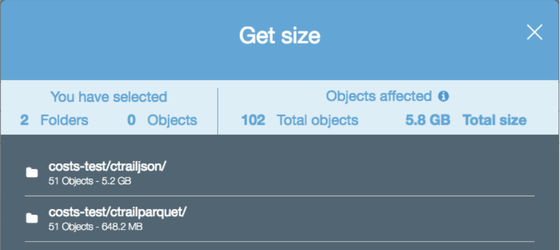
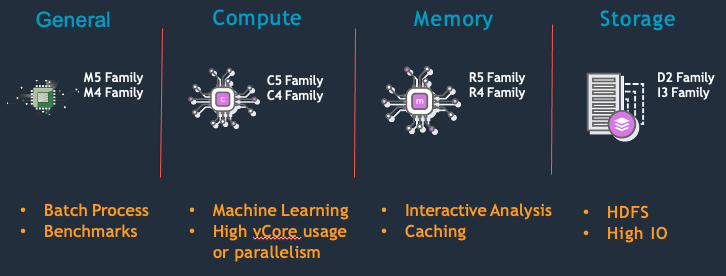

# ** 1 - Cost Optimizations **

 Best Practices (BP) for running cost optimized workloads on EMR.

## ** BP 1.1 Use Amazon S3 as your persistent data store **

As of Oct 1, 2021, Amazon S3 is 2.3 cents a GB/month for the first 50TB. This is $275 per TB/year which is a much lower cost than 3x replicated data in HDFS. With HDFS, you’ll need to provision EBS volumes. EBS is 10 cents a GB/month, which is `~`4x the cost of Amazon S3 or 12x if you include the need for 3x HDFS replication. 

Using Amazon S3 as your persistent data store allows you to grow your storage infinitely, independent of your compute.  With on premise Hadoop systems, you would have to add nodes just to house your data which may not be helping your compute and only increase cost.  In addition, Amazon S3 also has different storage tiers for less frequently accessed data providing opportunity for additional cost savings.

EMR makes using Amazon S3 simple with EMR File System (EMRFS). EMRFS is an implementation of HDFS that all EMR clusters use for accessing data in Amazon S3. 

**Note:** HDFS is still available on the cluster if you need it and can be more performant compared to Amazon S3. HDFS on EMR uses EBS local block store which is faster than Amazon S3 object store. Some amounts of HDFS/EBS may be still be required. You may benefit from using HDFS for intermediate storage or need it to store application jars. However, HDFS is not recommended for persistent storage. Once a cluster is terminated, all HDFS data is lost. 


## ** BP 1.2 Compress, compact and convert your Amazon S3 Objects **

**Compress** - By compressing your data, you reduce the amount of storage needed for the data, and minimize the network traffic between S3 and the EMR nodes. When you compress your data, make sure to use a compression algorithm that allows files to be split or have each file be the optimal size for parallelization on your cluster. File formats such as Apache Parquet or Apache ORC provide compression by default. The following image shows the size difference between two file formats, Parquet (has compression enabled) and JSON (text format, no compression enabled). The Parquet dataset is almost five times smaller than the JSON dataset despite having the same data.



**Compact** - Avoid small files. Generally, anything less than 128 MB. By having fewer files that are larger, you can reduce the amount of Amazon S3 LIST requests and also improve the job performance. To show the performance impact of having too many files, the following image shows a query executed over a dataset containing 50 files and a query over a dataset of the same size, but with 25,000 files.
The query that executed on 1 file is 3.6x faster despite the tables and records being the same.


**Convert** - Columnar file formats like Parquet and ORC can improve read performance. Columnar formats are ideal if most of your queries only select a subset of columns. For use cases where you primarily select all columns, but only select a subset of rows, choose a row optimized file format such as Apache Avro. The following image shows a performance comparison of a select count(`*`) query between Parquet and JSON (text) file formats.
The query that executed over parquet ran 74x faster despite being larger in size. 


## ** BP 1.3 Partition and Bucket your data in Amazon S3 **

Partition your data in Amazon S3 to reduce the amount of data that needs to be processed. When your applications or users access the data with the partition key, it only retrieves the objects that are required. This reduces the amount of data scanned and the amount of processing required for your job to run. This results in lower cost.

For example, the following image shows two queries executed on two datasets of the same size. One dataset is partitioned, and the other dataset is not.


The query over the partitioned data (s3logsjsonpartitioned) took 20 seconds to complete and it scanned 349 MB of data. The query over the non-partitioned data (s3logsjsonnopartition) took 2 minutes and 48 seconds to complete and it scanned 5.13 GB of data.

Bucketing is another strategy that breaks down your data into ranges in order to minimize the amount of data scanned. This makes your query more efficient and reduces your job run time. The range for a bucket is determined by the hash value of one or more columns in the dataset. These columns are referred to as `bucketing` or `clustered by` columns. A bucketed table can be created as in the below example:

```
CREATE TABLE IF NOT EXISTS database1.table1 (
col1 INT,
col2 STRING,
col3 TIMESTAMP
)
CLUSTERED BY (col1)
INTO 5 BUCKETS
STORED AS PARQUET
LOCATION ‘s3:///buckets_test/hive-clustered/’;
```

In this example, the bucketing column (col1) is specified by the CLUSTERED BY (col1) clause, and the number of buckets (5) is specified by the INTO 5 BUCKETS clause.

Bucketing is similar to partitioning – in both cases, data is segregated and stored – but there are a few key differences. Partitioning is based on a column that is repeated in the dataset and involves grouping data by a particular value of the partition column. While bucketing organizes data by a range of values, mainly involving primary key or non-repeated values in a dataset. Bucketing should be considered when your partitions are not comparatively equal in size or you have data skew with your keys. Certain operations like map-side joins are more efficient in bucket tables vs non bucketed ones. 
 

## ** BP 1.4 Use the right hardware family for the job type **


Most Amazon EMR clusters can run on general-purpose EC2 instance types/families such as m5.xlarge and m6g.xlarge. Compute-intensive clusters may benefit from running on high performance computing (HPC) instances, such as the compute-optimized instance family (C5). High memory-caching spark applications may benefit from running on high memory instances, such as the memory-optimized instance family (R5). Each of the different instance families have a different core:memory ratio so depending on your application characteristic, you should choose accordingly.  

The master node does not have large computational requirements. For most clusters of 50 or fewer nodes, you can use a general-purpose instance type such as m5. However, the master node is responsible for running key services such as Resource manager, Namenode, Hiveserver2 as such, it’s recommended to use a larger instance such as 8xlarge+. With single node EMR cluster, the master node is a single point of failure. 



## ** BP 1.5 Use instances with instance store for jobs that require high disk IOPS **

Use dense SSD storage instances for data-intensive workloads such as I3en or d3en. These instances provide Non-Volatile Memory Express (NVMe) SSD-backed instance storage optimized for low latency, very high random I/O performance, high sequential read throughput and provide high IOPS at a low cost. EMR workloads that spend heavily use HDFS  or spend a lot of time writing spark shuffle data can benefit from these instances and see improved performance which reduces overall cost. 

## ** BP 1.6 Use Graviton2 instances **

Amazon EMR supports Amazon EC2 graviton instances with EMR Versions 6.1.0, 5.31.0 and later. These instances are powered by AWS Graviton2 processors that are custom designed by AWS utilizing 64-bit ArmNeoverse cores to deliver the best price performance for cloud workloads running in Amazon EC2. On Graviton2 instances, Amazon EMR runtime for Apache Spark provides an additional cost savings of up to 30%, and improved performance of up to 15% relative to equivalent previous generation instances. 

For example, when you compare m5.4xlarge vs m6g.4xlarge. The total cost (EC2+EMR) / hour is 

|Instance Type | EC2 + EMR Cost | 
|--------------|---------------:|
|m5.4xlarge:   | $0.960 		|
|m6g.4xlarge:  | $0.770			| 

This is a 19.8% reduction in cost for the same amount of compute - 16vCPU and 64Gib Memory

For more information, see: 

<https://aws.amazon.com/blogs/big-data/amazon-emr-now-provides-up-to-30-lower-cost-and-up-to-15-improved-performance-for-spark-workloads-on-graviton2-based-instances>

## ** BP 1.7 Select the appropriate pricing model for your use case and node type **

The following table is general  guideline for purchasing options depending on your application scenario.

|Application scenario	 						|Master node purchasing option	|Core nodes purchasing option		|Task nodes purchasing option|
|-----------------------------------------------|:-----------------------------:|:---------------------------------:|---------------------------:|
|Long-running clusters and data warehouses  	|On-Demand						|On-Demand or instance-fleet mix	|Spot or instance-fleet mix  |
|Cost-driven workloads							|Spot							|Spot								|Spot 						 |
|Data-critical workloads 						|On-Demand						|On-Demand							|Spot or instance-fleet mix  |
|Application testing 							|Spot							|Spot								|Spot   					 |

For clusters where you need a minimum compute at all times - e.g spark streaming, ad hoc clusters. Using reserved instances or saving plans is recommended. 

For more information, see: 

<https://docs.aws.amazon.com/emr/latest/ManagementGuide/emr-instance-purchasing-options.html>

## ** BP 1.8 Use spot instances **

Spot instances are unused EC2 Capacity that is offered at up to a 90% discount (vs On-Demand pricing) and should be used when applicable. While EC2 can reclaim Spot capacity with a two-minute warning, less than 5% of workloads are interrupted. Due to the fault-tolerant nature of big data workloads on EMR, they can continue processing, even when interrupted. Running EMR on Spot Instances drastically reduces the cost of big data, allows for significantly higher compute capacity, and reduces the time to process big data sets. 


Below are the considerations and best practices when using Spot Instances on your EMR cluster. 

* Use Spot for workloads where they can be interrupted and resumed (interruption rates are extremely low), or workloads that can exceed an SLA
* Use Spot for testing and development workloads or when testing testing new applications. 
* Use Spot in combination with On demand as burst capacity to bring down total cluster cost while reducing job run time. See BP 1.11
* Avoid spot if your workload requires predictable completion time or has service level agreement (SLA) requirements
* Use instance fleet with allocation strategy while using Spot so that you can diversify across many different instances. Spot capacity pool is unpredictable so diversifying with as many instances that meets your requirements can help increase the likelihood of securing spot instances which in turn, reduces cost. 


For more information, see:
AWS Big Data Blog: Best practices for running Apache Spark applications using Amazon EC2 Spot Instances with Amazon EMR 

<https://aws.amazon.com/blogs/big-data/best-practices-for-running-apache-spark-applications-using-amazon-ec2-spot-instances-with-amazon-emr/>

Amazon EMR Cluster configuration guidelines and best practices 

<https://docs.aws.amazon.com/emr/latest/ManagementGuide/emr-plan-instances-guidelines.html#emr-plan-spot-instances>

## ** BP 1.9 Mix on-Demand and spot instances **


Consider using a combination of Spot and On-Demand instances to lower cost and runtime.  Two examples where where this may be applicable are when:

1) Cost is more important than the time to completion, but you cannot tolerate an entire cluster being terminated. 

* In this case, you can use Spot instances for the task nodes, and use On-Demand/Reserved instances for the master and core nodes. Even if all spot nodes are reclaimed, your cluster will still be accessible and tasks will be re-run on the remaining core nodes. 


2) You need to meet SLAs but are also considered about cost 

* In this case, you would provision enough on demand capacity to meet your SLAs and then use additional spot to bring down your average cost. If spot is not available, you’ll still have on demand nodes to meet your SLA. When spot is available, your cluster will have additional compute which reduce run time and lowers the total cost of your job. 
* For example:
```
10 node cluster running for 14 hours 
Cost = 1.0 * 10 * 14 = $140

Add 10 more nodes on Spot at 0.5$/node

20 node cluster running for 7 hours 
Cost = 1.0 * 10 * 7 = $70 = 0.5 * 10 * 7 = $35 Total $105

50 % less run-time ( 14→ 7) 25% less cost (140→ 105)
```


One consideration when mixing on demand and spot is if spot nodes are reclaimed, tasks or shuffle data that were on those spot nodes may have to be re executed on the remaining nodes. This reprocessing would increase the total run time of the job compared to running on only on demand. 

## ** BP 1.10 Use EMR managed scaling **


With Amazon EMR versions 5.30.0 and later (except for Amazon EMR 6.0.0), you can enable EMR managed scaling. Managed scaling lets you automatically increase or decrease the number of instances or units in your cluster based on workload. EMR continuously evaluates cluster metrics to make scaling decisions that optimize your clusters for cost and speed improving overall cluster utilization. Managed scaling is available for clusters composed of either instance groups or instance fleets 

This helps you reduce costs by running your EMR clusters with just the correct of amount of resources that your application needs. This feature is also useful for use cases where you have spikes in cluster utilization (i.e. a user submitting a job) and you want the cluster to automatically scale based on the requirements for that application. 

Here’s an example of cluster without auto scaling. Since the size of the cluster is static, there are resources you are paying for but your job does not actually need. 


Here’s an example of cluster with auto scaling. The cluster capacity (blue dotted line) adjusts to the job demand reducing unused resources and cost. 

## ** BP 1.11 Right size application containers **

By default, EMR will try to set YARN and Spark memory settings to best utilize the instances compute resources. This is important to maximize your cluster resources. Whether you are migrating jobs to EMR or writing a new application, It is recommended that you start with default EMR configuration.  If you need to modify the default configuration for your specific use case, It’s important to use all the available resources of the cluster - both CPU and Memory.  

For example, if you had a cluster that is using m5.4xlarge instances for its data nodes, you’d have 16 vCPU and 64GB of memory. 

EMR will automatically set yarn.nodemanager.resource.cpu-vcores and yarn.nodemanager.resource.memory-mb in yarn-site.xml to allocate how much of the instances resources can be used for YARN applications. In the m5.4xlarge case, this is 16vCPU and 57344 mb. When using custom configuration for your spark containers, you want to ensure that the memory and cores you allocate to your executor is a multiple of the total resources allocated to yarn. For example, if you set

spark.executor.memory 20,000M
spark.yarn.executor.memoryOverhead 10% (2,000M)
spark.executor.cores 4

Spark will only be able to allocate 2 executors on each node resulting in 57,344-44,000 (22,000`*`2) = 13,344 of unallocated resources and 76.7% memory utilization

However, if spark.executor.memory was right sized to the available total yarn.nodemanager.resource.memory-mb you would get higher instance utilization. For example, 

spark.executor.memory 12,000M
spark.yarn.executor.memoryOverhead 10% (1,200M)
spark.executor.cores 4

Spark will be able to allocate 4 executors on each node resulting in only 57,344-52,800(13,200 * 4) = 4,544 of unallocated resources and 92.0% memory utilization

For more information on Spark and YARN right sizing see: 

<https://aws.amazon.com/blogs/big-data/best-practices-for-successfully-managing-memory-for-apache-spark-applications-on-amazon-emr/>

<https://docs.aws.amazon.com/emr/latest/ReleaseGuide/emr-hadoop-task-config.html>

## ** BP 1.12 Monitor cluster utilization **


Monitoring cluster utilization is important for right sizing your cluster which can help reduces costs. To monitor cluster utilization, you can use EMR cloudwatch metrics, Ganglia (can be installed with EMR) or configure a 3rd party tool like Grafana and Prometheus. 

Regardless of which tool you use, you’ll want to monitor cluster metrics such as available vCPU, Memory and disk utilization to determine if you’re right sized for your workload.  If some containers are constantly available, shrinking your cluster saves cost without decreasing performance because containers are sitting idle.

For example, If looking at Ganglia shows that either CPU or memory is 100% but the other resources are not being used significantly, then consider moving to another instance type that may provide better performance at a lower cost or reducing the total cluster size. For example, 

* if CPU is 100%, and memory usage is less than 50% on R4 or M5 series instance types, then moving to C4 series instance type may be able to address the bottleneck on CPU. 
* If both CPU and memory usage is at 50%, reducing cluster capacity in half could give you the same performance at half the cost


These recommendations are more applicable towards job scoped pipelines or transient clusters where the workload pattern is known or constant. If the cluster is long running or the workload pattern is not predictable, using managed scaling should be considered since it will attempt to rightsize the cluster automatically. 

For more information on which cloudwatch metrics are available, see:

<https://docs.aws.amazon.com/emr/latest/ManagementGuide/UsingEMR_ViewingMetrics.html>

For more information on the Grafana and Prometheus solution, see:

<https://aws.amazon.com/blogs/big-data/monitor-and-optimize-analytic-workloads-on-amazon-emr-with-prometheus-and-grafana/>

## ** BP 1.13 Monitor and decommission idle EMR cluster **

Decommission Amazon EMR clusters that are no longer required to lower cost.  This can be achieved in two ways. You can use EMR’s “automatic termination policy”  starting 5.30.0 and 6.1.0 or, by monitoring the “isIdle” metric in cloudwatch and terminating yourself. 

With EMR’s automatic termination policy feature, EMR continuously samples key metrics associated with the workloads running on the clusters, and auto-terminates when the cluster is idle. For more information on when a cluster is considered idle and considerations, see 

<https://docs.aws.amazon.com/emr/latest/ManagementGuide/emr-auto-termination-policy.html>

With EMR’s “isIdle” cloudwatch metric, EMR will emit 1 if no tasks are running and no jobs are running, and emit 0 otherwise. This value is checked at five-minute intervals and a value of 1 indicates only that the cluster was idle when checked, not that it was idle for the entire five minutes.  You can set an alarm to fire when the cluster has been idle for a given period of time, such as thirty minutes.  Non-YARN based applications such as Presto, Trino, or HBase are not considered with the “IsIdle” Metrics 

For a sample solution of this approach, see 

<https://aws.amazon.com/blogs/big-data/optimize-amazon-emr-costs-with-idle-checks-and-automatic-resource-termination-using-advanced-amazon-cloudwatch-metrics-and-aws-lambda/>

## ** BP 1.14 Use the latest Amazon EMR version ** 


Use the latest EMR version and upgrade whenever possible. New EMR versions have performance improvements, cost savings, bug fixes stability improvements and new features. 

For more information, see EMR Release Guide <https://docs.aws.amazon.com/emr/latest/ReleaseGuide/emr-release-components.html>

## ** BP 1.15 Using transient and long-running clusters **


Amazon EMR supports both transient clusters and long running clusters and both should be considered depending on your use case and job type.


In general, transient clusters are good for job scoped pipelines. Clusters can be right-sized to meet the exact needs of your job. Using transient clusters reduces the blast radius across other jobs and makes it easier to upgrade clusters and restart jobs. Since transient clusters are shutdown after the job is run, you don’t need to worry about idle resources and managing many aspects of cluster life cycle, including replacing failed nodes, upgrades, patching, etc. 

In general, long running clusters are good for short-running jobs, ad hoc queries and streaming applications. Long running clusters can also be considered to save costs and operations for multi tenanted data science and engineering jobs. 

From a cost optimization standpoint,

* If using transient clusters, ensure your instances and containers are right sized so that you are not over provisioned. Use BP 1.12 to determine cluster utilization and if you’re able to lower your requested compute while still meeting your SLA. 
* If using long running clusters, ensure you’re using EMR Managed Scaling to scale up and down resources based off your jobs needs. It is also important to treat the cluster as a transient resources and have the automation in place to decommission and restart clusters. 

