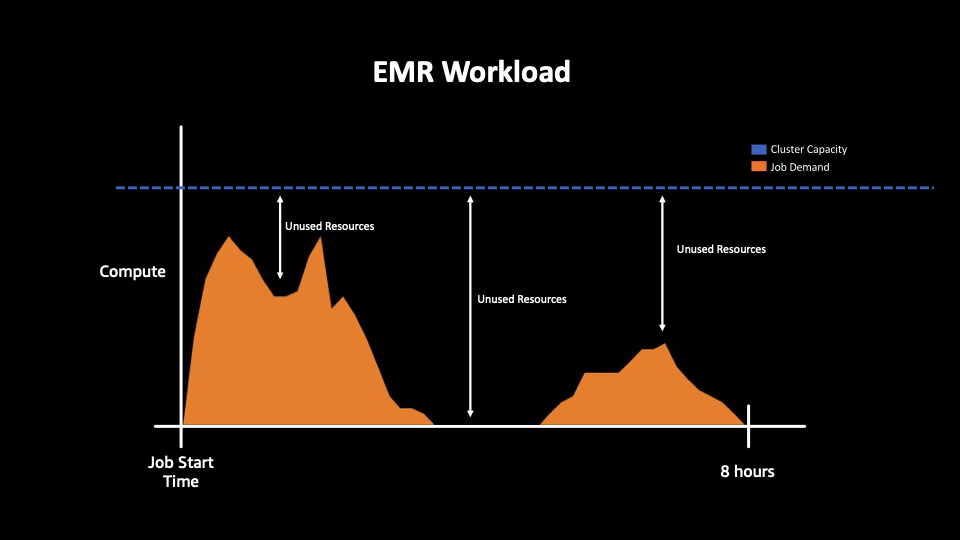

AWS EMR Cost Optimization includes the continual process of refinement and improvement of a system over its entire lifecycle. From the initial design of your very first proof of concept to the ongoing operation of production workloads, adopting the practices in this document can enable you to build and operate cost-aware systems that achieve business outcomes and minimize costs, thus allowing your business to maximize its return on investment.

A cost-optimized workload is one that

1. Meets functional and non functional requirements 
2. Fully utilizes all cluster resources and
3. Achieves an outcome at the lowest possible price point

To best understand this, let’s take a look at an example. Let’s assume we have an ETL job that needs to be completed within 8 hours. 

In order to meet the requirements of completing the job within 8 hours,  a certain amount of compute resources will be required. This is represented in the graph by the “Job Demand”. Sometimes this is static, where the amount of resources needed is consistent throughout the duration of the job.

And sometimes it’s more dynamic, where throughout the job, you have various peaks and valleys depending on the number of tasks that are running at each stage. 

In order for the job to finish within the 8 hours, it needs enough cluster capacity to meet the jobs compute demand - represented by the blue dotted line. 

If our cluster capacity is below our jobs compute demand 

Our job will be resource constrained and It’ll cause the job to run longer than our 8 hour sla

Now, just being able to meet your SLA is not enough to be cost optimized.  This leads us to our 2nd step of a cost optimized workload - Fully utilizing all cluster resources 

Take these next two graphs as an example, in the first case, we have a cluster that has compute capacity well beyond the jobs needs, represented by space in between the jobs demand and cluster capacity

In this 2nd graph,  we have a better match between the clusters capacity and jobs compute demands 

The space in between in between two is unused resources.  These are resources that are being charged for but the job does not actually need. Fully utilizing all resources means reducing this space as much as possible. 

Going back to our job with less predictable workload patterns, a static cluster size may not be the best way to maximize cluster resources, but instead, using something like EMR autoscaling that adjusts cluster capacity based off of your workload demand would be a better fit.

In this graph, our cluster scales up and down depending on demand. Our cluster capacity becomes a function of the jobs demand of resources. 

The last part of being “Cost Optimized” is achieving your jobs outcomes at the lowest price point possible.

EMR has multiple pricing models that allow you to pay for your resources in the most cost-effective way that suits your needs.  For example, On-Demand, Spot and Commitment discounts - Savings Plans/ Reserved Instances/Capacity

All of these pricing options leverage the exact same infrastructure but depending on which option you choose, the cost of your job will vary significantly. The numbers are just examples, with spot you can get up to 90% off on demand prices and with saving plans or RI, up to 72%. 

In the next sections, we’ll discuss best practices on choosing the right pricing model for your workload.  For the purpose of this example, regardless of of which option you choose, the cluster compute capacity stays the same. 

