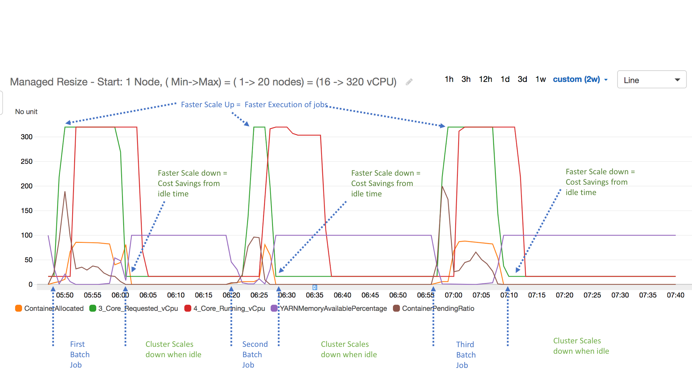

# Troubleshooting

## Overview

This guide provides a systematic approach to troubleshooting EMR Managed Scaling. It aims to help customers independently validate scaling behaviors, identify issues, and resolve common problems. The runbook covers various scaling scenarios including scale up, scale down, slow scaling, no scaling, and stuck scaling events. By following the supplied steps, customers can gain better insight into EMR cluster management related to managed scaling, and optimize their deployments more effectively. When additional assistance is needed, the guide also outlines how to efficiently engage AWS Support. 

## Required Access to Troubleshoot

* An EMR cluster with [Managed Scaling](https://docs.aws.amazon.com/emr/latest/ManagementGuide/emr-managed-scaling.html) enabled.
* IAM permissions to access all necessary resources, including Amazon S3 buckets for logs, CloudWatch metrics, and SSH access to the EMR cluster nodes if required.

## Feature History, Best Practices and Considerations

This section provides insights for EMR managed scaling users, covering three key areas for optimizing cluster performance, cost-efficiency, and adaptability

1. [Feature History](https://docs.aws.amazon.com/emr/latest/ManagementGuide/emr-managed-scaling.html#emr-managed-scaling-history): Consult this when you need to understand recent updates and enhancements to the EMR managed scaling capability. It's particularly useful if you're interested in new features like node labels or availability in new AWS Regions.
2. [Considerations](https://docs.aws.amazon.com/emr/latest/ManagementGuide/emr-managed-scaling.html#emr-managed-scaling-considerations): Review these points before implementing managed scaling. The link covers regional availability, required parameters, connectivity requirements for the metrics-collector process, and potential adjustments for YARN jobs during scale-down.
3. [Best Practices](https://aws.github.io/aws-emr-best-practices/docs/bestpractices/Features/Managed%20Scaling/best_practices/): Reference these guidelines when planning your EMR cluster setup. It focuses on strategies like keeping core nodes constant and scaling with only task nodes to improve scaling times and performance.

## Understanding Node Allocation Strategies

This summary of the [AWS node allocation strategy article](https://docs.aws.amazon.com/emr/latest/ManagementGuide/managed-scaling-allocation-strategy.html) provides an overview of scaling strategies used by Managed Scaling across EMR release labels. For detailed information, please refer to the full article."

#### Scale-up Strategy
For EMR releases 7.2 and higher, managed scaling first considers node labels and application process restrictions.
If node labels are enabled, scaling behavior differs based on restrictions (e.g., CORE nodes, ON_DEMAND nodes).
Without node labels, application processes aren't restricted to specific node or market types.
EMR considers MaximumCoreCapacityUnits and MaximumOnDemandCapacityUnits when scaling, prioritizing based on these limits.

#### Scale-down Strategy
Removes nodes based on node labels if enabled.
Without node labels, removes task nodes first, then core nodes, respecting minimum capacity limits.
For EMR versions 5.34.0+ and 6.4.0+, scaling is aware of Spark shuffle data to prevent unintended data loss.
Avoids scaling down nodes running Spark ApplicationMaster to minimize job failures and retries.

#### Key Considerations

Use On-Demand for core nodes to avoid HDFS data loss from Spot reclamation.
Consider using Spot for task nodes to reduce costs and improve job execution speed.

### Common Scaling Scenarios

**Scale Core Nodes Only**
Set On-Demand limit and maximum core node equal to the maximum boundary.

**Scale Task Nodes Only**
Set maximum core node equal to the minimum boundary.

**On-Demand Instances Only**
Set On-Demand limit equal to the maximum boundary.

**Spot Instances Only**
Set On-Demand limit to 0.

**On-Demand on Core, Spot on Task**:
Set On-Demand limit equal to maximum core node, both less than maximum boundary.

## Graphing Metrics Related to Managed Scaling

The troubleshooting portion of this runbook frequently requests that Cloudwatch metrics be analyzed. It is highly beneficial to have a consistent view of Yarn metrics related to EMR clusters when Managed Scaling enabled so the resource utilization can be examined. Please review [Graphing Managed Scaling Metrics](https://docs.aws.amazon.com/emr/latest/ManagementGuide/managed-scaling-metrics.html#managed-scaling-graphic) for more information on setting up views. 

## Validating and Actioning Scaling Events

**Summary**: The following section outlines possible managed scaling actions, and includes the resource to check to validate whether the event took place. Note that not all **validate** locations need to be checked. Multiple points are referenced for comprehensiveness.

### SCALE UP 

* **Definition**: Core or Task Instances are added to the EMR Cluster when no additional compute resource is required.
* **Symptoms**:  The EMR Cluster scales up, resulting in excess compute capacity. During scale-up events, CloudWatch metrics show high [YARNMemoryAvailablePercentage](https://docs.aws.amazon.com/emr/latest/ManagementGuide/UsingEMR_ViewingMetrics.html#UsingEMR_ViewingMetrics_Access) and low or zero [ContainerPending](https://docs.aws.amazon.com/emr/latest/ManagementGuide/UsingEMR_ViewingMetrics.html#UsingEMR_ViewingMetrics_Access). This indicates that the cluster had sufficient available resources and no pending workload requiring additional capacity. 

* **Potential Root Cause/s**:
    * Managed scaling triggered a scale-up based on resource utilization metrics
    * A scale-up event was initiated outside of managed scaling
    * The minimum cluster size configuration was increased by a user in the managed scaling configurations
* **Validate**: 
    * The [TotalNodesRequested](https://docs.aws.amazon.com/emr/latest/ManagementGuide/UsingEMR_ViewingMetrics.html#UsingEMR_ViewingMetrics_Access) and [TotalNodesRunning](https://docs.aws.amazon.com/emr/latest/ManagementGuide/UsingEMR_ViewingMetrics.html#UsingEMR_ViewingMetrics_Access) metrics in CloudWatch, these will reflect a request for new nodes, and an increase in total running nodes.
    * Review `/var/log/hadoop-yarn/hadoop-yarn-resourcemanager-*.log` from the leader node. Log line will look like `Added node ip-address.region.compute.internal:8041 clusterResource:resources`
    * Review the EMR Cluster page in AWS Console for another view of Cloudwatch metrics
        * *EMR Cluster → Monitoring Tab → Node Status*
    * Review the Events Tab in EMR Cluster for written description of event
        * *EMR Cluster → Events Tab → Search for String ‘ Instance Group State Change’*
    * Whether [YARNMemoryAvailablePercentage](https://docs.aws.amazon.com/emr/latest/ManagementGuide/UsingEMR_ViewingMetrics.html#UsingEMR_ViewingMetrics_MetricsReported) has decreased, we expect to see low memory availability at time of scale up.
* **Actions**:  
    * Check whether the [MinimumCapacityUnits/Instances](https://docs.aws.amazon.com/emr/latest/ManagementGuide/emr-managed-scaling.html#emr-managed-scaling-parameters) were increased by a user, resulting in a scale up irrelevant of low resource utilization.
    * Determine if a manual resize was triggered on the EMR Cluster through a user triggered call to resize instance fleet or group.
* **Related Links**: 
    * [Managed Scaling Metrics](https://docs.aws.amazon.com/emr/latest/ManagementGuide/managed-scaling-metrics.html)

### SCALE DOWN 

* **Definition**: Core and/or Task Instances are removed from the EMR Cluster when the use-case required the scaled-down instances.
* **Symptoms**: Scale down occurs, leading to insufficient resources in the EMR Cluster to handle incoming applications.
* **Potential Root Cause/s**:
    * EMR Managed Scaling triggered a scale down event based on threshold limits. 
    * A scale down event was triggered outside of managed scaling
    * The maximum cluster node count was reduced in the managed scaling configuration
* **Validate**: 
    * The TotalNodesRunning metric in CloudWatch, this will reflect a decrease in the running node count on scale down.
    * Review `/var/log/hadoop-yarn/hadoop-yarn-resourcemanager-*.log` from the leader node. Log line will look like `Removed node ip-address.region.compute.internal:8041 clusterResource: resources`
    * Review EMR Cluster page in AWS Console for another view of Cloudwatch metrics
        * *EMR Cluster → Monitoring Tab → Node Status* 
    * Review the Events Tab in EMR Cluster for written description of event
        * *EMR Cluster → Events Tab → Search for String ‘ Instance Group State Change’*
* **Actions**: 
    * Monitor [YARNMemoryAvailablePercentage](https://docs.aws.amazon.com/emr/latest/ManagementGuide/UsingEMR_ViewingMetrics.html) during scale-down. To prevent unwanted scaling, ensure clusters remain adequately utilized.
    * If frequent scale-downs lead to delays due to subsequent time to scale-up, consider a higher [Minimum Capacity](https://docs.aws.amazon.com/emr/latest/ManagementGuide/emr-managed-scaling.html#emr-managed-scaling-parameters) configuration. This may increase costs but can help mitigate delays where spikey workloads lead to time delays scaling up after scale down.
    * Where possible, orchestrate incoming work to minimize scaling altogether, while scaling is useful to adjust to resources to match incoming workload, minimizing scaling events will decrease the time associated with provision and decommissioning instances. 
* **Related Links**: 
    * [Managed Scaling Best Practices](https://aws.github.io/aws-emr-best-practices/docs/bestpractices/Features/Managed%20Scaling/best_practices/)

### SLOW SCALING

* **Definition**: The EMR cluster is taking a long time to resize an instance group
* **Symptoms**: Long scale-up or scale-down times, leading to delayed processing or inefficient use of resources. Applications may be waiting longer than expected for additional capacity.
* **Potential Root Cause/s**: 
    * **When scaling down**: Managed Scaling is attempted gracefully, this means that on scale down, the Yarn NodeManager needs to enter a decommissioning state to ensure that containers are not launched on the node. In addition to this, in the event the node is a Core node, to prevent data loss and under-replication, HDFS blocks are migrated to an existing healthy node. Slowdown can occur when there is a large volume of data to transfer to a healthy node, or if running containers delay full decommissioning.
    * **When scaling up**: When using Spot instances, EMR provides a configurable timeout. Delay in scaling can occur if Spot instances are unavailable at the time and of request.
    * **Bootstrap actions**: Where possible, avoid long running bootstrap actions, these run when instances are provisioned, and increase the time taken for instances to enter a ready state where they can accept work.
* **Validate**: 
    * Review [TotalNodesRequested](https://docs.aws.amazon.com/emr/latest/ManagementGuide/UsingEMR_ViewingMetrics.html#UsingEMR_ViewingMetrics_MetricsReported) and [TotalNodesRunning](https://docs.aws.amazon.com/emr/latest/ManagementGuide/UsingEMR_ViewingMetrics.html#UsingEMR_ViewingMetrics_MetricsReported) metrics in CloudWatch. TotalNodesRequested  should take longer to reach TotalNodesRunning than is acceptable based on your use-case. 
* **Actions**:
    * Ensure [bootstrap actions](https://docs.aws.amazon.com/emr/latest/ManagementGuide/emr-manage-view-web-log-files.html) complete quickly, consider moving less critical bootstrap functions that aren’t required to run at startup to a framework that runs after EMR node initialization such as Steps or custom scripts. 
    * If using Spot Instances, ensure on-demand capacity is sufficient to handle running application in the event that no spot capacity is available.
    * Where possible scale task nodes. This can be done by setting on-demand nodes and Core nodes to the same value, and scaling spot task nodes. This will remove the need to migrate HDFS blocks to other nodes, significantly improving scale down times.
    *  To optimize resource usage during decommissioning, you can reduce the `spark.blacklist.decommissioning.timeout` from one hour to one minute to make the node available sooner for other pending containers, while also increasing the `yarn.resourcemanager.nodemanager-graceful-decommission-timeout-secs` to a larger value (default 1 hour), to give the nodes more runway for graceful decommissioning. This configuration enables containers to run on the decommissioning node, but there is a trade-off that applications may fail if there are running containers on the node and the `yarn.resourcemanager.nodemanager-graceful-decommission-timeout-secs` is exceeded. 
* **Related Links**:
    * [EMR Steps](https://docs.aws.amazon.com/emr/latest/ManagementGuide/emr-work-with-steps.html)
    * [Finding Common EMR Log Files](https://docs.aws.amazon.com/emr/latest/ManagementGuide/emr-manage-view-web-log-files.html)

### NO SCALING

* **Definition**: The EMR cluster is not scaling and applications are waiting for resources
* **Symptoms**: The [TotalNodesRequested](https://docs.aws.amazon.com/emr/latest/ManagementGuide/UsingEMR_ViewingMetrics.html#UsingEMR_ViewingMetrics_MetricsReported) metric in CloudWatch remains unchanged, and applications either await resources (no scale-up) or EMR the cluster is significantly underutilized (no scale-down).
* **Potential Root Cause/s**:  
    * **Inefficient YARN Memory Utilization**: Managed scaling may not be triggered if thresholds aren't breached, often due to small Yarn containers preventing larger pending containers from launching. This is common when there are multiple running application with container sizes that do not fit neatly onto individual instances.
    * **Scaling Configuration Limits**: Scaling has already reached the upper or lower boundary set in the managed scaling configuration.
    * **Instance Provision Failures**: If scaling started, but eventually failed, which we could see by an uptick in TotalNodesRequested that does not proceed to TotalNodesRunning, this could be due to node to instances failing to provision. This is elaborated on in the next section (stuck scaling).
    * **Application Type**: Managed Scaling triggers are based on Yarn metrics. If the application consuming Cluster resources does not use Yarn as the resource manager, scaling will not occur. 
* **Validate**: 
    * Review [YARNMemoryAvailablePercentage](https://docs.aws.amazon.com/emr/latest/ManagementGuide/managed-scaling-metrics.html) to ascertain whether Yarn memory consumption is high or low for a sustained period, which would be expected when triggering a scaling event.
    * Review TotalNodesRequested and TotalNodesRunning in CloudWatch to ensure no scaling request was made or completed during this time.
    * Review ManagedScaling configuration to ensure that the MinimumCapacityUnits/MaximumCapacityUnits allow for scaling where we can’t scale down past minimum, or up past maximum. 
* **Actions**:
    * Right-size executor containers to efficiently fit within available YARN memory, especially when running multiple applications concurrently.
    * Check whether maximum or minimum node/unit count is being hit, and change the configuration if required by the workload.

### STUCK SCALING

* **Definition**: A scale-up or scale-down event is initiated but does not complete.
* **Symptoms**: Applications are in a pending state while scaling requests result in increased [TotalNodesRequested](https://docs.aws.amazon.com/emr/latest/ManagementGuide/UsingEMR_ViewingMetrics.html#UsingEMR_ViewingMetrics_MetricsReported) without corresponding changes in [TotalNodesRunning](https://docs.aws.amazon.com/emr/latest/ManagementGuide/UsingEMR_ViewingMetrics.html#UsingEMR_ViewingMetrics_MetricsReported). We may see nodes enter a [terminated/arrested](https://docs.aws.amazon.com/emr/latest/APIReference/API_InstanceGroupStatus.html) state.
* **Potential Root Cause/s**: 
    * **Provisioning Failures**: Resources are requested but are unable to be allocated or properly initialized.
    * **Bootstrap Action Failures**: Bootstrap actions can fail during node provisioning, preventing nodes from successfully joining the cluster. 
    * **Scaling Down Core Nodes**: Core nodes cannot be scaled down in a way that reduces replication factor. If an EMR cluster has an HDFS replication factor of 2, and we attempt to scale down to a single Core node, scale down will fail as it needs to maintain 2 of each HDFS block on the EMR Cluster.
* **Validate**: 
    * Review [TotalNodesRequested](https://docs.aws.amazon.com/emr/latest/ManagementGuide/UsingEMR_ViewingMetrics.html#UsingEMR_ViewingMetrics_MetricsReported) and [TotalNodesRunning](https://docs.aws.amazon.com/emr/latest/ManagementGuide/UsingEMR_ViewingMetrics.html#UsingEMR_ViewingMetrics_MetricsReported) in CloudWatch metrics to verify if node allocation requests are being created by not fulfilled.
    * Review EMR Cluster instances to check whether they have entered a suspended state
* **Actions**:
    * In the event of bootstrap failure or timeouts, review the bootstrap logs to mitigate any errors, and streamline functions that take significant time. This will also help improve scale up times.
* **Related Links**: 
    
    * [Instance Group States](https://docs.aws.amazon.com/emr/latest/APIReference/API_InstanceGroupStatus.html)
    * [Troubleshoot Stuck Scaling](https://repost.aws/knowledge-center/emr-troubleshoot-stuck-cluster-scaling)

## Escalating to AWS

**Overview**: If an event occurs, and you are unable to discern or rectify the behavior, and it does not align with your expectations, AWS Support is a great resource to get help. Providing sufficient information at case creation prevents potentially lengthy requests for additional information. The following outlines information you can include when opening support cases, and insight into why we need them. 

### EMR Cluster-id

**Why**: The EMR Cluster-id is the unique resource identifier that allows us to understand which EMR Cluster needs to be investigated.

**Where**: The EMR Cluster-id can be retrieved from the AWS Console under Services → EMR → Clusters  which should land you on a list of recent clusters. The resource identifier starts with a j- prefix followed by a string of numbers and letters

### Metrics Collector Log

**Why**: Metrics collector provides key metrics that help with managed scaling decisions, failures or delay in the metrics collector process can lead to unexpected behavior. 

**Where**: Log path on leader node: `/emr/metricscollector/log/metricscollector.log`

### Node and HDFS Status

**Why**: In the event that scale resizing is taking a long time, it is important to note the Decommissioning as well as Block Replication status, this allows us to check whether HDFS blocks are underreplicated, and the current status of cluster nodes.

**Where**: From the leader node, run $ `hdfs dfsadmin -report` and attach the output to the case

### Instance Controller log

**Why**: Instance Controller monitors the state of instances attached to the EMR Cluster, and is an important resource to observe change requests.

**Where**: From the leader node, `/emr/instance-controller/log/`

