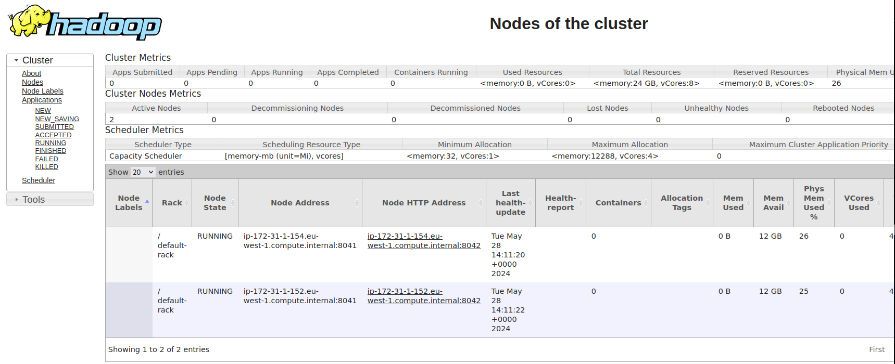
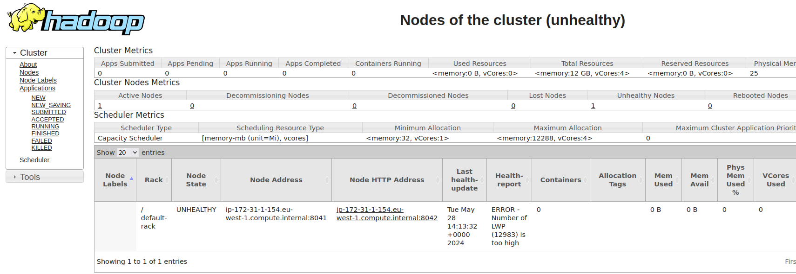
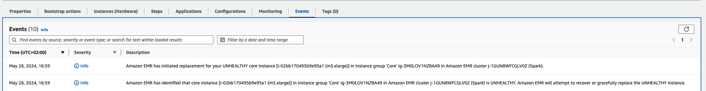

# Enhancing YARN Node Resilience with External Health Scripts on Amazon EMR 

Apache YARN is a critical component of the Hadoop ecosystem, responsible for managing and allocating cluster resources for various workloads. In an Amazon EMR cluster running on EC2 instances, YARN plays a crucial role in ensuring efficient and reliable execution of big data processing jobs. However, there may be scenarios where the default Node Manager functionality falls short, potentially leading to unresponsive nodes and impacting cluster performance.

By default, the YARN Node Manager performs basic health checks on the disks attached to the node. If more than 75% of the disks are deemed unhealthy (e.g., disk utilization exceeds the configured threshold or there are hardware faults), the Node Manager reports an unhealthy status to the Resource Manager. Depending on your cluster configuration, Amazon EMR may take appropriate actions, such as terminating or isolating the unhealthy node.
While this default behavior is helpful, it may not be comprehensive enough to address all potential issues that could render a node unresponsive. Fortunately, YARN provides a mechanism to extend its health-checking capabilities through the use of external scripts.

## External Health Scripts: Enhancing Node Resilience

In addition to the default YARN behavior, YARN allows you to provide up to [four external scripts](https://github.com/apache/hadoop/blob/trunk/hadoop-yarn-project/hadoop-yarn/hadoop-yarn-server/hadoop-yarn-server-nodemanager/src/main/java/org/apache/hadoop/yarn/server/nodemanager/health/NodeHealthCheckerService.java#L58)  to perform custom health checks on your nodes. These scripts can monitor various aspects of the node's health, such as CPU utilization, memory usage, network connectivity, or any other custom criteria specific to your workloads or infrastructure.
By leveraging external health scripts, you can proactively identify and mitigate potential issues that could otherwise go undetected by the default YARN health checks. While the default health checks are suitable for many customers, some may have unique requirements necessitating enhanced monitoring capabilities. These enhancements can improve cluster resilience and performance, ensuring that your big data processing jobs run smoothly and efficiently without interruptions.
To take advantage of this feature, you can develop custom bash scripts that encapsulate the desired health check logic. These scripts should output an error message to standard output (stdout) if any issue is detected, triggering the monitoring regex used in the native YARN implementation to mark the node as unhealthy. 
```
# NM will match the "ERROR" substring and report the node as unhealthy
# Additional information can be added in your report message 
echo "ERROR - ...." 
.... 

```
When configuring an Amazon EMR cluster, you can leverage the following EMR Classification to enable and customize various aspects of your custom health scripts.
```
[
  {
    "Classification": "yarn-site",
    "Properties": {
      "yarn.nodemanager.health-checker.scripts": "threads",
      "yarn.nodemanager.health-checker.threads.path": "/etc/yarn-nm-scripts/threads.sh",
      "yarn.nodemanager.health-checker.threads.opts": "foobar",
      "yarn.nodemanager.health-checker.threads.interval-ms": "10000",
      "yarn.nodemanager.health-checker.threads.timeout-ms": "10000"
    }
  }
]
```
Please note the following for each parameter:


* yarn.nodemanager.health-checker.scripts This parameter allows you to specify up to four external monitoring scripts for custom health checks on your YARN nodes. You can provide the names of the scripts here, separated by commas if you have multiple scripts. Please note that the number of scripts is limited to four and not tunable.
* yarn.nodemanager.health-checker.SCRIPT_NAME.path For each script name defined in the yarn.nodemanager.health-checker.scripts parameter, you need to specify the corresponding path to the script on the local filesystem using this parameter. Replace SCRIPT_NAME with the actual name of the script you provided earlier. For example, if you defined yarn.nodemanager.health-checker.scripts=script1,script2, you would need to set the following parameters:
    * yarn.nodemanager.health-checker.script1.path=/path/to/script1.sh
    * yarn.nodemanager.health-checker.script2.path=/path/to/script2.sh
* yarn.nodemanager.health-checker.SCRIPT_NAME.opts This parameter allows you to pass additional arguments or variables to the external health monitoring script during execution. Replace SCRIPT_NAME with the name of the script you defined earlier.

For additional information, see [YARN External Health Script.](https://hadoop.apache.org/docs/current/hadoop-yarn/hadoop-yarn-site/NodeManager.html#External_Health_Script)

## Configuring External Health Scripts on Amazon EMR

To showcase this functionality on Amazon EMR, you can create a bash script to monitor the number of lightweight processes (LWP) that can run on the instance without causing impairment to the system. For this purpose, we'll use the following health check script:
```
# get the total number of all threads across all processes that are running
all_threads=`ps -eo nlwp | tail -n +2 | awk '{ num_threads += $1 } END { print num_threads }'`

# get a conservative value for the maximum number of threads
# we first estimate the physical memory and divide it by the default thread stack size
# we then apply a multiplier not to bee too restrictive
tot_mem=$(free -b | grep -oP '\d+' | head -n1)
stack_size=$(ulimit -s)
max_threads=$(echo "$tot_mem/($stack_size * 1024) * 5" | bc)

if [ $all_threads -gt $max_threads ]; then 
   echo "ERROR - Number of LWP ($all_threads) is too high"
else 
   echo "OK - Number of LWP ($all_threads) is within range"
fi
```

This script retrieves the total number of LWPs on the instance and compares this value with a restrictive value computed using the physical memory of the instance. While there are several ways in Linux to prevent a process or the system from exceeding a predefined number of processes/threads, in this case, we want to demonstrate how to implement custom monitoring tools so that the node can be marked as unhealthy from the YARN perspective, and subsequently replaced by EMR after detecting it.
To leverage the script, we'll use a Bootstrap Action to create the file across all worker nodes (excluding the EMR master) to monitor the health of the node. The full Bootstrap Action is as follows:

```
#!/bin/bash

# run as root
if [ $(id -u) != "0" ]; then
    sudo "$0" "$@"
    exit $?
fi

# skip install on EMR master
if grep isMaster /mnt/var/lib/info/instance.json | grep true; then        
    exit 0
fi

mkdir -p /etc/yarn-nm-scripts/

cat << 'EOF' > /etc/yarn-nm-scripts/threads.sh

# get the total number of all threads across all processes that are running
all_threads=`ps -eo nlwp | tail -n +2 | awk '{ num_threads += $1 } END { print num_threads }'`

# get a conservative value for the maximum number of threads
# we first estimate the physical memory and divide it by the default thread stack size
# we then apply a multiplier not to bee too restrictive
tot_mem=$(free -b | grep -oP '\d+' | head -n1)
stack_size=$(ulimit -s)
max_threads=$(echo "$tot_mem/($stack_size * 1024) * 5" | bc)

if [ $all_threads -gt $max_threads ]; then 
   echo "ERROR - Number of LWP ($all_threads) is too high"
else 
   echo "OK - Number of LWP ($all_threads) is within range"
fi

EOF

chmod oug+rwx -R /etc/yarn-nm-scripts/
exit 0
```

Now, to test our solution, store the Bootstrap Action previously created in an S3 bucket and launch a cluster specifying it. After the cluster is up and running, you can configure YARN to use the threads.sh script for health monitoring by setting the following EMR configuration:
```
[
  {
    "Classification": "yarn-site",
    "Properties": {
      "yarn.nodemanager.health-checker.scripts": "threads",
      "yarn.nodemanager.health-checker.threads.path": "/etc/yarn-nm-scripts/threads.sh",
      "yarn.nodemanager.health-checker.threads.interval-ms": "10000",
      "yarn.nodemanager.health-checker.threads.timeout-ms": "10000"
    }
  }
]
```

With this configuration, YARN will execute the threads.sh script periodically on each worker node. If the script outputs an "ERROR" message to standard output (stdout), indicating that the number of LWPs is too high, the corresponding node will be marked as unhealthy. EMR will then take appropriate actions, such as decommissioning and replacing the unhealthy node, to maintain the overall health and performance of the cluster.
To test our solution, we'll launch an Amazon EMR cluster with two core nodes and then intentionally impair one of them using a fork bomb. We'll execute a modified fork bomb on one of the nodes to simulate a system becoming unresponsive due to a high number of threads generated by a simulated DDoS attack.
**WARNING**: The following bash command, if executed, will cause the system to become impaired. Please ensure that you run this command in a safe or test environment only.
```
fork() {
    sleep 5
    fork | fork &
}
fork
```
If we monitor the YARN ResourceManager interface, we'll see that both core nodes are initially marked as healthy once our custom health monitoring script is launched. However, the fork bomb script will gradually spawn processes, overwhelming the targeted system.

As the number of threads on the impaired node increases, our custom threads.sh script will detect this condition and output an "ERROR" message to standard output (stdout). This will trigger YARN's health monitoring mechanism to mark the affected node as unhealthy.

By observing the YARN ResourceManager interface, we should be able to see the status of the impaired node change from healthy to unhealthy as the fork bomb continues to spawn processes and the number of threads exceeds the configured threshold.


Once the node is marked as unhealthy by YARN, Amazon EMR will automatically take action to decommission and replace the unhealthy node with a new one, ensuring that the cluster remains in a healthy state and can continue processing jobs efficiently.

It's important to note that executing the fork bomb command can have severe consequences on a production system and should only be done in a controlled testing environment. In a real-world scenario, you would rely on the custom health monitoring script to detect and respond to legitimate issues, such as resource exhaustion or system failures, rather than intentionally impairing the system with a fork bomb.

The solution we've demonstrated, which involves integrating custom health monitoring scripts with YARN on Amazon EMR, offers a flexible and extensible approach to monitoring various aspects of a node's health. While we've focused on monitoring the number of lightweight processes (LWPs) to detect potential resource exhaustion, this approach can be adapted to monitor and enforce additional checks to ensure that nodes remain in a healthy state.

For instance, you could create scripts to monitor CPU utilization, memory usage, network throughput, or any other system metrics that are critical to your workloads. By setting appropriate thresholds and outputting error messages when these metrics exceed predefined limits, you can leverage YARN's health monitoring capabilities to proactively identify and mitigate potential issues before they escalate and impact your cluster's performance or stability.

Furthermore, this approach can be extended to encompass security considerations. You could develop scripts to verify the security posture of a node, checking for potential vulnerabilities, unauthorized access attempts, or any other security-related concerns. If a breach or compromise is detected, the script could output an error message, triggering YARN to mark the affected node as unhealthy and initiate the process of decommissioning and replacing it with a fresh, secure node.
The flexibility of this solution lies in the ability to create custom scripts tailored to your specific monitoring requirements. Whether it's monitoring system resources, verifying application health, or ensuring adherence to security best practices, you can develop scripts that encapsulate the desired logic and seamlessly integrate them with YARN's health monitoring framework.

By leveraging this approach, you gain a powerful and extensible mechanism to maintain the overall health and integrity of your Amazon EMR cluster. It empowers you to proactively identify and mitigate potential issues, optimize resource utilization, and enhance the resilience and security of your big data processing environment.

# WARNING - These scripts / code examples can make your system unstable

## Fork Bomb - DoS attack

Use the second command to have a more gradual blast

```
# WARNING !! This is dangerous !!! Don't run it on a production system 
# or in your personal computer if you're not ready to restart it
# fork bomb - https://en.wikipedia.org/wiki/Fork_bomb
:(){ :|: & };:
```
```
fork() {
sleep 5
fork | fork &
}
fork
```
