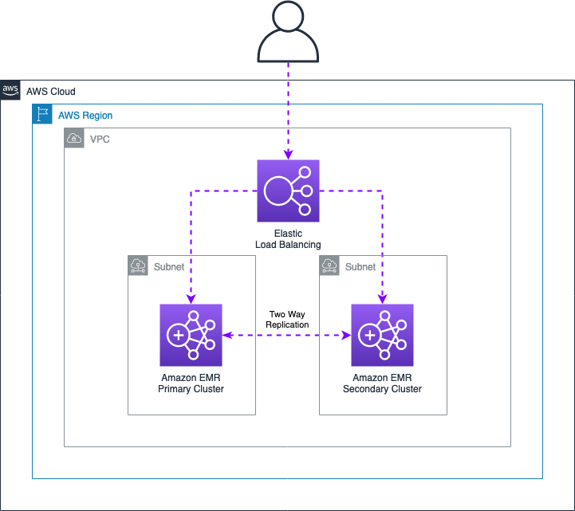
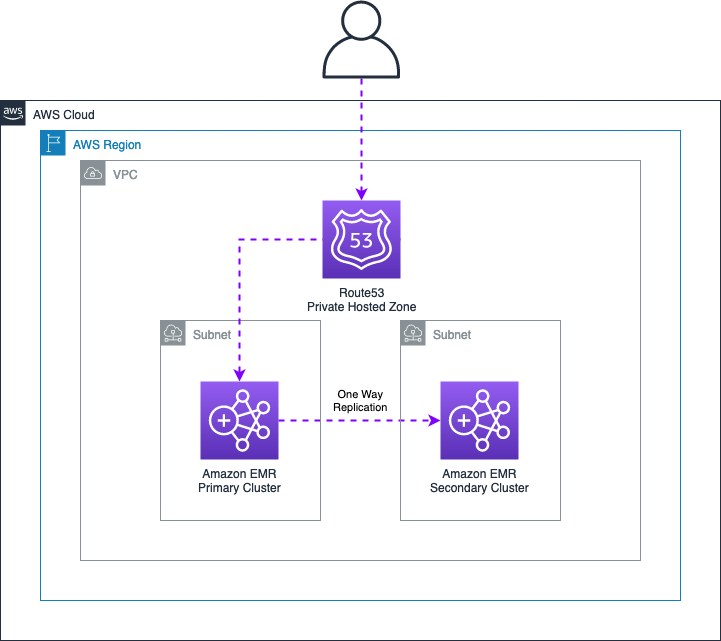
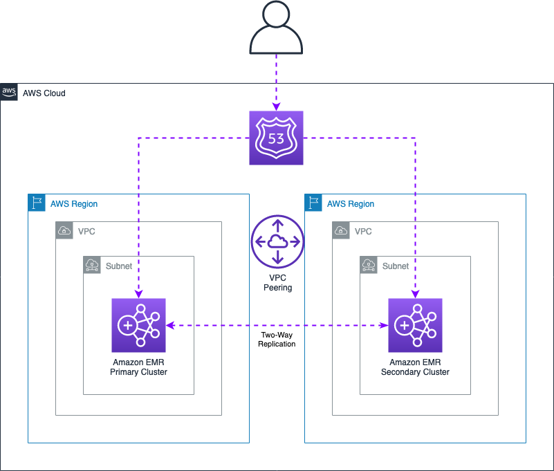

# Data Integrity / High Availability

The following document illustrates architectures and service features that can be combined to implement Highly Available architectures and Disaster Recovery solutions for HBase clusters running on Amazon EMR. The document also describes additional best practices for data recovery in case of integrity issues you might face when using HBase.

## Best Practice

When working with HBase on Amazon EMR, it is good practice to enable the [EMR Multimaster](https://docs.aws.amazon.com/emr/latest/ManagementGuide/emr-plan-ha.html) feature that allows you to launch three EMR master nodes. This functionality allows the HBase cluster to tolerate impairments that might occur if a single master goes down. Please note that EMR on EC2 launches all the nodes of the cluster within the same Availability Zone, so this solution is not sufficient to create a robust setup for high available clusters.

Nevertheless, this functionality is highly recommended both when using HDFS or Amazon S3 as storage layer. Enabling this, allows you to serve HBase requests (both writes and reads) in case of a master failure. Please note that if you launch the EMR cluster with a single master and this node is terminated for any reason, it will not be possible to recover any data from the HDFS storage of the cluster as the HDFS metadata will be lost after the termination of the EMR master.

Moreover, it is also recommended to specify a SPREAD placement group strategy that places the master instances across separate underlying hardware to guard against the loss of multiple master nodes in the event of a hardware failure. For additional details see [Amazon EMR integration with EC2 placement groups](https://docs.aws.amazon.com/emr/latest/ManagementGuide/emr-plan-ha-placementgroup.html)

In terms of cluster scale in / out, it’s not recommended to enable the [EMR Managed Scaling](https://docs.aws.amazon.com/emr/latest/ManagementGuide/emr-managed-scaling.html) or the [EMR scaling with custom policies](https://docs.aws.amazon.com/emr/latest/ManagementGuide/emr-automatic-scaling.html) when using HBase. These features are designed to operate with YARN workloads, so they might cause data integrity issues if some nodes are terminated by the scaling policies. In case you need to scale your HBase cluster size, you can follow the below procedures:

* Scale Out - Use the EMR Web Console or API to increase the number of nodes. New nodes are automatically recognized once they join the cluster, and the HBase balancer will automatically spread regions across new nodes.
* Scale In - Disable the HBase tables and use the EMR Web Console or API to decrease the number of nodes in the cluster.

## HBase on HDFS

Within this section you can find additional information to secure your data when launching an Amazon EMR cluster using HDFS as storage layer.

As best practice is recommended to launch the EMR cluster using at least 4 CORE nodes. When you launch an EMR cluster with at least 4 CORE nodes, the default HDFS replication factor will be automatically set to 2 by the EMR service. This prevents to lose data in case some CORE nodes get terminated. Please note that you cannot recover a HDFS block if all its replicas are lost (e.g. all CORE nodes containing a specific HDFS block and its replica are terminated). If you want a stronger guarantee about the availability of your data, launch the EMR cluster with at least 10 CORE nodes (this will set the default replication factor to 3), or manually specify the HDFS replication factor using the EMR Configuration API.

If you specify the HDFS replication manually, please make sure to have a sufficient number of CORE nodes to allocate all the replica of your data. For more details see [HDFS configuration](https://docs.aws.amazon.com/emr/latest/ReleaseGuide/emr-hdfs-config.html) in the Amazon EMR documentation.

### HBase - Snapshots

HBase snapshots should be considered the first line of defense against data integrity issues that might cause a service disruption in your HBase cluster. To prevent any kind of data loss, is highly recommended to perform daily snapshots of your HBase tables. Please note that taking a snapshot of a table does not involve any data copy operation, so this operation doesn’t generate any additional data in your HDFS storage.
However, it is not recommended to maintain a high number of snapshots for a table, especially if its data change frequently. Modified regions that are used by old snapshots are preserved in the **archive** folder within the HBase root directory, so this can have a significant impact on the amount of data retained in the HDFS.

Besides, please note that HBase snapshots are by default persisted in the same storage layer configured when launching the cluster (in this case HDFS), so they should not be considered a strong disaster recovery mechanism if you want to protect your data in case of a cluster termination. In this case, you can export the snapshots in an Amazon S3 bucket to persist all your data on a reliable storage layer.  

Please note that periodic snapshots exports to S3 are recommended only if your tables have a small size (less than few TB) as an HBase export will copy all the data belonging to the snapshot in the S3 bucket using a Map Reduce job.
For sample scripts and commands see the related examples in the [Data Migration](./data_migration.md) guide.

**Additional Tips**

* Use a time identifier in the snapshot name that can help you identify when the snapshot was created. The creation time is also present in the snapshot metadata, but using this convention in the name can save some time while restoring an impaired cluster.

### HBase - Cluster Replication

The [HBase cluster replication](https://hbase.apache.org/book.html#_cluster_replication) allows you to keep one or more HBase clusters synchronized between each other. Depending on how you set up the replication and peering between the clusters you can achieve different configurations to establish both a Disaster Recovery or a Highly Available setup depending on your needs.  

The following sections describe typical architectures that can be achieved with this feature.

#### Active - Active architecture

This first approach describes a setup that is suitable to provide Highly Available clusters that can both serve read and write requests. In this case is required to set up a two-way replication peering between the Primary and Secondary cluster as described in the below figure. In this architecture both reads and writes will be routed across the two clusters by the Elastic Load Balancer and data written in a cluster will also be replicated in the other one.



To setup this architecture you should performed the following steps:

* Create two HBase clusters in different AWS Availability Zones

* Create an [Elastic Load Balancer](https://aws.amazon.com/elasticloadbalancing/) using an [EC2 Target Group](https://docs.aws.amazon.com/elasticloadbalancing/latest/application/create-target-group.html) configured with the following specifications:
    * **Target Type**: IP addresses. EMR master IP for the Primary and Secondary cluster
    * **Protocol**: TCP
    * **Port:** 2181. Default port used by the Zookeeper service

* Establish a Two Way replication peering between the two clusters. To enable the replication, you can run the following commands on each master node. While running these commands, please make sure to replace **MASTER_NODE_IP** with the IP address of the other master node. For example, if running the commands on the Primary the **MASTER_IP** should be set with the Secondary IP address.

```bash
HBASE_CMD="sudo -u hbase hbase"
MASTER_IP="MASTER_NODE_IP"
PEER_NAME="aws"

## Create peering with the destination cluster
echo "add_peer '$PEER_NAME', CLUSTER_KEY => '$MASTER_IP:2181:/hbase'" | $HBASE_CMD shell

## List peers in the source cluster
echo "list_peers" | $HBASE_CMD shell

```

* Make sure the HBase tables you want to replicate are already available in both EMR clusters, If your tables need to be initialized with the same data use the HBase snapshots to make sure they contain the same data.

* Enable the table replication using the following snippet for each table you want to replicate on both clusters

```bash
## Enable replication
TABLE_NAME="YOUR_TABLE_NAME"
HBASE_CMD="sudo -u hbase hbase"
echo "enable_table_replication '$TABLE_NAME'" | $HBASE_CMD shell
```

* To leverage this setup, specify the Network Load Balancer endpoint in the **hbase.zookeeper.quorum** property used by your client applications.


This setup can tolerate impairments of an Availability Zone within the same Region and provides the best performance if you need milliseconds / sub milliseconds responses from your clusters. Please note that by default the HBase replication is an asynchronous process executed in background, and replicates WAL data across the clusters for which the replication is enabled. This means that this feature does not guarantee strong consistency when reading data. So carefully evaluate if this meet your business needs.

In case one of the two cluster is terminated or needs to be upgraded, you have to re-create the HBase peering for the new cluster and restore the table’s data and metadata in the new cluster.

#### Active - Passive architecture

In a similar way as before, you can set up an Active / Passive architecture that can serve DR purposes. This can be useful if you want to have a backup cluster you can switch to in case of issues on the Primary one. The following picture highlights the overall architecture setup and components.



In order to implement the following architecture, you can perform the steps below:

* Create two EMR clusters in separate Availability Zones

* Create a [Route53 Private Hosted Zone](https://docs.aws.amazon.com/Route53/latest/DeveloperGuide/hosted-zone-private-creating.html) and [create an A record](https://docs.aws.amazon.com/Route53/latest/DeveloperGuide/resource-record-sets-creating.html) pointing to the EMR Master you want to act as Primary. If using the EMR Multi-Master feature, it is recommended to add all the 3 Master nodes in the record set

* Establish a One Way HBase replication from the EMR Primary to EMR Secondary to replicate data to the Secondary cluster. In this case, you can use the commands previously shared and execute them on the EMR Primary cluster only.

* Once done, specify the Route53 A record previously defined to route your client applications to the EMR Primary cluster.

This architecture serves mainly to implement a DR strategy for your HBase data. However, you can still leverage the Secondary cluster as a read replica of your data to reduce read requests on the Primary EMR Cluster. However, if you want to implement this scenario, please make sure that only client applications that have to perform READ operations (e.g. SCAN, GET) connect to the Secondary EMR cluster.

In case of failures on the EMR Primary cluster, you’ll be able to route your client application traffic to the Secondary EMR cluster by changing the IP address in the A record defined in the Route55 Private Hosted Zone. Please note that your client applications might face some failures while the A record update takes place.

#### Multi Region architecture

If you have a business requirement that requires to replicate HBase data in different AWS Regions, you can still leverage the HBase cluster replication feature to synchronize data between two clusters. The setup is very similar to what previously described, but requires to establish an inter-region [VPC peering](https://docs.aws.amazon.com/vpc/latest/peering/what-is-vpc-peering.html) between the two AWS Regions, so that HBase clusters can exchange data between each other. An example multi region Active / Active setup is depicted in the below figure.



## HBase on Amazon S3

The following section provides architectures and best practices that you can use to implement Disaster Recovery (DR) strategies and Highly Available clusters when using Amazon S3 as storage layer for your HBase clusters.

### Storage Classes

When using Amazon S3 as storage layer for your HBase cluster, all the objects created in the bucket by HBase will be created using the default [S3 Standard](https://docs.aws.amazon.com/AmazonS3/latest/userguide/storage-class-intro.html) storage class. In this case your data will be redundantly stored on a minimum of three Availability Zones within the same AWS Region. This ensures that your data is still available in your HBase cluster, either if there is an impairment in one Availability Zone.

If you want to maintain this level of data availability in case of AZ failures, it is not recommended to set any [S3 Lifecycle configuration](https://docs.aws.amazon.com/AmazonS3/latest/userguide/object-lifecycle-mgmt.html) that might transition HBase files in a storage class that will reduce the internal S3 data replication (e.g. S3 One Zone-IA).

**Additional Tips**

* Always use dedicated S3 Buckets for your HBase on S3 clusters. This minimize chances of API throttling in case other processes or applications (e.g. Spark ETL jobs) are also using the same HBase bucket.

### HBase - Snapshots

Although Amazon S3 already provides native functionalities to replicate objects across multiple Availability Zones, this doesn’t protect you in case of application issues that might corrupt your HBase data.

In this case, is good practice to leverage HBase existing capabilities to create periodic snapshots of your tables so that you can recover / restore tables in case of HBase inconsistencies or similar data integrity issues. Apache HBase stores snapshot data (store files and metadata) in the `archive` and `.hbase-snapshot` folders within the HBase root path. When using Amazon S3 as storage layer, this data will be replicated across multiple Availability Zones as well, as their content will be stored by default in the S3 bucket.

We recommend to create HBase snapshots using the same S3 bucket used while launching the cluster (default behavior). In this way, snapshots will leverage incremental capabilities during the snapshot creation thus minimizing the footprint of data stored in the bucket. Please note that exporting a HBase snapshot in a different S3 bucket or prefix, will force HBase to copy all data required by the snapshot. For this reason, if you manage large clusters (hundred of TB or PB data), it’s not recommended to export snapshots in different AWS Regions or S3 Buckets using this approach.

### HBase - Cluster Replication

As previously described in the HDFS section, the HBase Cluster Replication can be used to create a Highly Available cluster, or to implement different DR solutions depending on your business requirements.

When using Amazon S3 as storage layer, it’s important to remember that two HBase clusters cannot share the same S3 root directory, when they both receive write requests, as this might lead to data inconsistencies. For this reason, you should always use separate buckets for each individual HBase cluster, or as alternative use different prefixes within the same S3 bucket. This latest solution however is not ideal as it might increase the chances to face S3 throttling issues.

### Amazon EMR - Read Replica

The EMR HBase Read Replica feature can be used to provide High Available reads for your HBase clusters using S3 as storage layer. Although this feature does not provide additional benefits for a DR recovery mechanism, it can still be useful to serve HBase read requests, in case you want to perform a Blue / Green deployment to modify a cluster configuration on the primary Amazon EMR cluster that requires the termination of the cluster (e.g. EMR release version upgrade)

For additional details see [Using a read-replica cluster](https://docs.aws.amazon.com/emr/latest/ReleaseGuide/emr-hbase-s3.html#emr-hbase-s3-read-replica) in the Amazon EMR documentation. 

### Amazon S3 - Object Replication

If you want to replicate your HBase data on a backup region for DR purposes, you might leverage the [Amazon S3 Object Replication](https://docs.aws.amazon.com/AmazonS3/latest/userguide/replication.html) feature. This can be used to replicate objects within the same AWS Region (Same-Region Replication) or in a different region (Cross-Region Replication). This approach can be used to implement a DR mechanism that allows you to launch a Secondary cluster in a different AWS Region in case you have an impairment in your Primary one.

The overall architecture is described in the below figure.


This architecture requires you to use a DNS mechanism (for example using Route 53 hosted zones) so that you can switch between the AWS Regions in case of failures. This approach requires the following components:

* Primary Amazon EMR cluster with his own dedicated S3 Bucket.
* Secondary Amazon EMR cluster that will only be launched in case of failures, with his own dedicated S3 bucket. The secondary cluster can be launched in the same AWS Region as the primary or in a different one depending on the requirements.
* Active S3 Replication between the Primary and the Secondary S3 buckets to replicate S3 objects
* A DNS setup that allows you to switch your HBase clients from the primary to the secondary in case of failures. For example this might be achieved using a [Route 53 private hosted zones](https://docs.aws.amazon.com/Route53/latest/DeveloperGuide/hosted-zones-private.html)

As previously described, the Secondary cluster should only be launched in case of an impairment in the Primary Region or Availability Zone failure. The cluster can be launched with the same configurations and sizes as the primary, but should point to a different S3 bucket. We also recommend to launch the secondary cluster using the Amazon EMR HBase read replica feature to be sure that no new data will be written on the secondary cluster. This prevent the secondary cluster to receive new data, but simplify the recovery after an impairment.

In order to enable the S3 Object Replication, you should follow the steps below:

* Create two Amazon S3 buckets that will be respectively used to store production and replicated data. Make sure to enable the [Amazon S3 Versioning](https://docs.aws.amazon.com/AmazonS3/latest/userguide/Versioning.html), as this functionality is required to enable the [S3 replication](https://docs.aws.amazon.com/AmazonS3/latest/userguide/replication-what-is-isnot-replicated.html). 
* In the primary bucket, create a new S3 replication rule to replicate data generated by the primary cluster. You can follow the [example](https://docs.aws.amazon.com/AmazonS3/latest/userguide/replication-example-walkthroughs.html) in the Amazon S3 documentation to enable the replication in the bucket. While creating the replication rule, make sure to adhere the following best practices:
    * Enable the S3 Object Replication only for the HBase root prefix specified when launching the cluster. This help mitigating delay problems that might occur if you also have objects outside the HBase root prefix that should be replicated.
    * Enable the [Replication Time Control (RTC)](https://docs.aws.amazon.com/AmazonS3/latest/userguide/replication-walkthrough-5.html)capabilities. This feature is designed to replicate 99.99% of objects within 15 minutes after upload. Enabling this feature will also automatically enable the S3 replication metrics that are review the pending replication objects. 
    * Enable the [Delete Marker Replication](https://docs.aws.amazon.com/AmazonS3/latest/userguide/delete-marker-replication.html)


Additionally, is also recommend to create a [Lifecycle Rule](https://docs.aws.amazon.com/AmazonS3/latest/userguide/object-lifecycle-mgmt.html) to delete expired object delete markers, incomplete multipart uploads, and non current version of files.

This architecture serves mainly to implement a cost effective DR strategy for your HBase data as only one active cluster will be running. In case of failover, before switching to the secondary cluster, check the [S3 replication metrics](https://docs.aws.amazon.com/AmazonS3/latest/userguide/replication-metrics.html) to verify there are no pending objects to be replicated.

**Additional Considerations**

Amazon EMR implements internal features that prevents the clusters to be terminated in case of Availability Zone or service issues. If your primary cluster cannot be reached, you might want to launch another cluster pointing to the same Amazon S3 bucket in a different AZ. However, this might lead to inconsistencies in case your Primary HBase cluster is not terminated as you might end up in a situation where two active HBase clusters are pointing to the same S3 root bucket. For this reason, you might want to implement the following safety measures in case of service issues:

* If you only require to continue supporting HBase read operations, you can launch a backup cluster pointing to the same S3 root directory until we solve the problem. As alternative, if you’re not able to determine if your cluster instances are terminated (e.g. the failure also impact your ability to use the EC2 service) you might contact our Support to verify if the cluster was terminated to decide launching a new active cluster instead of just launch a HBase read replica.
* If you want to continue to support HBase write requests within the same Region, you’ll have to leverage a backup S3 bucket where data have been replicated using the S3 Object Replication or HBase cluster replication to avoid data inconsistencies if the Primary EMR cluster has not been yet terminated. As in the previous scenario, you can also contact our Support to determine if the Primary cluster was already terminated, but this might delay the recovery time.

### HBase WALs

When using Amazon S3 as storage layer, HBase still stores WALs on the local HDFS of the cluster. WALs are used internally by HBase to replay mutate operations in case of a region failure. Please note that every mutation request on HBase is first written on a WAL file, then in the HBase memstore and only after a Memstore flush this data will be persisted on S3. If the Amazon EMR cluster is terminated due to an incident, you might lose the latest data not yet persisted on S3.

In this case is a good practice to leverage a persistent event store solution, like [Amazon MSK](https://aws.amazon.com/msk/) or [Amazon Kinesis](https://aws.amazon.com/kinesis/) to retain the latest ingested data, so that you’ll be able to replay any missing data from the moment of the service interruption.

As alternative, you can configure your HBase cluster to store WALs on a persistent storage layer as an external HDFS cluster, or an [Amazon EFS](https://docs.aws.amazon.com/efs/latest/ug/whatisefs.html) filesystem. This last solution might increase the latency of your write operations on HBase so you might want to verify if this solution met your SLA requirements. To configure WALs on Amazon EFS you can use the procedure described [here](https://github.com/aws-samples/aws-emr-utilities/tree/main/applications/hbase-wal-efs).

If you prefer to simply leverage another HDFS cluster, you can configure the new path using the following EMR Classification when launching your HBase Cluster.

```json
[
    {
        "classification": "hbase-site",
        "properties": {
            "hbase.wal.dir": "hdfs://HDFS_MASTER_NODE:8020/PATH"
        }
    }
]
```

Please note that the **PATH** used in the external HDFS cluster should be pre-created before launching the cluster and should be writable by the following user and group: **hbase**:**hbase**. Additionally, if your external HDFS cluster is secured with Kerberos authentication, you also need to configure your HBase cluster with Kerberos, and both clusters should leverage the same Kerberos REALM to be able to communicate between each other. For additional information, see [External KDC](https://docs.aws.amazon.com/emr/latest/ManagementGuide/emr-kerberos-options.html#emr-kerberos-extkdc-summary) in the Amazon EMR documentation.
