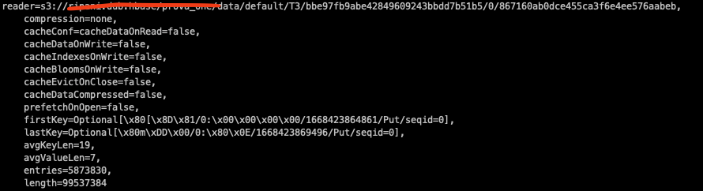

# Management

This section highlights some commands and best practices, that can help you to manage your HBase clusters on Amazon EMR.

## Create command alias

If you administrate your HBase cluster mainly from the shell of the EMR master, it might be convenient to define a command alias to avoid permission issues you might incur by typing erroneous commands using a different user (e.g. root).

As best practice, you should always run HBase commands as `hbase` user. In order to do that, you can add the following alias in the `~/.bashrc` profile for the user that you use to administrate your cluster (e.g. hadoop)

```bash
alias hbase='sudo -u hbase hbase'
```

Once done, you can safely run HBase commands as usual

```bash
hbase shell
```

## Determine average row size

If you want to determine the average size of a row stored in a HBase table, you can use the following commands to retrieve the payload from a storefile of the table. For example:

```bash
# Simple notation
hbase hfile -m -f $HBASE_PATH

# Extended notation
hbase org.apache.hadoop.hbase.io.hfile.HFile -m -f $HBASE_PATH
```



The class `org.apache.hadoop.hbase.io.hfile.HFile` allows you to analyze HBase store files that are persisted on HDFS or S3. The option `-m` returns the metadata for the file analyzed that reports the average size (bytes) of the Row Key in that particular file, and the average size (bytes) of the values stored in that file.

To get a rough estimation of the average payload of a single row, you can sum the parameters **avgKeyLen** and **avgValueLen** that are returned in the previous command, to get the average size in bytes of a row. For example:

```
# row_avg_size = avgKeyLen + avgValueLen
row_avg_size = 19 + 7 = 26
```

This command might be useful to get a rough estimate of your data payload when you are not sure about it. You can later on use this value to fine-tuning your cluster (e.g. [increase/decrease RPC Listeners](./best_practice#hbase-rpc-listeners))

## Reduce number of Regions

The HBase community introduced a new utility in the [hbase-tools](https://github.com/apache/hbase-operator-tools/blob/master/hbase-tools/) package that helps to reduce the number of regions for tables stored in HBase. This utility is available in the class `org.apache.hbase.RegionsMerger` and can help you to automatically merge the number of regions to a value that you define, if you have a high count in your cluster (e.g. wrong table pre-split, or high split rate due to incorrect settings)

```bash
# copy library in classpath
sudo cp /usr/lib/hbase-operator-tools/hbase-tools-*.jar /usr/lib/hbase/lib/

# merge regions
hbase org.apache.hbase.RegionsMerger <TABLE_NAME> <TARGET_NUMBER_OF_REGIONS>
```

This tool is available in HBase versions >= 2.x.x and should only be used with these versions.
