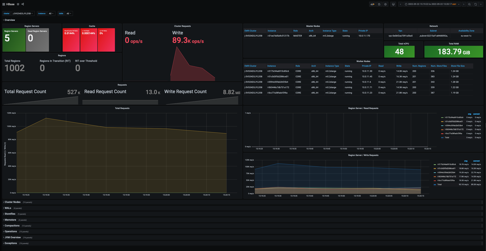

# Observability

This section describes how you can leverage existing monitoring tools and features available in Amazon EMR to monitor and troubleshoot issues that might occur when working with HBase.

## Logs

By default, Amazon EMR stores HBase logs under the following directory: */var/log/hbase*. Depending on the role of the node you are connected to (e.g. MASTER, CORE or TASK) you might see different types of log files stored within this folder. Below a list of log files generated by HBase:

* **hbase-hbase-master-ip-xxx-xxx-xxx-xxx.log** This file is present on the EMR master node only and provides details about operations performed by the HBase master service. In an impaired cluster, this is typically the first file to look at to identify the origin of the problem.

* **hbase-hbase-rest-ip-xxx-xxx-xxx-xxx.log** This log file is available on the EMR master node only and provides details about REST API requests. If you’re not using the HTTP REST API to communicate with HBase, then you can skip this file. By default, Amazon EMR exposes HTTP REST API for HBase on port 8070.

* **hbase-hbase-thrift-ip-xxx-xxx-xxx-xxx.log** This log file is available on the EMR master node only and provides details about connections instantiated through the thrift interface of HBase. By default, Amazon EMR exposes the Thrift server on port 9090.

* **hbase-hbase-regionserver-ip-xxx-xxx-xxx-xxx.log** Available on CORE and TASK nodes only. It collects log entries generated by the region server running on the node. Should be reviewed in case of issues on the specific node.

* **hbase.log** This file logs the output of client commands issued by end users. For example, if you launch the command `hbase hbck -details`  on the EMR master node, this file will trace the default logger of the hbck utility (which does not correspond to the stdout messages generated by the command).

* **SecurityAuth.audit** This file records user accesses to HBase tables, and it’s mainly used for audit purposes. In order to collect useful logs, it’s required to enable Kerberos authentication and enable the Access Controller capabilities of the HBase co-processor to provide more details in terms of tables accessed by the users. For an example configuration, see [Security/Authorization](security.md#authorization)

In order to modify the default log level of HBase, you can modify the *hbase-log4j* classification when launching an EMR cluster. For example, the below configuration will enable TRACE logging to have a more granular audit of user accesses to HBase tables (requires to enable [Security/Authorization](security.md#authorization)).

```json
[
  {
    "Classification": "hbase-log4j",
    "Properties": {
          "log4j.category.SecurityLogger":"TRACE,RFAS",
          "log4j.logger.SecurityLogger.org.apache.hadoop.hbase.security.access.AccessController": "TRACE",
          "log4j.logger.SecurityLogger.org.apache.hadoop.hbase.security.visibility.VisibilityController": "TRACE"
    }
  }  
]
```

If you enabled the [EMR logging on Amazon S3](https://docs.aws.amazon.com/emr/latest/ManagementGuide/emr-plan-debugging.html) these files will also be periodically collected on the S3 bucket that you choose when launching the cluster.

## Monitoring HBase

### Web UI

By default, HBase provides out of the box a Web UI that you can leverage to quickly check the status of your cluster and review detailed metrics of cluster utilization on a friendly interface. Amazon EMR exposes the HBase Web UIs at the following addresses:

* **HBase Master** `http://master-dns-name:16010/`
* **HBase Region** `http://region-dns-name:16030/`

The HBase Master Web UI is typically the first entry point to check the status of your cluster. It provides details about the current number of tables hosted on the cluster, details about regions servers, cache utilization and much more. In HBase 2.x the Web UI was further improved, thus making it a valuable and quick tool to check the health and status of your HBase cluster. Below a sample image of the HBase master Web UI.


### Ganglia

Another way to monitor HBase is with the help of Ganglia, which can be installed while provisioning your EMR cluster. Ganglia automatically collects HBase metrics and allows you to create reports and custom visualizations for the metrics of interests. The project has been discontinued in the last years, but it can still provide you with detailed information on your HBase utilization. This software should be installed if you need a quick and easy way for monitoring you HBase cluster. To install Ganglia in your cluster, please see [Monitor HBase with Ganglia](https://docs.aws.amazon.com/emr/latest/ReleaseGuide/emr-hbase-ganglia.html).

### Grafana & Prometheus

Grafana in combination with Prometheus provides a better and more rich experience to monitor your HBase cluster that can be customized based on your needs.

In order to monitor your HBase cluster using a Grafana dashboard, you should install the prometheus [node_exporter](https://github.com/prometheus/node_exporter) utility on each node to collect additional details from the nodes (CPU, Memory, Disk, Network metrics) and the [Prometheus JMX exporter](https://github.com/prometheus/jmx_exporter) to prepare HBase JMX metrics for prometheus scraping.

Please refer to the following scripts for additional information on the setup and configurations of the components previously described:

* [emr-ba-prometheus_exporter.sh](https://github.com/aws-samples/aws-emr-utilities/blob/main/applications/hbase-monitoring/resources/emr-ba-prometheus_exporter.sh) Node Exporter and Prometheus JMX exporter setup
* [emr-step-monitoring_apps.sh](https://github.com/aws-samples/aws-emr-utilities/blob/main/applications/hbase-monitoring/resources/emr-step-monitoring_apps.sh) Prometheus & Grafana setup

Finally, in order to expose HBase JMX metrics from the HBase Master and Region Servers it is required to set the following variables in the */etc/hbase/conf/hbase-env.sh* script:

```bash
export HBASE_MASTER_OPTS="$HBASE_MASTER_OPTS -javaagent:/opt/prometheus/prometheus_javaagent.jar=7000:/opt/prometheus/hbase.yml"
export HBASE_REGIONSERVER_OPTS="$HBASE_REGIONSERVER_OPTS -javaagent:/opt/prometheus/prometheus_javaagent.jar=7000:/opt/prometheus/hbase.yml"
```

This can easily be achieved using the following [EMR Configurations](https://docs.aws.amazon.com/emr/latest/ReleaseGuide/emr-configure-apps.html)

```json
[
  {
    "Classification": "hbase-env",
    "Configurations": [
      {
        "Classification": "export",
        "Properties": {
          "HBASE_REGIONSERVER_OPTS": "\"$HBASE_REGIONSERVER_OPTS -javaagent:/opt/prometheus/prometheus_javaagent.jar=7000:/opt/prometheus/hbase.yml\"",
          "HBASE_MASTER_OPTS": "\"$HBASE_MASTER_OPTS -javaagent:/opt/prometheus/prometheus_javaagent.jar=7000:/opt/prometheus/hbase.yml\""
        }
      }
    ],
    "Properties": {}
  }
]
```

A sample CloudFormation template with related dashboard can be found [here](https://github.com/aws-samples/aws-emr-utilities/tree/main/applications/hbase-monitoring).



### JMX Metrics

By default, HBase generates a significant amount of metrics that can be used to monitor the status and utilization of your cluster. To retrieve a list of all the metrics exposed by the cluster with related descriptions, you can directly invoke the HBase REST API using the following addresses:

* **HBase Master** `http://master-dns-name:16010/jmx?description=true`
* **HBase Region** `http://region-dns-name:16030/jmx?description=true`

For more details on JMX metrics, see [HBase Metrics](https://hbase.apache.org/book.html#hbase_metrics) in the official HBase documentation.

## Monitoring HDFS

Amazon EMR pushes metrics to [Amazon CloudWatch](https://docs.aws.amazon.com/AmazonCloudWatch/latest/monitoring/WhatIsCloudWatch.html), a service that monitors your Amazon Web Services (AWS) resources, where you can define alarms for Amazon EMR metrics. For example, you can configure an alarm to receive a notification any time the HDFS utilization rises above 80%. This can help you to detect problems that might occur in your HBase cluster due to the full utilization of the HDFS space. Typically, it’s useful to define an alarm for the following metrics:

* **HDFSUtilization** - The percentage of HDFS storage currently used
* **MissingBlocks** - The number of blocks in which HDFS has no replicas
* **UnderReplicatedBlocks** - The number of blocks that need to be replicated one or more times.

For a list of all the metrics published by Amazon EMR, see [Monitor metrics with CloudWatch](https://docs.aws.amazon.com/emr/latest/ManagementGuide/UsingEMR_ViewingMetrics.html) in the EMR documentation.
To configure an alarm for the previously mentioned metrics, see [Create or edit a CloudWatch alarm](https://docs.aws.amazon.com/AmazonCloudWatch/latest/monitoring/ConsoleAlarms.html) in the Amazon CloudWatch User Guide.

## Monitoring Amazon S3

Monitoring is an important part of maintaining the reliability, availability, and performance of Amazon S3 and your AWS solutions. Amazon S3 provides different tools that you can use to both monitor and audit the operations that are performed on the service.

When using Amazon S3 as storage layer for HBase, there are typically two main information that you might want to get out from the S3 service: size of the data stored in the bucket that can help you to estimate costs, and number of 5xx errors that might indicate throttling operations for S3 calls.

In this case, you can use [S3 Storage Lens](https://docs.aws.amazon.com/AmazonS3/latest/userguide/storage_lens.html) that can provide visibility into object-storage usage and activity. Once enabled, the service generates summary insights that you can review using a pre-built service dashboard. The dashboards can be generated for individual buckets or a list of buckets within the same region. When monitoring HBase, we recommend to enable S3 Storage Lens with the following configurations:

* **Dashboard Scope** This mainly depends on how you want to monitor S3. You might generate individual dashboards for each bucket or a more comprehensive dashboard for a single region if you have multiple HBase clusters using S3 as storage layer.
* **Metrics Selection** Enable the ‘“Advanced Metrics and Recommendations” and select Activity Metrics and Detailed Status Code Metrics. Please note that the following metrics are available with additional costs, however they provide a more granular visibility about issues that you might experience on a specific bucket.

Amazon S3 also provides native integrations with Amazon CloudWatch and CloudTrail for a more granular control on  the operations performed against S3 buckets. However, if you don’t have strong auditing requirements, the S3 Storage Lens capabilities are usually sufficient to monitor S3 when using HBase.

For additional details on S3 monitoring tools available on the service, see [Monitoring Amazon S3](https://docs.aws.amazon.com/AmazonS3/latest/userguide/monitoring-overview.html) in the Amazon S3 documentation.

Finally, in some cases it might be useful to show in the HBase logs extended details for S3 calls performed by the HBase master and Region Servers. This information is useful to troubleshoot unusual behavior in the cluster or in case of issues. In this specific cases, you might want change the default logging for S3 calls using the following EMR configurations:

```json
[
  {
    "Classification": "hbase-log4j",
    "Properties": {
      "log4j.logger.com.amazon.ws.emr.hadoop.fs.shaded.com.amazonaws.request": "DEBUG",
      "log4j.logger.com.amazon.ws.emr.hadoop.fs.shaded.com.amazonaws.latency": "ERROR"
    }
  }
]
```
