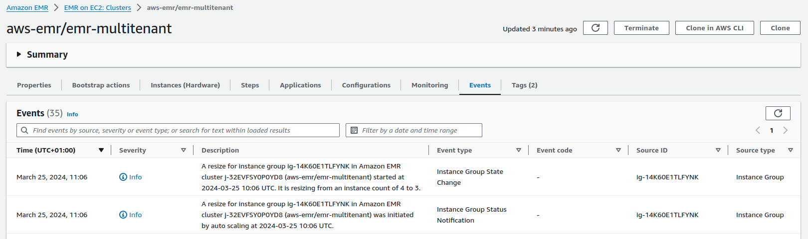

# YARN Scaling with custom labels

## Overview

This document offers a comprehensive guide for deploying an Amazon EMR cluster capable of dynamically adjusting its capacity using [YARN Node Labels](https://hadoop.apache.org/docs/stable/hadoop-yarn/hadoop-yarn-site/NodeLabel.html) to scale specific Instance Groups based on pending container requests.

In scenarios where a multitenant cluster accommodates diverse applications with distinct hardware requirements (e.g. memory vs compute intensive jobs), selective scaling of the cluster can enhance throughput and minimize resource underutilization.

To achieve this, we can use a custom agent deployed on the EMR primary node to gather additional metrics and publish them on CloudWatch. These metrics can serve as input for the [EMR Custom Autoscale](https://docs.aws.amazon.com/emr/latest/ManagementGuide/emr-automatic-scaling.html) functionality where we can define precise scaling logic for the nodes of our cluster.

In the provided example, we demonstrate launching an EMR cluster with two distinct Instance Groups: one optimized for COMPUTE tasks (using c5 instances) and another tailored for MEMORY intensive workloads (using r5 instances). Each Instance Group is tagged with a custom [YARN Node Label](https://hadoop.apache.org/docs/stable/hadoop-yarn/hadoop-yarn-site/NodeLabel.html) defined at cluster launch. EMR's Instance Group configurations accommodate such labeling, using the following YARN configurations:

**Note** *Custom YARN labels defined in the configurations should be created manually while launching the cluster. You can use an EMR Step to automate this process as shown in the CloudFormation example*

```json
[
  {
    "Classification": "yarn-site",
    "Properties": {
      "yarn.nodemanager.node-labels.provider": "config",
      "yarn.nodemanager.node-labels.provider.configured-node-partition": "COMPUTE_OPTIMIZED"
    }
  }
]
```

Subsequently, custom YARN metrics are streamed to CloudWatch to serve as triggers for cluster scaling. In our demonstration, we track two distinct metrics on CloudWatch: pending vCores and memory utilization across each cluster partition of the cluster identified by a YARN Label. These metrics are acquired using the [YARN Resource Manager Scheduler API](https://hadoop.apache.org/docs/stable/hadoop-yarn/hadoop-yarn-site/ResourceManagerRest.html), and aggregated across all YARN queues (if defined in the yarn configurations). For a practical implementation, refer to the provided [Metric Collector Script](./scripts/yarn_labels_scaling.sh).

Finally, scaling policies are defined using CloudWatch triggers available in EMR Custom Autoscale. In our example, we adopt two distinct scaling strategies for each Instance Group: memory-optimized scaling, based on pending memory, and compute-optimized scaling, reliant on pending vCore.

Below is an example of a scale-out policy defined for the COMPUTE Instance Group. This policy triggers a scaling action to augment the cluster's capacity by 20% if the count of pending vCores exceeds 10, with a cooldown period of 300 seconds between consecutive scaling actions.


```json
{
  "Name": "COMPUTE_OPTIMIZED_SCALE_OUT",
  "Description": "Scale-Out on pending vCores",
  "Action": {
    "SimpleScalingPolicyConfiguration": {
      "AdjustmentType": "PERCENT_CHANGE_IN_CAPACITY",
      "ScalingAdjustment": 20,
      "CoolDown": 300
    }
  },
  "Trigger": {
    "CloudWatchAlarmDefinition": {
      "ComparisonOperator": "GREATER_THAN_OR_EQUAL",
      "EvaluationPeriods": 1,
      "MetricName": "COMPUTE_OPTIMIZED.PendingVCores",
      "Namespace": "AWS/ElasticMapReduce",
      "Period": 120,
      "Statistic": "AVERAGE",
      "Threshold": 10,
      "Unit": "COUNT"
    }
  }
}
```

For further details on configurations and parameters, consult [Understanding automatic scaling rules](https://docs.aws.amazon.com/emr/latest/ManagementGuide/emr-automatic-scaling.html#emr-scaling-rules).

## Commands / Examples

### Hadoop YARN

#### List Node Labels

```bash
yarn cluster --list-node-labels
```

#### List Cluster Nodes Labels

```bash
yarn node -list -all -showDetails
```

#### Create Node Label

```bash
yarn rmadmin -addToClusterNodeLabels "MY_TEST_LABEL(exclusive=true)"
```

#### Delete Node Label

```bash
yarn rmadmin -removeFromClusterNodeLabels "MY_TEST_LABEL"
```

### Apache Spark

To target specific nodes of the cluster while launching your Spark application you can use the following spark configurations:

- **spark.yarn.am.nodeLabelExpression** A YARN node label expression that restricts the set of nodes AM will be scheduled on
- **spark.yarn.executor.nodeLabelExpression** A YARN node label expression that restricts the set of nodes executors will be scheduled on

The following example, launch a SparkPi example to run only on COMPUTE_OPTIMIZED nodes of our cluster running on c5 instances:

```bash
spark-example \
  --queue analytics \
  --driver-cores 4 --driver-memory 4g \
  --executor-cores 4 --executor-memory 4g \
  --conf spark.yarn.am.nodeLabelExpression="CORE" \
  --conf spark.yarn.executor.nodeLabelExpression="COMPUTE_OPTIMIZED" \
  --conf spark.dynamicAllocation.maxExecutors=5 \
  SparkPi 5000000
```

If you're using the default template configurations, the job will be able to request only 1 executor for the job and the COMPUTE_OPTIMIZED.PendingVCores metric will be 16 triggering a scale out operation targetting the specific Instance Group of the cluster. 

## Monitoring

For troubleshooting and monitoring purposes, metrics visualization on CloudWatch offers insights into resources requested against each cluster partition. 
Besides, in the EMR Web Console you can find more details on the scaling events that occurred on the cluster. Open the EMR Web Console for the cluster of interest and select the **Events** tab.



## Resources

In this section, you'll find additional resources for testing this feature. 

To deploy the CloudFormation templates, store the relevant Bootstrap Action script in an S3 bucket. Next, launch the template from the AWS Web Console, ensuring to complete all necessary input parameters.

- EMR 6.x - [CloudFormation Template](./scripts/yarn_labels_scaling.yaml) / [Metric Collector Script](./scripts/yarn_labels_scaling.sh)

## References

- [EMR - Custom Autoscale](https://docs.aws.amazon.com/emr/latest/ManagementGuide/emr-automatic-scaling.html)
- [Hadoop - YARN Node Labels](https://hadoop.apache.org/docs/stable/hadoop-yarn/hadoop-yarn-site/NodeLabel.html)
- [Spark - Running on YARN](https://spark.apache.org/docs/latest/running-on-yarn.html)