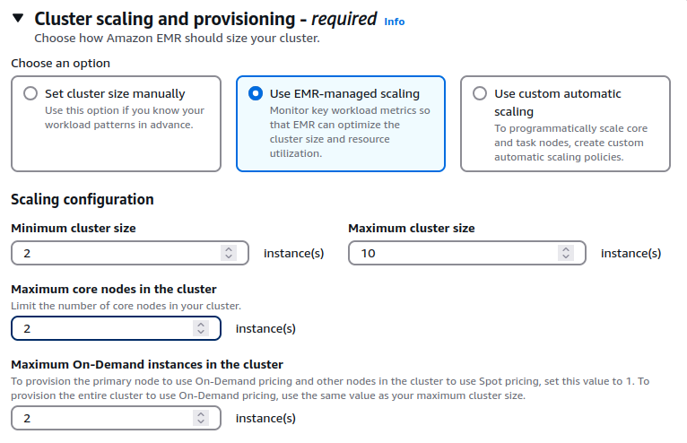

# Best Practices

## Use the most recent version of EMR

Amazon EMR provides several Spark optimizations out of the box with [EMR Spark runtime](https://aws.amazon.com/blogs/big-data/run-apache-spark-3-0-workloads-1-7-times-faster-with-amazon-emr-runtime-for-apache-spark/) which is 100% compliant with the open source Spark APIs i.e., EMR Spark does not require you to configure anything or change your application code. We continue to [improve](https://aws.amazon.com/about-aws/whats-new/2021/10/amazon-emr-6-4-supports-apache-spark-3-1-2/) the performance of this Spark runtime engine for new releases. Several [optimizations](https://docs.aws.amazon.com/emr/latest/ReleaseGuide/emr-spark-performance.html) such as Adaptive Query Execution are only available from EMR 5.30 and 6.0 versions onwards. For example, following image shows the Spark runtime performance improvements in EMR 6.5.0 (latest version as of writing this) compared to its previous version EMR 6.1.0 based on a derived TPC-DS benchmark test performed on two identical EMR clusters with same hardware and software configurations (except for the version difference).


As seen in the above image, Spark runtime engine on EMR 6.5.0 is 1.9x faster by geometric mean compared to EMR 6.1.0. Hence, it is strongly recommended to migrate or upgrade to the latest available Amazon EMR version to make use of all these performance benefits.

Upgrading to a latest EMR version is typically a daunting task - especially major upgrades (for eg: migrating to Spark 3.1 from Spark 2.4). In order to reduce the upgrade cycles, you can make use of [EMR Serverless](https://aws.amazon.com/emr/serverless/) (in preview) to quickly run your application in an upgraded version without worrying about the underlying infrastructure. For example, you can create an EMR Serverless Spark application for EMR release label 6.5.0 and submit your Spark code.

```bash
aws emr-serverless create-application \
  --release-label emr-6.5.0-preview   \
  --type 'SPARK'                      \
  --name spark-6.5.0-demo-application \
  --region us-east-1
```

Detailed documentation for running Spark jobs using EMR Serverless can be found [here](https://docs.aws.amazon.com/emr/latest/EMR-Serverless-UserGuide/spark-jobs.html). Since EMR Serverless and EMR on EC2 will use the same Spark runtime engine for a given EMR release label, once your application runs successfully in EMR Serverless, you can easily port your application code to the same release version on EMR. Please note that this approach does not factor in variables due to infrastructure or deployment into consideration and is only meant to validate your application code quickly on an upgraded Spark version in the latest Amazon EMR release available.

## Choose the right hardware for your workloads

Spark workloads may require different types of hardware for different job characteristics to ensure optimal performance. EMR supports [several instance types](https://docs.aws.amazon.com/emr/latest/ManagementGuide/emr-supported-instance-types.html) to cover all types of processing requirements. While onboarding new workloads, it is recommended to start benchmarking with general instance types like `m5` or `m6g`. Monitor the OS and YARN metrics from Ganglia and CloudWatch to determine the system bottlenecks at peak load. Bottlenecks include CPU, memory, storage and I/O. Once identified, choose the appropriate hardware type for your job requirements.

### Memory-optimized

Memory-optimized instances such as `r5` and `r4` are ideal choices for memory-intensive workloads. Workloads that involve caching large DataFrames, Datasets, or RDDs in Apache Spark; performing complex join, union, or other data manipulation tasks on extensive tables; utilizing numerous internal or custom broadcast variables or accumulators; undergoing multiple garbage collection (GC) cycles; and executing significant data shuffling processes typically fall into this category. The following diagram illustrates the percentage of YARN memory used and the corresponding aggregate OS memory consumption from Amazon EMR's CloudWatch namespace and Ganglia, respectively:


### CPU-optimized

CPU-optimized instances, such as `c5` and `c4`, are ideal choices for CPU-intensive workloads. Tasks like Spark jobs with intricate aggregate operations employing numerous built-in mathematical functions or User Defined Functions (UDFs), along with those utilizing extensive LRU caches, tend to be computationally demanding. The subsequent screenshot illustrates the accumulated CPU usage of an EMR cluster derived from Ganglia.


### General purpose

General purpose instances like `m5` and `m4` are good candidates for a mix of CPU and memory intensive workloads. They are also great for benchmarking and onboarding your Spark applications. Following sheet outlines the CPU:Memory ratio of 3 different instances types at a similar price. It is important to use instance types with right CPU:memory ratio based on your workload needs.

| Instance Type | Instance | EC2 price | EMR price | Cores | Memory in GiB | CPU:memory ratio |
|--------|----------------|------------|-----------|--------|------------|------------|
| Compute | c5.18xlarge |  $3.06 |  $0.27 | 72 | 144 | 2 |
| Memory | r5.12xlarge |  $3.02 |  $0.27 | 48 | 384 | 8 |
| General | m5.16xlarge |  $3.07 | $0.27 | 64 | 256 | 4 |

### Storage-optimized

Storage-optimized instances like `i3en`, `d2` are good candidates for I/O intensive workloads. If your use case is CPU/memory bound but also consumes a lot of I/O, and demands high disk throughput or low read or write latencies from transient HDFS storage, you can consider using instances backed by SSD volumes like `r5d`, `c5d`, `m5d` etc.. Spark jobs that perform massive shuffles may also benefit from instance types with optimized storage since Spark external shuffle service will write the shuffle data blocks to the local disks of worker nodes running the executors.

### GPU instances

GPU instances such as `p3` family are typically used for Spark ML and intensive analytical workloads like image processing. From EMR 6.2, you can make use of [Nvidia RAPIDS accelerator](https://docs.aws.amazon.com/emr/latest/ReleaseGuide/emr-spark-rapids.html) plugin to improve your GPU instance performance without any changes to your code or data processing pipelines.

### Graviton instances

Starting EMR 5.31+ and 6.1+, EMR supports Graviton instance (eg: `r6g`, `m6g`, `c6g`) which offers up to 15% improvement in performance and 30% reduction in cost based on our derived benchmark tests. They are a great choice to replace your legacy instances and achieve better price-performance.


## Choose the right deploy mode

Spark provides two deployment modes: `client` and `cluster`. The choice of deployment mode in Spark determines where the Spark driver, which acts as the central control system for your Spark application, will run. The Spark driver plays a crucial role by managing the SparkContext (or SparkSession), monitoring task and executor status through heartbeats, and retrieving computation results from the executors. Select an appropriate deploy mode according to your specific workload needs.

### Client deploy mode

In client deployment mode for Spark applications (the default mode in an EMR on Ec2 cluster), the driver process runs inside the client submitting the application rather than on the cluster itself. This means that if you initiate the submission from an EMR master node via the EMR Step API or spark-submit, or even from a remote client, the Spark driver process will launch locally. However, it's important to note that the Spark driver is now a potential single point of failure since there won't be any automatic retrying of a failed driver process in client deployment mode. Additionally, should the client lose its connection to YARN, the associated job will be terminated.


#### When to use

* You are running only one or two Spark applications at a time in a cluster. This deploy mode is not ideal if you are running multiple applications at the same time on the same cluster since all those Spark drivers running on a single master/remote node can lead to resource contention.
* You want to be more in control of your Spark driver configurations. In client mode, Spark driver resources will not compete with YARN resources and can be adjusted separately without affecting the YARN resource procurement of your applications.
* You're currently handling an excessive number of executors (over 1000) and tasks (more than 30000) within your Spark application. This could be causing performance issues due to the Spark driver being overwhelmed with monitoring and managing these processes. To mitigate this issue, consider allocating a more robust instance for your master node. By selecting a high-performance instance such as `z1d`, you can provide additional memory and CPU capabilities specifically for the Spark driver process that is responsible for overseeing numerous executors and tasks within your application.
* You want to write output to the console i.e., send the results back to the client program where you submitted your application.
* Notebook applications such as Jupyter, Zeppelin etc. will use client deploy mode.

### Cluster deploy mode

In cluster deploy mode, your Spark driver will be located within the Application Master (AM) container from YARN regardless of where you submit your Spark application from.


#### When to use

* You are submitting multiple applications at the same time or have higher application or EMR step concurrency. While running multiple applications, Spark drivers will be spread across the cluster since AM container from a single application will be launched on one of the worker nodes.
* There are relatively fewer number of executors per application. i.e., the Spark driver process does not have to do intensive operations like manage and monitor tasks from too many executors.
* You are saving results in S3/HDFS and there is no need to print output to the console.
* You want to specify detailed instructions on where AM runs. You can launch AMs on CORE partition or both CORE and TASK partitions based on where you want your AM and executors to launch. For example, you can run AM on only on-demand CORE nodes and executors only on spot task nodes.
* You want to relaunch a failed driver JVM i.e., increased resiliency. By default, YARN re-attempts AM loss twice based on property *`spark.yarn.maxAppAttempts`*. You can increase this value further if needed.
* You want to ensure that termination of your Spark client will not lead to termination of your application. You can also have Spark client return success status right after the job submission if the property *`spark.yarn.submit.waitAppCompletion`* is set to "false".

Regardless of which deploy mode you choose, make sure that your driver Spark configs are tuned for your workload needs.

## Leverage spot nodes with managed autoscaling

Enable managed autoscaling for your EMR clusters. From EMR 5.32 and EMR 6.2, several optimizations have been made to managed scaling to make it more resilient for your Spark workloads. It is not recommended to use Spot with core or master nodes since during a Spot reclaimation event, your cluster could be terminated and you would need to re-process all the work. Try to leverage task instance fleets with many instance types per fleet along with Spot since it would give both cost and performance gains. However, in this case, make sure that your output is being written directly to S3 using EMRFS since we will aim to have limited/fixed core node capacity.

Following policy defines max core nodes to 2 and we are requesting the core nodes to be on-demand as recommended. Rest of the nodes are Spot task nodes.



Following experimentation illustrates the performance gains using Managed Autoscaling.


For some of our Spark workloads, we observed ~50% gains compared to custom autoscaling clusters. Please note that the results may vary for your workloads.


If your workloads are SLA sensitive and fault intolerant, it is best to use on-demand nodes for task fleets as well since reclaimation of Spot may lead to re-computation of one or more stages or tasks.
