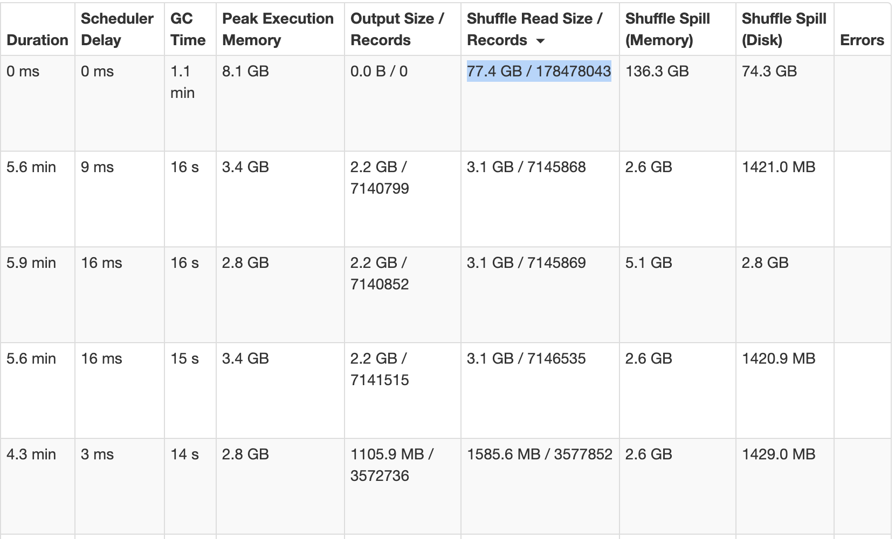
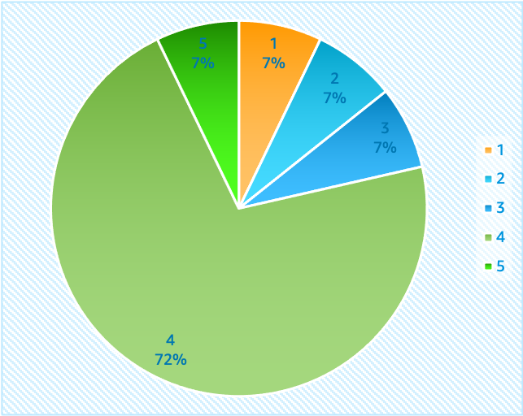
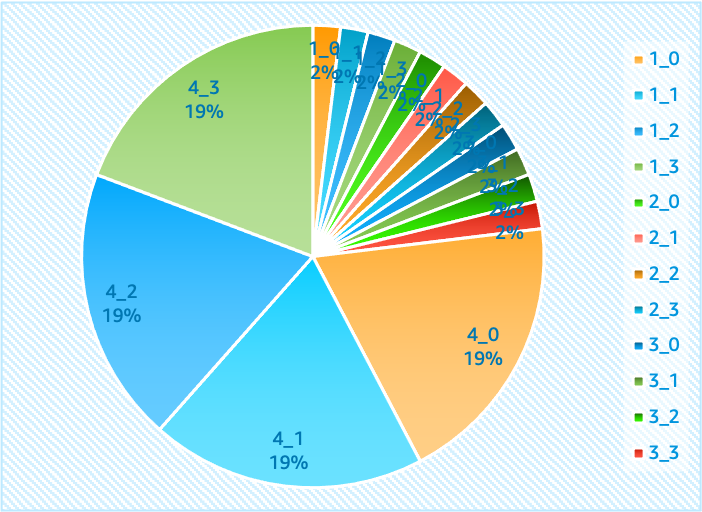
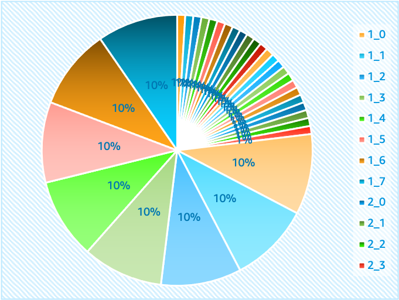
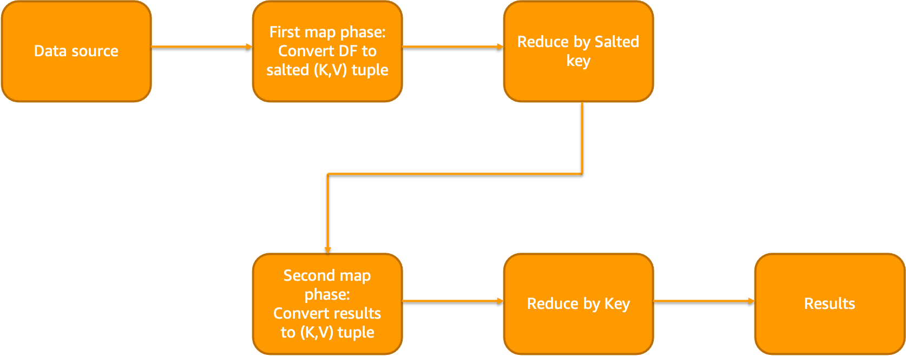
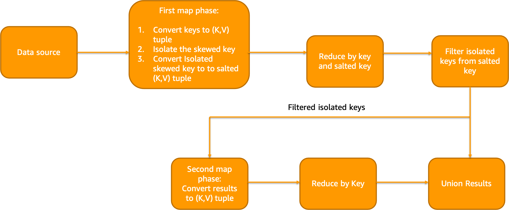
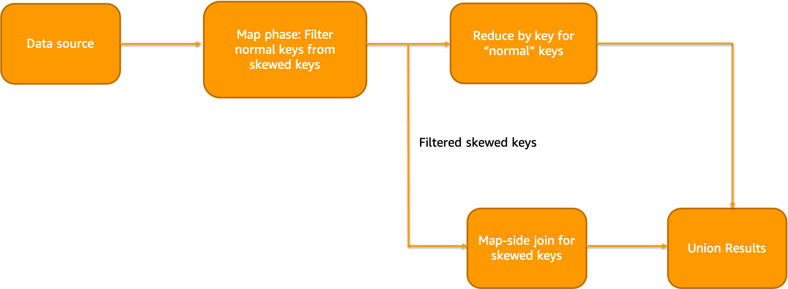

# Data Skew

Data imbalance, or skew, can have a significant impact on performance in big data processing systems like Apache Spark. When one task processes an unusually large portion of the dataset compared to others, it can result in several issues:

* **Slowness** A single JVM may become overloaded with excessive data, causing delays for that specific task and potentially affecting the overall throughput of the system.
* **Out-of-Memory (OOM)** The increased memory requirements for handling larger datasets can cause OOM errors in YARN containers if not managed properly.
* **Disk space filling** As tasks process their respective portions of the data, unevenly distributed data can fill up available storage faster than expected, leading to potential bottlenecks.

In this example, as observed in Spark UI, a single task is processing 25 times more data than other tasks. This can inevitably lead to slowness, OOMs and disk space filling issues.



When there is a data skew, it is best handled at code level since very little can be done in terms of configuration. You can increase JVM size or use one fat executor per node in order to prevent OOMs to the best of ability. But this will impact other running tasks and also will not improve your job performance since one task uses only one vCPU. Following are some of the common strategies to mitigate data skew at code level.

## Salting

Salting is an effective technique used for skew reduction in data processing systems. By adding a random value or "salt" to a skewed column, such as 'col1', we aim to distribute the data more evenly among processing units. This method can also involve splitting the salted column into several smaller ones, like 'col1_0', 'col1_1', and so forth. The greater the number of salts employed, the less pronounced the skew becomes, enabling improved task parallelism.

Original data              |  Salted 4 times           |  Salted 8 times
:-------------------------:|:-------------------------:|:-------------------------:
 |   | 

A typical Salting workflow looks like below:



For example, a salt column is added to the data with 100 randomized salts during narrow transformation phase (map or flatMap type of transforms).

```python
from pyspark.sql.functions import rand
n = 100
salted_df = df.withColumn("salt", (rand() * n).cast("int"))
```

Now, aggregation is performed on this salt column and the results are reduced by keys

```python
unsalted_df = (
    salted_df.groupBy("salt", groupByFields)
    .agg(aggregateFields)
    .groupBy(groupByFields)
    .agg(aggregateFields)
)
```

The same principle applies when dealing with windowing functions. However, it's essential to note that there are potential drawbacks associated with this strategy. One significant disadvantage arises from creating numerous tiny tasks for non-skewed keys. This situation could negatively influence the overall performance of the job due to increased overhead costs related to managing these multitudes of smaller tasks. Therefore, careful consideration should be given before implementing salting techniques.

## Isolated Salting

In this approach salting is applied to only subset of the keys. If 80% or more data has a single value, isolated salting approach could be considered (for eg: skew due to NULL columns). In narrow transformation phase, we will isolate the skewed column. In the wide transformation phase, we  will isolate and reduce the heavily skewed column after salting. Finally, we will reduce other values without the salt and merge the results. Isolated Salting workflow looks like below:



Example code looks like below:

```scala
val count = 4
val salted = df.withColumn("salt", when('col === "A", rand(1) * count cast IntegerType) otherwise 0)
val replicaDF = skewDF
      .withColumn("replica", when('col === "A", (0 until count) toArray) otherwise Array(0))
      .withColumn("salt", explode('replica'))
      .drop('replica')
val merged = salted.join(replicaDF, joinColumns :+ "salt")
```

## Isolated broadcast join

In this approach, smaller lookup table is broadcasted across the workers and joined in map phase itself. Thus, reducing the amount of data shuffles. Similar to last approach, skewed keys are separated from normal keys. Then, we reduce the ”normal” keys and perform map-side join on isolated ”skewed” keys. Finally, we can merge the results of skewed and normal joins

Isolated map-side join workflow looks like below:



Example code looks like below:

```scala
val count = 8
val salted = skewDF.withColumn("salt", when('col === "A", rand(1) * count cast IntegerType) otherwise 0).repartition('col', 'salt') // Re-partition to remove skew
val broadcastDF = salted.join(broadcast(sourceDF), "symbol")
```

## Hashing for SparkSQL queries

While running SparkSQL queries using window functions on skewed data, you may have observed that it runs out of memory sometimes. Following could be an example query working on top of a skewed dataset.

```sql
select *, ROW_NUMBER() OVER (partition by l_orderkey order by l_orderkey) AS row_num FROM testdb.skewlineitem
```

Considering there is a skew in l_orderkey field, we can split the above query into 4 hashes.

```sql
select * from (select *, ROW_NUMBER() OVER (partition by l_orderkey order by l_orderkey) AS row_num FROM testdb.skewlineitem where cast(l_orderkey as integer)%4 = 1
union
select *, ROW_NUMBER() OVER (partition by l_orderkey order by l_orderkey ) AS row_num FROM testdb.skewlineitem where cast(l_orderkey as integer)%4 = 2
union
select *, ROW_NUMBER() OVER (partition by l_orderkey order by l_orderkey ) AS row_num FROM testdb.skewlineitem where cast(l_orderkey as integer)%4 = 3
union
select *, ROW_NUMBER() OVER (partition by l_orderkey order by l_orderkey ) AS row_num FROM testdb.skewlineitem where cast(l_orderkey as integer)%4 = 4 )
limit 10;
```

If the values are highly skewed, then salting approaches should be used instead since this approach will still send all the skewed keys to a single task. This approach should be used to prevent OOMs quickly rather than to increase performance. The read job is re-computed for the number of sub queries written.
