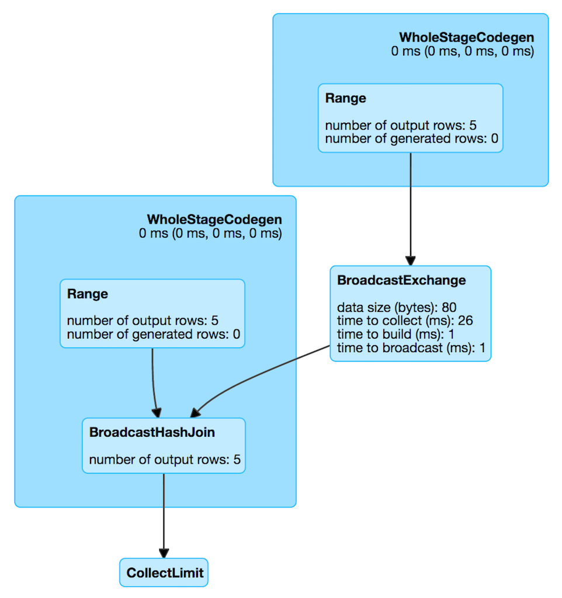
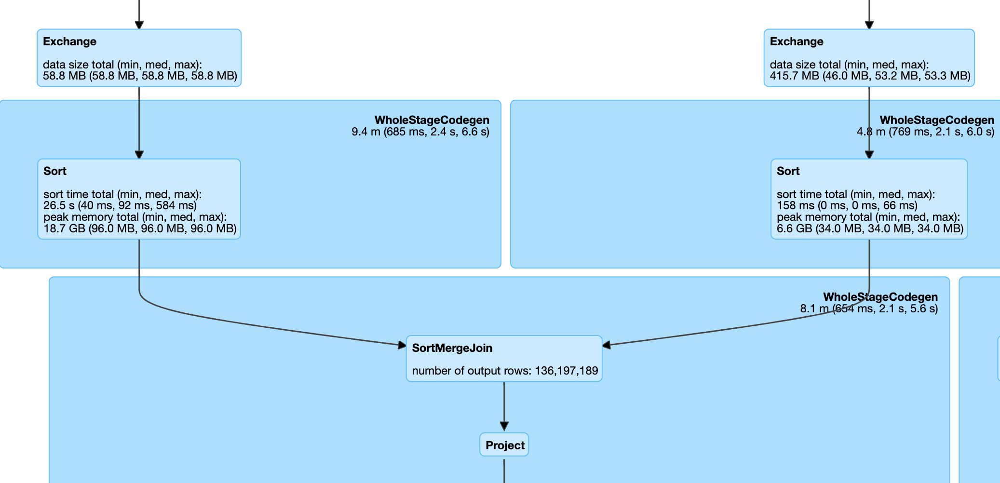
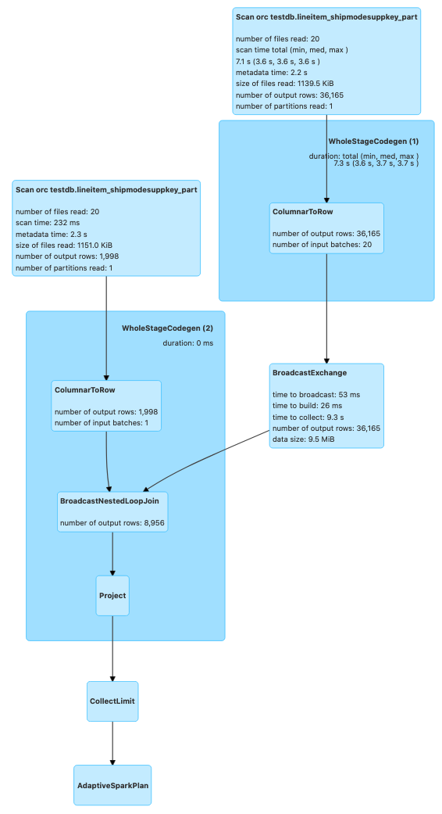
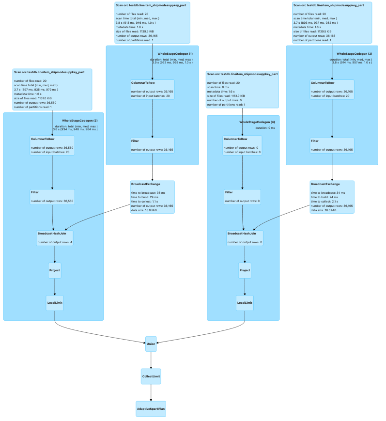
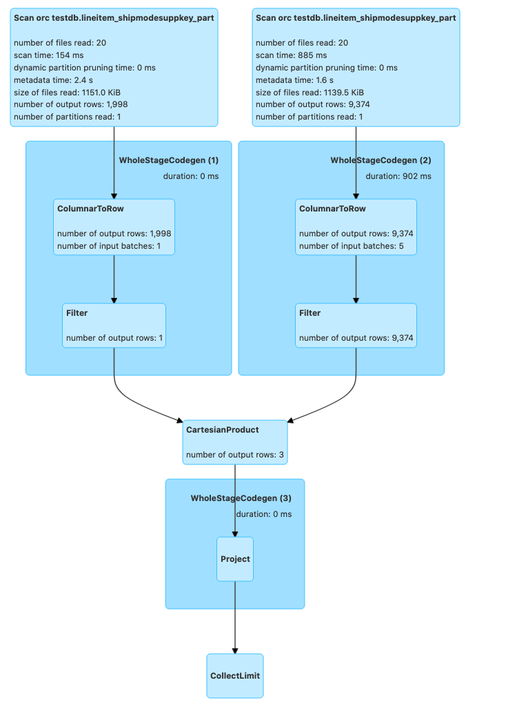
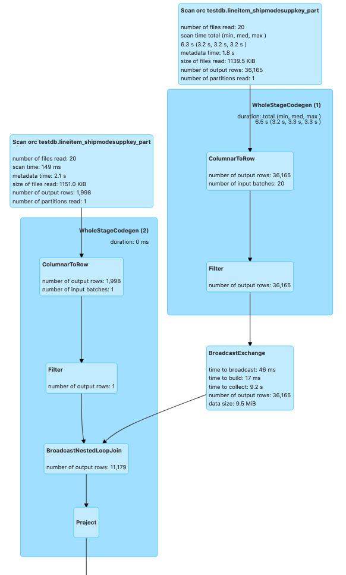
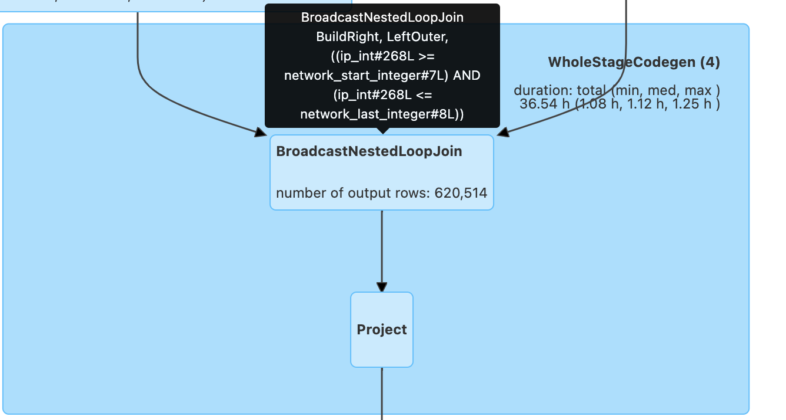
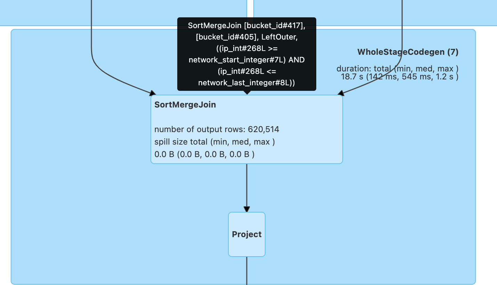

# Join Types

## Choose the right type of join

There are several types of joins in Spark. Some are more optimal than others based on certain considerations. Spark by default does a few join optimizations. However, we can pass join "hints" as well if needed to instruct Spark to use our preferred type of join. For example, in the following SparkSQL queries we supply broadcast and shuffle join hints respectively.

```sql
SELECT /*+ BROADCAST(t1) */ * FROM t1 INNER JOIN t2 ON t1.key = t2.key;
SELECT /*+ SHUFFLE_HASH(t1) */ * FROM t1 INNER JOIN t2 ON t1.key = t2.key;
```

### Broadcast Join

Broadcast join i.e., map-side join is the most optimal join, provided one of your tables is small enough - in the order of MBs and you are performing an equi (`=`) join. All join types are supported except full outer joins. This join type broadcasts the smaller table as a hash table across all the worker nodes in memory. Note that once the small table has been broadcasted, we cannot make changes to it. Now that the hash table is locally in the JVM, it is merged easily with the large table based on the condition using a hash join. High performance while using this join can be attributed to minimal shuffle overhead. From EMR 5.30 and EMR 6.x onwards, by default, while performing a join if one of your tables is `<=` 10 MB, this join strategy is chosen. This is based on the parameter *`spark.sql.autoBroadcastJoinThreshold`* which is defaulted to 10 MB.

If one of your join tables are larger than 10 MB, you can either modify *`spark.sql.autoBroadcastJoinThreshold`* or use an explicit broadcast hint. You can verify that your query uses a broadcast join by investigating the live plan from SQL tab of Spark UI.



Please note that you should not use this join if your "small" table is not small enough. For eg, when you are joining a 10 GB table with a 10 TB table, your smaller table may still be large enough to not fit into the executor memory and will subsequently lead to OOMs and other type of failures. Also, it is not recommended to pass GBs of data over network to all of the workers which will cause serious network bottlenecks. Only use this join if broadcast table size is `<`1 GB.

### Sort Merge Join

This is the most common join used by Spark. If you are joining two large tables (>10 MB by default), your join keys are sortable and your join condition is equi (=), it is highly likely that Spark uses a Sort Merge join which can be verified by looking into the live plan from the Spark UI.



Spark configuration *`spark.sql.join.preferSortMergeJoin`* is defaulted to true from Spark 2.3 onwards. When this join is implemented, data is read from both tables and shuffled. After this shuffle operation, records with the same keys from both datasets are sent to the same partition. Here, the entire dataset is not broadcasted, which means that the data in each partition will be of manageable size after the shuffle operation. After this, records on both sides are sorted by the join key. A join is performed by iterating over the records on the sorted dataset. Since the dataset is sorted, the merge or join operation is stopped for an element as soon as a key mismatch is encountered. So a join attempt is not performed on all keys. After sorting, join operation is performed upon iterating the datasets on both sides which will happen quickly on the sorted datasets.

Continue to use this join type if you are joining two large tables with an equi condition on sortable keys. Do not convert a sort merge join to broadcast unless one of the tables is < 1 GB. All join types are supported.

### Shuffle Hash Join

Shuffle Hash Join sends data with the same join keys in the same executor node followed by a Hash Join. The data is shuffled among the executors using the join key. Then, the data is combined using Hash Join since data from the same key will be present in the same executor. In most cases, this join type performs poorly when compared to Sort Merge join since it is more shuffle intensive. Typically, this join type is avoided by Spark unless *`spark.sql.join.preferSortMergeJoin`* is set to "false" or the join keys are not sortable. This join also supports only equi conditions. All join types are supported except full outer joins. If you find out from the Spark UI that you are using a Shuffle Hash join, then check your join condition to see if you are using non-sortable keys and cast them to a sortable type to convert it into a Sort Merge join.

### Broadcast Nested Loop Join

Broadcast Nested Loop Join broadcasts one of the entire datasets and performs a nested loop to join the data. Some of the results are broadcasted for a better performance. Broadcast Nested Loop Join generally leads to poor job performance and may lead to OOMs or network bottlenecks. This join type is avoided by Spark unless no other options are applicable. It supports both equi and non-equi join conditions `(<,>,<=,>=,`like conditions,array/list matching etc.). If you see this join being used by Spark upon investigating your query plan, it is possible that it is being caused by a poor coding practice.



Best way to eliminate this join is to see if you can change your code to use equi condition instead. For example, if you are joining two tables by matching elements from two arrays, explode the arrays first and do an equi join. However, there are some cases where this join strategy is not avoidable.

For example, below code leads to Broadcast Nested Loop Join.

```scala
val df1 = spark.sql("select * from testdb.lineitem_shipmodesuppkey_part where l_shipdate='1993-12-03' and l_shipmode='SHIP'")
val df2 = spark.sql("select * from testdb.lineitem_shipmodesuppkey_part where l_shipdate='1993-12-04' and l_shipmode='SHIP'")
val nestedLoopDF = df1.join(df2, df1("l_partkey") === df2("l_partkey") || df1("l_linenumber") === df2("l_linenumber"))
```

Instead, you can change the code like below:

```scala
val result1 = df1.join(df2, df1("l_partkey") === df2("l_partkey"))
val result2 = df1.join(df2, df1("l_linenumber") === df2("l_linenumber"))
val resultDF = result1.union(result2)
```

The query plan after optimization looks like below. You can also optionally pass a broadcast hint to ensure that broadcast join happens if any one of your two tables is small enough. In the following case, it picked broadcast join by default since one of the two tables met *`spark.sql.autoBroadcastJoinThreshold`*.



### Cartesian Join

Cartesian joins or cross joins are typically the worst type of joins. It is chosen if you are running "inner like" queries. This type of join follows the below procedure which as you can see is very inefficient and may lead to OOMs and network bottlenecks.

```
for l_key in lhs_table:
  for r_key in rhs_table:
    #Execute join condition
```

If this join type cannot be avoided, consider passing a Broadcast hint on one of the tables if it is small enough which will lead to Spark picking Broadcast Nested Loop Join instead. Broadcast Nested Loop Join may be slightly better than the cartesian joins in some cases since atleast some of the results are broadcasted for better performance.

Following code will lead to a Cartesian product provided the tables do not meet *`spark.sql.autoBroadcastJoinThreshold`*.

```scala
val crossJoinDF = df1.join(df2, df1("l_partkey") >= df2("l_partkey"))
```



Now, passing a broadcast hint which leads to Broadcast Nested Loop Join

```scala
val crossJoinDF = df1.join(broadcast(df2), df1("l_partkey") >= df2("l_partkey"))
```



### Range Join

A Range Join is a specialized type of join operation that is optimized for joining two datasets based on a range condition. It is particularly useful when one of the datasets contains ranges or intervals, and the other dataset contains values that fall within those ranges. The Range Join operation efficiently matches the values from the second dataset with the corresponding ranges in the first dataset.

Range Joins are often used in scenarios such as:

1. Geospatial data processing, where you need to match points or locations with geographic regions or boundaries.
2. Time-series data analysis, where you need to associate events or measurements with time intervals or periods.
3. IP address mapping, where you need to map IP addresses to their corresponding network ranges or subnets.

#### Challenge

In Apache Spark, if you attempt to perform a range join using a non-equality join condition (e.g., ```df.ip_int >= ips.network_start_integer AND df.ip_int <= ips.network_last_integer```), Spark will treat it as a Cartesian product followed by a filter operation. This is because Spark's default join implementation, BroadcastNestedLoopJoin, is optimized for equality-based join conditions and cannot efficiently handle range conditions out of the box.

Performing a Cartesian product followed by a filter can be extremely inefficient, especially when dealing with large datasets. The computational complexity of this approach is quadratic (O(n*m)), where n and m are the sizes of the input datasets. As the dataset sizes grow, the performance degradation becomes more severe, leading to long execution times and high resource consumption.

#### Solution

Bucketing/Binning Technique To overcome the performance challenges of range joins in Spark, a more efficient approach is to use a bucketing or binning technique. This technique involves partitioning the data into buckets or bins based on the range condition, allowing Spark to leverage its partitioning and sorting capabilities for optimized join performance.

Example Code with Range Join (Original):

```python
df_final = spark.sql(
    """
        SELECT *
        FROM df LEFT JOIN ips
        ON (df.ip_int >= ips.network_start_integer AND df.ip_int <= ips.network_last_integer)
    """
).drop("ip_int", "network_start_integer", "network_last_integer").cache()
```

Here's an example of how you can implement the bucketing/binning technique in Spark (Modified):

```python
from pyspark.sql.functions import explode, sequence, col
# Create the bucketed version of the geolocation table
b_geo = spark.sql("""
  WITH b_geo AS (
    SELECT
      explode(
        sequence(
          CAST(network_start_integer / 256 AS INT),
          CAST(network_last_integer / 256 AS INT)
        )
      ) AS bucket_id,
      *
    FROM ips
  )
  SELECT * FROM b_geo
""")
# Create the bucketed version of the events table
b_events = df.selectExpr("CAST(ip_int / 256 AS INT) AS bucket_id", "*")
# Perform the join using the bucketed tables
df_final = b_events.join(
    b_geo,
    (b_events.bucket_id == b_geo.bucket_id) &
    (b_events.ip_int >= b_geo.network_start_integer) &
    (b_events.ip_int <= b_geo.network_last_integer),
    "left"
).drop("ip_int", "network_start_integer", "network_last_integer", "bucket_id")
```

In this example, we first create a bucketed version of the geolocation table (ips) by exploding the range of IP addresses into individual buckets based on the first two bytes of the IP address (network_start_integer / 256 and network_last_integer / 256). We then create a bucketed version of the events table (df) by extracting the first two bytes of the IP address as the bucket ID.

Next, we perform a join between the bucketed versions of the two tables, ensuring that the bucket IDs match and the IP address from the events table falls within the range of the corresponding bucket in the geolocation table.

By bucketing the data based on the range condition, we significantly reduce the number of combinations that Spark needs to explore during the join operation. Instead of performing a full Cartesian product, Spark can leverage its partitioning and sorting capabilities to efficiently join the relevant partitions and prune irrelevant data.

This bucketing/binning technique can provide substantial performance improvements for range joins, especially when dealing with large datasets. However, it's important to note that the appropriate bucketing strategy may vary depending on the characteristics of your data and the specific range condition you're working with.

#### Prior to applying bucketing technique:



#### After applying bucketing technique to code:



By introducing the sort merge join before the range comparison, the bucketing/binning technique effectively replaced the inefficient Cartesian product followed by a filter approach, which would have been the default behavior for a non-equality join condition in Spark. This optimization enabled efficient data partitioning and pruning, leading to significant performance improvements in the execution of the range join operation, especially when dealing with large datasets.