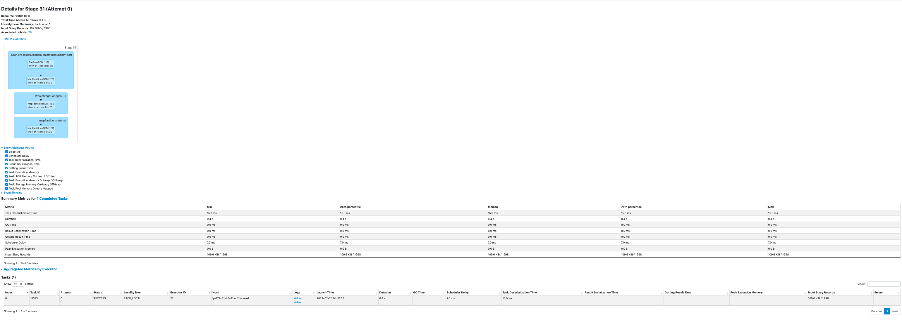
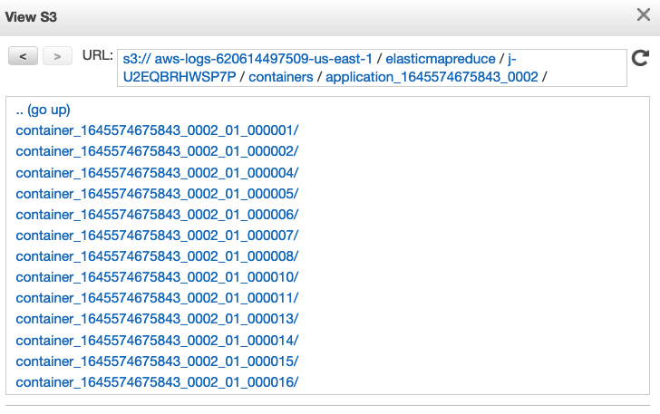

# Observability

## Debugging and monitoring

EMR provides several options to debug and monitor your Spark application. As you may have seen from some of the screenshots in this document, Spark UI is very helpful to determine your application performance and identify any potential bottlenecks. With regards to Spark UI, you have 3 options in Amazon EMR.

1. **Spark Event UI** This is the live user interface typically accessible on port 20888 (YARN Proxy). It shows the most up-to-date status of your jobs in real-time. You can go to this UI from Application Master URI in the Resource Manager UI. If you are using EMR Studio or EMR Managed Notebooks, you can navigate directly to Spark UI from your Jupyter notebook anytime after a Spark application is created using Livy. This UI is not accessible once the application finishes or if your cluster terminates.
2. **Spark History Server** SHS runs on port 18080. It shows the history of your job runs. You may also see live application status but not in real time. SHS will persist beyond your application runtime but it becomes inaccessible when your EMR cluster is terminated.
3. **EMR Persistent UI** Amazon EMR provides [Persistent User Interface for Spark](https://docs.aws.amazon.com/emr/latest/ManagementGuide/app-history-spark-UI.html). This UI is accessible for up to 30 days after your application ends even if your cluster is terminated since the logs are stored off-cluster. This option is great for performing post-mortem analysis on your applications without spending on your cluster to stay active.

Spark UI options are  also helpful to identify important metrics like shuffle reads/writes, input/output sizes, GC times, and also information like runtime Spark/Hadoop configurations, DAG, execution timeline etc. All these UIs will redirect you to live driver (cluster mode) or executor logs when you click on "stderr" or "stdout" from Tasks and Executors lists. When you encounter a task failure, if stderr of the executor does not provide adequate information, you can check the stdout logs. For additional details, see [Reading Spark UI](../../../benchmarks/Analyzing/read_spark_UI.md)



Apart from the UIs, you can also see application logs in S3 Log URI configured when you create your EMR cluster. Application Master (AM) logs can be found in `s3://LOG_PATH/CLUSTER_ID/containers/YARN_APP_ID/container_appID_attemptID_0001/`. AM container is the very first container launched in your Spark application. This is where your driver logs will be located if you ran your job in cluster deploy mode. If you ran your job in client deploy mode, driver logs are printed on to the console where you submitted your job which you can write to a file. If you used EMR Step API with client deploy mode, driver logs can be found in EMR Step's stderr. Spark executor logs are found in the same S3 location. All containers than the first container belong to the executors. S3 logs are pushed every few minutes and are not live.



If you have SSH access to the EC2 nodes of your EMR cluster, you can also see application master and executor logs stored in the local disk under /var/log/containers. You will only need to see the local logs if S3 logs are unavailable for some reason. Once the application finishes, the logs are aggregated to HDFS and are available for up to 48 hours based on the property *`yarn.log-aggregation.retain-seconds`*.

## Spark Observability Platforms

Spark JMX metrics will supply you with fine-grained details on resource usage. It goes beyond physical memory allocated and identifies the actual heap usage based on which you can tune your workloads and perform cost optimization. There are several ways to expose these JMX metrics. You can simply use a ConsoleSink which prints the metrics to console where you submit your job or CSVSink to write metrics to a file which you can use for data visualization. But these approaches are not tidy. There are more options as detailed [here](https://spark.apache.org/docs/latest/monitoring.html). You can choose an observability platform based on your requirements. Following are some example native options.

### Amazon Managed Services for Prometheus and Grafana

AWS offers [Amazon Managed Prometheus (AMP)](https://aws.amazon.com/prometheus/) which is a Prometheus-compatible monitoring and alerting service that makes it easy to monitor containerized applications and infrastructure at scale. [Amazon Managed Grafana (AMG)](https://aws.amazon.com/grafana/) is a fully managed service for open source Grafana developed in collaboration with Grafana Labs. Grafana is a popular open source analytics platform that enables you to query, visualize, alert on and understand your metrics no matter where they are stored. You can find the [deployment instructions](https://aws.amazon.com/blogs/big-data/monitor-and-optimize-analytic-workloads-on-amazon-emr-with-prometheus-and-grafana/) available to integrate Amazon EMR with OSS Prometheus and Grafana which can be extended to AMP and AMG as well. Additionally, Spark metrics can be collected using [PrometheusServlet](https://spark.apache.org/docs/latest/monitoring.html) and [prometheus/jmx_exporter](https://github.com/prometheus/jmx_exporter). However, some bootstrapping is necessary for this integration.

### Amazon Opensearch

[Amazon Opensearch](https://aws.amazon.com/blogs/opensource/introducing-opensearch/) is a community-driven open source fork of [Elasticsearch and Kibana](https://aws.amazon.com/blogs/opensource/stepping-up-for-a-truly-open-source-elasticsearch/). It is a popular service for log analytics. Logs can be indexed from S3 or local worker nodes to Amazon Opensearch either using AWS Opensearch SDK or Spark connector. These logs can then be visualized using Kibana To analyze JMX metrics and logs, you will need to develop a custom script for sinking the JMX metrics and importing logs.

Apart from native solutions, you can also use one of the AWS Partner solutions. Some of the popular choices are Splunk, Data Dog and Sumo Logic.

## Monitor cluster health

Below are the recommended steps to monitor the health of your cluster:

* **Resource Manager UI** Yarn is the resource manager of the EMR cluster. You can access the Resource Manage persistent UI to get a high level cluster metrics like Apps submitted, Apps Pending, Containers Running,Physical Mem Used % etc. You can also check Cluster node level metric, Scheduler Metrics and application level information and access the Resource Manager UI from the application tab of EMR cluster.

* **NameNode UI** NameNode is the HDFS master. You can access this UI to get information on HDFS status such as Configured Capacity, DFS Used, DFS Remaining, Live Nodes,Decommissioning Nodes. Datanode information tab tells the status of the datanode,datanode volume failures, snapshot and startup progress. The UI also gives utilities like metrics, log level information etc about the HDFS cluster. You can access the namenode UI from the application tab of EMR cluster

* **AWS Management Console** You can access cluster performance graphs from the Monitoring tab within your Amazon EMR console. The data presented falls into one of three categories: Cluster Status, Node Status, or Inputs/Outputs.

Cloudwatch Metrics [EMR cluster Metrics](https://docs.aws.amazon.com/emr/latest/ManagementGuide/UsingEMR_ViewingMetrics.html#UsingEMR_ViewingMetrics_MetricsReported) can be monitored while key metrics for lookout are YarnavailableMemoryPercentage, IsIdle, ContainerPendingRatio, CoreNodesPending and CoreNodesRunning. You can create custom [cloudwatch metrics dashboards](https://repost.aws/knowledge-center/emr-custom-metrics-cloudwatch) to get notified when certain conditions occurs.

* EMR metrics Dashboard can be created directly form the EMR monitoring tab or from the Cloudwatch by picking and choosing the EMR metric for the dashboard.

* Set alarms by specifying metrics and conditions. Search the EMR cluster that you would like to create an alarm on then select the metric of EMR. Select the statistics and time period. Then select the condition for the alarm. Select the Alarm trigger, create or choose the SNS topic, subscribe to the SNS topic. You will get an email for the confirmation, confirm the subscription of the topic. Name the alarm and select create alarm.

* [Why did my Spark job in Amazon EMR fail?](https://repost.aws/knowledge-center/emr-troubleshoot-failed-spark-jobs)

## Monitor Structured Streaming query progress

To avoid Spark Structured Streaming jobs stuck for long time, try to monitor `QueryProgressEvent` per query id, take action if no `QueryProgressEvent` for the max time to process events (e.g. 60mins).

Below is an example code of registering a listener for  `QueryProgressEvent`  which will stop the query then more than 60 minutes no query progress event .

```scala
import org.apache.log4j.Logger
import org.apache.spark.sql.SparkSession
import org.apache.spark.sql.functions._
import org.apache.spark.sql.streaming.Trigger
import org.apache.spark.sql.streaming.StreamingQueryListener
import org.apache.spark.sql.streaming.StreamingQueryListener._

import java.util.concurrent.ThreadFactory
import java.util.concurrent.atomic.AtomicInteger
import java.util.concurrent.{TimeUnit, Executors, ConcurrentHashMap, ScheduledFuture}
import scala.util.control.NonFatal

object QueryProgressListenerExample {
  lazy val logger: Logger = Logger.getLogger(QueryProgressListenerExample.getClass)
  private val queryTimerMap = new ConcurrentHashMap[String, ScheduledFuture[_]]()

  private val threadCounter = new AtomicInteger(0)
  private val threadFactory: ThreadFactory = new ThreadFactory {

    override def newThread(r: Runnable): Thread = {
      val t = new Thread(r)
      t.setDaemon(true) // Set the thread as a daemon thread
      t.setName(s"QueryProgressListenerThread-${threadCounter.getAndIncrement()}")
      t
    }

  }
  
  private val myListener = new StreamingQueryListener {
    override def onQueryStarted(event: QueryStartedEvent): Unit = {
      startTimer(event.id.toString)
    }

    override def onQueryProgress(event: QueryProgressEvent): Unit = {
      val queryId = event.progress.id.toString
      val scheduledTask = queryTimerMap.get(queryId)
      if (scheduledTask != null) {
        logger.info(s"Resetting the timeout for stream query ${event.progress.id}")
        resetTimer(queryId, scheduledTask)
      }
    }

    override def onQueryTerminated(event: QueryTerminatedEvent): Unit = {
      cancelTimer(event.id.toString)
    }
  }

  private def startTimer(queryId: String): Unit = {
    val executor = Executors.newSingleThreadScheduledExecutor(threadFactory)
    val scheduledTask = executor.schedule(new Runnable {
      override def run(): Unit = {
        try {
          val query = spark.streams.get(queryId)
          logger.info(s"Query $queryId timed out after 60 minutes. Stopping the query.")
          query.stop()
        } catch {
          case NonFatal(e) => logger.error(s"Error stopping query $queryId: ${e.getMessage}", e)
        }
      }
    },
      60, 
      TimeUnit.MINUTES)
    queryTimerMap.put(queryId, scheduledTask)
  }

  private def resetTimer(queryId: String, scheduledTask: ScheduledFuture[_]): Unit = {
    scheduledTask.cancel(false)
    startTimer(queryId)
  }

  private def cancelTimer(queryId: String): Unit = {
    val scheduledTask = queryTimerMap.remove(queryId)
    if (scheduledTask != null) {
      scheduledTask.cancel(true)
    }
  }

  private lazy val spark: SparkSession = SparkSession.builder()
    .appName("QueryProgressListenerExample")
    .master("local[*]")
    .getOrCreate()

  // run `nc -lk 9999` in terminal first
  def main(args: Array[String]): Unit = {
    spark.streams.addListener(myListener)

    // Create a streaming DataFrame
    val lines = spark.readStream
      .format("socket")
      .option("host", "localhost")
      .option("port", 9999)
      .load()
      .select(expr("value as word"))
    
    val query = lines
      .writeStream
      .outputMode("append")
      .format("console")
      .trigger(Trigger.ProcessingTime("15 seconds"))
      .start()

    query.awaitTermination()

  }
}
```
