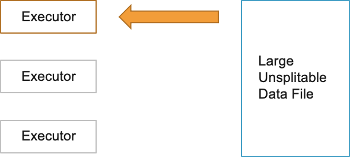
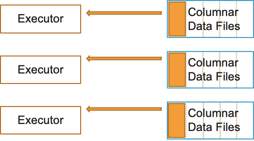
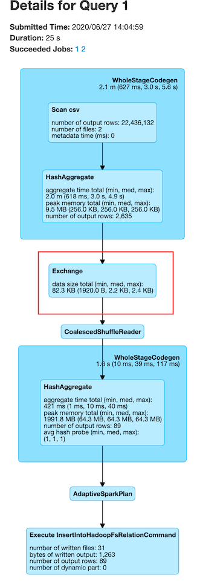
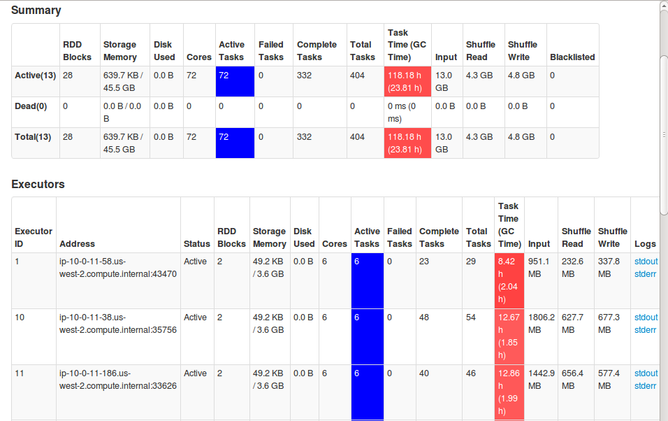
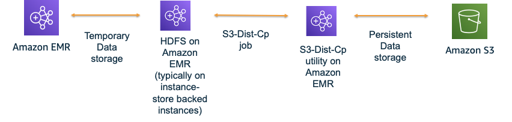
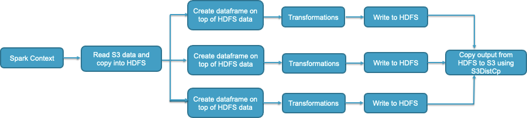
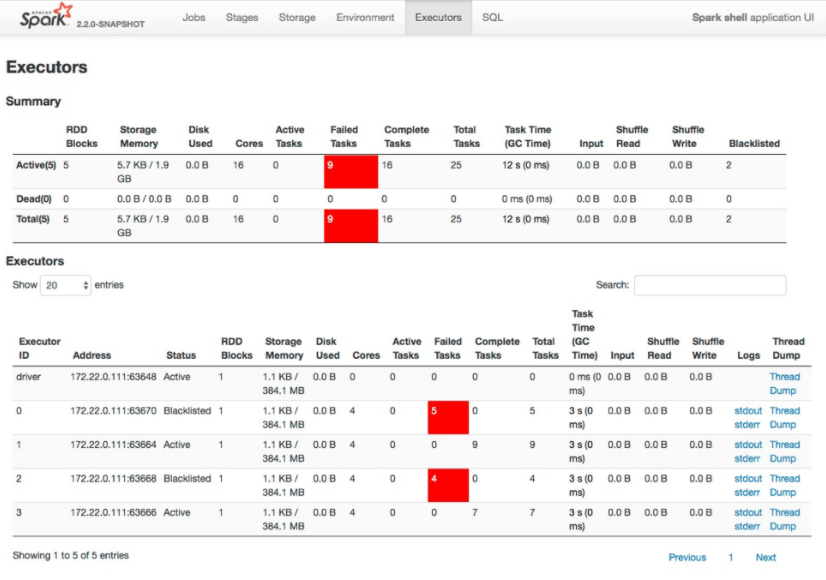

# Performance

## Use right file formats and compression type

Right file formats must be used for optimal performance. Avoid legacy file formats like CSV, JSON, text files etc. since the read/write performance will much slower. It is highly recommended that you use columnar file formats like Parquet and ORC. For Spark, Parquet file format would be the best choice considering performance benefits and wider community support.

When writing Parquet files to S3, EMR Spark will use [EMRFSOutputCommitter](https://docs.aws.amazon.com/emr/latest/ReleaseGuide/emr-spark-s3-optimized-committer.html) which is an optimized file committer that is more performant and resilient than FileOutputCommitter. Using Parquet file format is great for schema evolution, filter push downs and integration with applications offering transactional support like Apache Hudi, Apache Iceberg etc.

Also, it is recommended to use an optimal compression format. Avoid using unsplittable compression formats like GZIP. Since they are not splittable, when a Spark task processes a large GZIP compressed file, it will lead to executor OOM errors.



Use splittable compression formats like BZ2, LZO etc. Parquet uses Snappy compression by default. ORC uses ZLIB compression by default. Both compression types are good choices and you can continue to use the defaults.



You can also apply columnar encryption on Parquet files using KMS:

```scala
sc.hadoopConfiguration.set("parquet.encryption.kms.client.class" ,"org.apache.parquet.crypto.keytools.mocks.InMemoryKMS")
// Explicit master keys (base64 encoded) - required only for mock InMemoryKMS
sc.hadoopConfiguration.set("parquet.encryption.key.list" ,"keyA:AAECAwQFBgcICQoLDA0ODw ,  keyB:AAECAAECAAECAAECAAECAA")
// Activate Parquet encryption, driven by Hadoop properties
sc.hadoopConfiguration.set("parquet.crypto.factory.class" ,"org.apache.parquet.crypto.keytools.PropertiesDrivenCryptoFactory")
// Write encrypted dataframe files.
// Column "square" will be protected with master key "keyA".
// Parquet file footers will be protected with master key "keyB"
squaresDF.write.option("parquet.encryption.column.keys" , "keyA:square").option("parquet.encryption.footer.key" , "keyB").parquet("/path/to/table.parquet.encrypted")
// Read encrypted dataframe files
val df2 = spark.read.parquet("/path/to/table.parquet.encrypted")
```

## Data Partitioning

Partitioning your data or tables is very important if you are going to run your code or queries with filter conditions. Partitioning helps arrange your data files into different S3 prefixes or HDFS folders based on the partition key. It helps minimize read/write access footprint i.e., you will be able to read files only from the partition folder specified in your where clause - thus avoiding a costly full table scan. Partitioning can also help if your data ingestion is incremental in nature. However, partitioning can reduce read throughput when you perform full table scans.

You can choose one or more partition fields from your dataset or table columns based on:

* Query pattern. i.e., if you find queries use one or more columns frequently in the filter conditions more so than other columns, it is recommended to consider leveraging them as partitioning field.
* Ingestion pattern. i.e., if you are loading data into your table based on a fixed schedule (eg: once everyday) and you want to avoid re-writing historical data, you can partition your data based on date field (typically in YYYY-MM-DD format or YYYY/MM/DD nested partitions).
* Cardinality of the partitioning column. For partitioning, cardinality should not be too high. For example, fields like employee_id or uuid should not be chosen as partition fields.
* File sizes per partition. It is recommended that your individual file sizes within each partition are >=128 MB.

The number of shuffle partitions will determine the number of output files per table partition.

```scala
df.repartition(400).write.partitionBy("datecol").parquet("s3://bucket/output/")
```

The above code will create maximum of 400 files per datecol partition. Repartition API alters the number of shuffle partitions dynamically. PartitionBy API specifies the partition column(s) of the table. You can also control the number of shuffle partitions with the Spark property *`spark.sql.shuffle.partitions`*. You can use repartition API to control the output file size i.e., for merging small files. For splitting large files, you can use the property *`spark.sql.files.maxPartitionBytes`*.

Partitioning ensures that [dynamic partition pruning](https://docs.aws.amazon.com/emr/latest/ReleaseGuide/emr-spark-performance.html#emr-spark-performance-dynamic) takes place during reads and writes. Pruning makes sure that only necessary partition(s) are read from S3 or HDFS. Spark optimized logical plan or DAG can be studied to ensure that the partition filters are pushed down while reading and writing to partitioned tables from Spark.

For example, following query will push partition filters for better performance. `l_shipdate` and `l_shipmode` are partition fields of the table "testdb.lineitem_shipmodesuppkey_part".

```scala
val df = spark.sql("select count(*) from testdb.lineitem_shipmodesuppkey_part where l_shipdate='1993-12-03' and l_shipmode='SHIP'")

df.queryExecution.toString
```

Printing the query execution plan where we can see pushed filters for the two partition fields in where clause:

```c
== Physical Plan ==
AdaptiveSparkPlan isFinalPlan=true
+- == Final Plan ==
   *(2) HashAggregate(keys=[], functions=[count(1)], output=[count(1)#320])
   +- ShuffleQueryStage 0
      +- Exchange SinglePartition, ENSURE_REQUIREMENTS, [id=#198]
         +- *(1) HashAggregate(keys=[], functions=[partial_count(1)], output=[count#318L])
            +- *(1) Project
               +- *(1) ColumnarToRow
                  +- FileScan orc testdb.lineitem_shipmodesuppkey_part[l_shipdate#313,l_shipmode#314] Batched: true, DataFilters: [], Format: ORC, Location: InMemoryFileIndex[s3://vasveena-test-vanguard/bigtpcparq/lineitem_shipmodesuppkey_part/l_shipdate..., PartitionFilters: [isnotnull(l_shipdate#313), isnotnull(l_shipmode#314), (l_shipdate#313 = 1993-12-03), (l_shipmode..., PushedFilters: [], ReadSchema: struct<>
+- == Initial Plan ==
   HashAggregate(keys=[], functions=[count(1)], output=[count(1)#320])
   +- Exchange SinglePartition, ENSURE_REQUIREMENTS, [id=#179]
      +- HashAggregate(keys=[], functions=[partial_count(1)], output=[count#318L])
         +- Project
            +- FileScan orc testdb.lineitem_shipmodesuppkey_part[l_shipdate#313,l_shipmode#314] Batched: true, DataFilters: [], Format: ORC, Location: InMemoryFileIndex[s3://vasveena-test-vanguard/bigtpcparq/lineitem_shipmodesuppkey_part/l_shipdate..., PartitionFilters: [isnotnull(l_shipdate#313), isnotnull(l_shipmode#314), (l_shipdate#313 = 1993-12-03), (l_shipmode..., PushedFilters: [], ReadSchema: struct<>
```

## Maximize cluster utilization

Amazon EMR configures Spark defaults during the cluster launch based on your cluster's infrastructure (number of instances and instance types). EMR configured defaults are generally sufficient for majority of the workloads. However, if it is not meeting your performance expectations, it is recommended to tune the Spark driver/executor configurations and see if you can achieve better performance. Following are the general recommendations on driver/executor configuration tuning.

For a starting point, generally, it is advisable to set *`spark.executor.cores`* to 4 or 5 and tune *`spark.executor.memory`* around this value. Also, when you calculate the *`spark.executor.memory`*, you need to account for the executor overhead which is set to 0.1875 by default (i.e., 18.75% of *`spark.executor.memory`*). For example, for a 2 worker node r4.8xlarge cluster, following will be the configurations.

Based on [Task Configurations](https://docs.aws.amazon.com/emr/latest/ReleaseGuide/emr-hadoop-task-config.html) r4.8xlarge node has YARN memory of 241664 MB (based on the value of *`yarn.nodemanager.resource.memory-mb`*). The instance has 32 vCores. If we set *`spark.executor.cores`* as 4, we can run 8 executors at a time. So, the configurations will be following.

```python
spark.executor.cores = 4

spark.executor.memory + (spark.executor.memory * spark.yarn.executor.memoryOverheadFactor) = (241664 MB / 8) = 30208 MB

spark.executor.memory = 24544 MB (substituting default spark.yarn.executor.memoryOverheadFactor = 0.1875)
```

If you have a cluster of 10 r4.8xlarge nodes, then totally, 80 executors can run with 24544 MB memory and 4 vCores each.

Please note that some of the jobs benefit from bigger executor JVMs (with more cores assigned). Some jobs benefit from smaller but more number of executors. So, you can use the above formula to arrive at optimal values for your application. EMR Spark has a feature called [maximizeResourceAllocation](https://docs.aws.amazon.com/emr/latest/ReleaseGuide/emr-spark-configure.html#emr-spark-maximizeresourceallocation). Setting this property to "true" will lead to one fat executor JVM per node that uses all of the available cores in that instance. However, please note that this setting may not prove to be optimal for many different types of workloads. It is not recommended to enable this property if your cluster is a shared cluster with multiple parallel applications or if your cluster has HBase installed.

After configuring the values, run a sample job and monitor the Resource Manager UI, ContainerPendingRatio and YARNMemoryAvailablePcnt Cloudwatch metrics to verify that the vCores and YARN memory are being fully utilized. [Spark JMX metrics](https://spark.apache.org/docs/latest/monitoring.html) provides JMX level visibility which is the best way to determine resource utilization.

While using instance fleets, it is generally advisable to request worker nodes with similar vCore:memory ratio (for eg: requesting r4, r5 and r6gs in the same fleet). However, in some cases, in order to ensure capacity, you may have to diversify the instance type families as well in your request (for eg: requesting c5s, m5s and r5s within the same fleet). EMR will configure driver/executor configurations based on minimum of (master, core, task) OS resources. Generally, with variable fleets, it is best to use the default configurations. However, if needed, you can fine tune the driver and executor configurations based on above principles. But in this case, you will need to take YARN memory and vCores of all the different instance families into consideration.

To provide an example, lets say you have requested a cluster with a core fleet containing following instances: r5.4xlarge, r5.12xlarge, c5.4xlarge, c5.12xlarge, m5.4xlarge, m5.12xlarge. All the 4xlarge instances in this fleet have 16 vCores and 12xlarge instances have 48 vCores. But the OS/YARN memory of these instances are different.

| Instance | YARN memory in MB |
|----------------|------------|
| c5.4xlarge | 24576 |
| c5.12xlarge | 90112 |
| m5.4xlarge | 57344 |
| m5.12xlarge | 188416 |
| r5.4xlarge | 122880 |
| r5.12xlarge | 385024 |

Now, let us calculate executor memory after setting *`spark.executor.cores`* = 4 by starting with smallest YARN memory from the above table (c5.4xlarge) and dividing the YARN memory by *`spark.executor.cores`* to get the total container size -> 24576 / 4 = 6144.

*`spark.executor.memory`* = 6144 - (6144 * 0.1875) = 4992 MB

Using default Spark implementation, with the above math, if you set 4992 MB as executor memory, then in r5.12xlarge instances in your fleet, the resources will be under utilized even though you will not see the evidence of it from the Resource Manager UI. With the above configs, 77 executors can run in r5.12xlarge but there are only 48 vCores. So, even though 77 executors will have YARN resources allocated, they are only able to run 48 tasks at any given time which could be considered a wastage of memory resources.

In order to alleviate this issue, from EMR 5.32 and EMR 6.2, there is a feature called Heterogenous Executors which dynamically calculates executor sizes. It is defined by the property *`spark.yarn.heterogeneousExecutors.enabled`* and is set to "true" by default. Further, you will be able to control the maximum resources allocated to each executor with properties *`spark.executor.maxMemory`* and *`spark.executor.maxCores`*. Minimum resources are calculated with *`spark.executor.cores`* and *`spark.executor.memory`*. For uniform instance groups or for flexible fleets with instance types having similar vCore:memory ratio, you can try setting *`spark.yarn.heterogeneousExecutors.enabled`* to "false" and see if you get better performance.

Similar to executors, driver memory and vCores can be calculated as well. The default memory overhead for driver container is 10% of driver memory. If you are using cluster deploy mode, then the driver resources will be allocated from one of the worker nodes. So, based on the driver memory/core configurations, it will take away some of the YARN resources that could be used for launching executors - which shouldn't matter that much if your cluster is not very small. If you are using client deploy mode and submitting jobs from EMR master node or a remote server, then the driver resources are taken from the master node or remote server and your driver will not compete for YARN resources used by executor JVMs. The default driver memory (without maximizeResourceAllocation) is 2 GB. You can increase driver memory or cores for the following conditions:

1. Your cluster size is very large and there are many executors (1000+) that need to send heartbeats to driver.
2. Your result size retrieved during Spark actions such as collect() or take() is very large. For this, you will also need to tune *`spark.driver.maxResultSize`*.

You can use smaller driver memory (or use the default *`spark.driver.memory`*) if you are running multiple jobs in parallel.

Now, coming to *`spark.sql.shuffle.partitions`* for Dataframes and Datasets and *`spark.default.parallelism`* for RDDs, it is recommended to set this value to total number of vCores in your cluster or a multiple of that value. For example, a 10 core node r4.8xlarge cluster can accommodate 320 vCores in total. Hence, you can set shuffle partitions or parallelism to 320 or a multiple of 320 such that each vCore handles a single Spark partition at any given time. It is not recommended to set this value too high or too low. Generally 1 or 2x the total number of vCores is optimal. Generally, each Spark shuffle partition should process ~128 MB of data. This can be determined by looking at the execution plan from the Spark UI.



From the above image, you can see that the average size in exchange (shuffle) is 2.2 KB which means we can try to reduce *`spark.sql.shuffle.partitions`* to increase partition size during the exchange.

Apart from this, if you want to use tools to receive tuning suggestions, consider using [Sparklens and Dr. Elephant](https://aws.amazon.com/blogs/big-data/tune-hadoop-and-spark-performance-with-dr-elephant-and-sparklens-on-amazon-emr/) with Amazon EMR which will provide tuning suggestions based on metrics collected during the runtime of your application.

## Use Kryo serializer by registering custom classes especially for Dataset schemas

Spark uses Java Serializer by default. From Spark 2.0+, Spark internally uses Kryo Serializer when shuffling RDDs with simple types, arrays of simple types, or string type. It is highly recommended that you use Kryo Serializer and also register your classes in the application.

```c
val spark = SparkSession
              .builder
              .appName("my spark application name")
              .config(getConfig)
              .config("spark.serializer", "org.apache.spark.serializer.KryoSerializer")
              // use this if you need to increment Kryo buffer size. Default 64k
              .config("spark.kryoserializer.buffer", "1024k")
              // use this if you need to increment Kryo buffer max size. Default 64m
              .config("spark.kryoserializer.buffer.max", "1024m")
              /*
               * Use this if you need to register all Kryo required classes.
               * If it is false, you do not need register any class for Kryo, 
               * but it will increase your data size when the data is serializing.
              */
              .config("spark.kryo.registrationRequired", "true")
              .getOrCreate
```

If you do not specify classesToRegister, then there will be a Kryo conversion overhead which could impact performance. Hence, it is recommended to register Kryo classes in your application. Especially, if you are using Datasets, consider registering your Dataset schema classes along with some classes used by Spark internally based on the data types and structures used in your program. An example provided below:

```scala
val conf = new SparkConf()
conf.registerKryoClasses(
  Array(
    classOf[org.myPackage.FlightDataset],
    classOf[org.myPackage.BookingDataset],
    classOf[scala.collection.mutable.WrappedArray.ofRef[_]],
    classOf[org.apache.spark.sql.types.StructType],
    classOf[Array[org.apache.spark.sql.types.StructType]],
    classOf[org.apache.spark.sql.types.StructField],
    classOf[Array[org.apache.spark.sql.types.StructField]],
    Class.forName("org.apache.spark.sql.types.StringType$"),
    Class.forName("org.apache.spark.sql.types.LongType$"),
    Class.forName("org.apache.spark.sql.types.BooleanType$"),
    Class.forName("org.apache.spark.sql.types.DoubleType$"),
    classOf[org.apache.spark.sql.types.Metadata],
    classOf[org.apache.spark.sql.types.ArrayType],
    Class.forName("org.apache.spark.sql.execution.joins.UnsafeHashedRelation"),
    classOf[org.apache.spark.sql.catalyst.InternalRow],
    classOf[Array[org.apache.spark.sql.catalyst.InternalRow]],
    classOf[org.apache.spark.sql.catalyst.expressions.UnsafeRow],
    Class.forName("org.apache.spark.sql.execution.joins.LongHashedRelation"),
    Class.forName("org.apache.spark.sql.execution.joins.LongToUnsafeRowMap"),
    classOf[org.apache.spark.util.collection.BitSet],
    classOf[org.apache.spark.sql.types.DataType],
    classOf[Array[org.apache.spark.sql.types.DataType]],
    Class.forName("org.apache.spark.sql.types.NullType$"),
    Class.forName("org.apache.spark.sql.types.IntegerType$"),
    Class.forName("org.apache.spark.sql.types.TimestampType$"),
    Class.forName("org.apache.spark.sql.execution.datasources.FileFormatWriter$WriteTaskResult"),
    Class.forName("org.apache.spark.internal.io.FileCommitProtocol$TaskCommitMessage"),
    Class.forName("scala.collection.immutable.Set$EmptySet$"),
    Class.forName("scala.reflect.ClassTag$$anon$1"),
    Class.forName("java.lang.Class")
  )
)
```

You can also optionally fine tune the following Kryo configs :

* *`spark.kryo.unsafe`* - Set to false for faster serialization. This is not unsafer for same platforms but should not be used if your EMR cluster fleets use a mix of different processors (for eg: AMD, Graviton and Intel types within the same fleet).
* *`spark.kryoserializer.buffer.max`* - Maximum size of Kryo buffer. Default is 64m. Recommended to increase this property upto 1024m but the value should be below 2048m.
* *`spark.kryoserializer.buffer`* - Initial size of Kryo serialization buffer. Default is 64k. Recommended to increase up to 1024k.

## Tune Java Garbage Collector

By default, EMR Spark uses Parallel Garbage Collector which works well in most cases. You can change the GC to G1GC if your GC cycles are slow since G1GC may provide better performance in some cases specifically by reducing GC pause times. Also, since G1GC is the default garbage collector since Java 9, you may want to switch to G1GC for forward compatibility.

Following is the spark configuration:

```json
[
  {
    "classification": "spark-defaults",
    "properties": {
      "spark.executor.extraJavaOptions": "-XX:+UseG1GC -XX:+UnlockDiagnosticVMOptions -XX:+G1SummarizeConcMark -XX:InitiatingHeapOccupancyPercent=35 -verbose:gc -XX:+PrintGCDetails -XX:+PrintGCDateStamps -XX:OnOutOfMemoryError='kill -9 %p'",
      "spark.driver.extraJavaOptions": "-XX:+UseG1GC -XX:+UnlockDiagnosticVMOptions -XX:+G1SummarizeConcMark -XX:InitiatingHeapOccupancyPercent=35 -verbose:gc -XX:+PrintGCDetails -XX:+PrintGCDateStamps -XX:OnOutOfMemoryError='kill -9 %p'"
    },
    "configurations": []
  }
]
```

You can also tune the GC parameters for better GC performance. You can see the comprehensive list of parameters [here](https://www.oracle.com/technical-resources/articles/java/g1gc.html) for G1GC and [here](https://docs.oracle.com/en/java/javase/11/gctuning/parallel-collector1.html) for ParallelGC. Some useful ones are below:

```
-XX:ConcGCThreads=n
-XX:ParallelGCThreads=n
-XX:InitiatingHeapOccupancyPercent=45
-XX:MaxGCPauseMillis=200
```

You can monitor GC performance using Spark UI. The GC time should be ideally `<=` 1% of total task runtime. If not, consider tuning the GC settings or experiment with larger executor sizes. For example, we see below in the Spark UI that GC takes almost 25% of task runtime which is indicative of poor GC performance.



## Use optimal APIs wherever possible

When using Spark APIs, try to use the optimal ones if your use case permits. Following are a few examples.

### repartition vs coalesce

Both repartition and coalesce are used for changing the number of shuffle partitions dynamically. Repartition is used for both increasing and decreasing the shuffle partitions whereas coalesce is used for only decreasing the number of shuffle partitions. If your goal is to decrease the number of shuffle partitions, consider using coalesce instead of repartition. Repartition triggers a full shuffle but coalesce triggers only a partial shuffle and thus minimizes the amount of data shuffled by keeping a few nodes as solely receivers of the shuffle data.

```
df.coalesce(1) // instead of df.repartition(1)
```

But please note that when you coalesce (or repartition) to a very small number, your JVM will process a lot of data which can lead to OOM issues or disk space issues due to shuffle spill.

### groupByKey vs reduceByKey

Use reduceByKey instead of groupByKey wherever possible. With groupByKey, data will be transferred over the network and collected on the reduced workers. This can lead to OOMs since all data is sent across the network. Whereas, with reduceByKey, data is combined at partition-level, with only one output for one key at each partition to send over the network.

### orderBy vs sortBy or sortWithinPartitions

orderBy performs global sorting. i.e., all the data is sorted using a single JVM. Whereas, sortBy or sortWithinPartitions performs local sorting i.e., data is sorted within each partition but it does not preserve global ordering. Use sortBy or sortWithinPartitions if global ordering is not necessary. Try to avoid orderBy clause especially during writes.

## For workloads with predictable pattern, consider disabling dynamic allocation

Dynamic allocation is enabled in EMR by default. It is a great feature for following cases:

1. Workloads processing variable amount of data  
2. When your cluster uses autoscaling
3. Dynamic processing requirements or unpredictable workload patterns
4. Streaming and ad-hoc workloads
5. When your cluster runs multiple concurrent applications
6. Your cluster is long-running

The above cases would cover at least 95% of the workloads run by our customers today. However, there are a very few cases where:

1. Workloads have a very predicatable pattern
2. Amount of data processed is predictable and consistent throughout the application
3. Cluster runs Spark application in batch mode
4. Clusters are transient and are of fixed size (no autoscaling)
5. Application processing is relatively uniform. Workload is not spikey in nature.

For example, you may have a use case where you are collecting weather information of certain geo regions twice a day. In this case, your data load will be predictable and you may run two batch jobs per day - one at BOD and one at EOD. Also, you may use two transient EMR clusters to process these two jobs.  

For such use cases, you can consider disabling dynamic allocation along with setting the precise  number and size of executors and cores like below.

```json
[
  {
    "classification": "spark-defaults",
    "properties": {
      "spark.dynamicAllocation.enabled": "false",
      "spark.executor.instances": "12",
      "spark.executor.memory": "8G",
      "spark.executor.cores": "4"
    },
    "configurations": []
  }
]
```

Please note that if you are running more than one application at a time, you may need to tweak the Spark executor configurations to allocate resources to them. By disabling dynamic allocation, Spark driver or YARN Application Master does not have to calculate resource requirements at runtime or collect certain heuristics. This may save anywhere from 5-10% of job execution time. However, you will need to carefully plan Spark executor configurations in order to ensure that your entire cluster is being utilized. If you choose to do this, then it is better to disable autoscaling since your cluster only runs a fixed number of executors at any given time unless your cluster runs other applications as well.

However, only consider this option if your workloads meet the above criteria since otherwise your jobs may fail due to lack of resources or you may end up wasting your cluster resources.

## Leverage HDFS as temporary storage for I/O intensive workloads

Many EMR users directly read and write data to S3. This is generally suited for most type of use cases. However, for I/O intensive and SLA sensitive workflows, this approach may prove to be slow - especially during heavy writes.


For I/O intensive workloads or for workloads where the intermediate data from transformations is much larger than the final output, you can leverage HDFS as temporary storage and then use S3DistCp to copy the data into final location once your application is finished. For example, for a fraud detection use case, you could be performing transforms on TBs of data but your final output report may only be a few KBs. In such cases, leveraging HDFS will give you better performance and will also help you avoid S3 throttling errors.



Following is an example where we leverage HDFS for intermediate results. A Spark context could be shared between multiple workflows, wherein, each workflow comprises of multiple transformations. After all transformations are complete, each workflow would write the output to an sHDFS location. Once all workflows are complete, you can save the final output to S3 either using S3DistCp or simple S3 boto3 client determined by the number of files and the output size.



However, while using this architecture, please make sure that you are sizing your HDFS properly to prevent job failures due to lack of storage space when the job is running. Refer to best practice BP 2.13 in Reliability section. Also, checkpoint your data frequently to S3 using S3DistCp or boto to prevent data loss due to unexpected cluster terminations.

Even if you are using S3 directly to store your data, if your workloads are shuffle intensive, use storage optimized instances or SSD/NVMe based storage (for example: r5d’s and r6gd’s instead of r5s and r6g’s). This is because when dynamic allocation is turned on, Spark will use external shuffle service that spills data to local disks when the executor JVM cannot hold any more shuffle data. This process is a very I/O intensive one and will benefit from instance types that offer high disk throughput.

## Spark speculation with EMRFS

In Hadoop/Spark, speculative execution is a concept where a slower task will be launched in parallel on another node using a different JVM (based on resource availability). Whichever task completes first (original or speculated task), will write the output to S3. This works well for HDFS based writes. However, for EMRFS, turning on spark.speculation may lead to serious issues such as data loss or duplicate data. By default, *`spark.speculation`* is turned off. Only enable *`spark.speculation`* if you are doing one of the following.

* Writing Parquet files to S3 using EMRFSOutputCommitter
* Using HDFS as temporary storage in an understanding that final output will be written to S3 using S3DistCp
* Using HDFS as storage (not recommended)

Do not enable *`spark.speculation`* if none of the above criteria is met since it will lead to incorrect or missing or duplicate data.

You can consider enabling *`spark.speculation`* especially while running workloads on very large clusters, provided you are performing one of the above actions. This is because, due to some hardware or software issues, one node out of 500+ nodes could be slower and may run tasks slowly even if data size being processed is the same as other tasks. Chances of this happening are higher in larger clusters. In that case, *`spark.speculation`* will help relaunch those slow tasks on other nodes providing SLA consistency (as long as the above criteria are met).

You can set *`spark.speculation`* to true in spark-defaults or pass it as a command line option (--conf *`spark.speculation`*="true").

```json
[
  {
    "classification": "spark-defaults",
    "properties": {
      "spark.speculation": "true"
    },
    "configurations": []
  }
]
```

Please do not enable *`spark.speculation`* if you are writing any non-Parquet files to S3 or if you are writing Parquet files to S3 without the default EMRFSOutputCommitter.

## Use DataFrames wherever possible

We must use Dataframes and Datasets instead of RDDs since Dataframes and Datasets have several enhancements over RDDs like catalyst optimizer and adaptive query execution. But between Datasets and Dataframes, Dataframes perform certain optimizations during DAG creation and execution. These optimizations can be identified by inspecting the query plan. For example -

* Datasets perform many serializations and deserializations that Dataframes tries to skip.
* Dataframes perform more push downs when compared to Datasets. For example, if there is a filter operation, it is applied early on in the query plan in Dataframes so that the data transfer in-memory is reduced.
* Dataframes avoid unnecessary exchanges. For example, distinct after join will be accomplished with two exchanges in Datasets but with only one exchange in Dataframes.

Only downside to using dataframes instead of datasets is that, with dataset, you generally define schema in a class.

```scala
case class DeviceIoTData (
  battery_level: Long,
  c02_level: Long,
  cca2: String,
  cca3: String,
  cn: String,
  device_id: Long,
  device_name: String,
  humidity: Long,
  ip: String,
  latitude: Double,
  longitude: Double,
  scale: String,
  temp: Long,
  timestamp: Long
)
```

This provides you type-safety. When there are changes to your schema, it can be consolidated and tracked within a single class. This can be considered as the industry standard. While using Spark Dataframes, you can achieve something similar by maintaining the table columns in a list and fetching from that list dynamically from your code. But this requires some additional coding effort.

## Consider Spark Blacklisting for large clusters

Spark provides blacklisting feature which allows you to blacklist an executor or even an entire node if one or more tasks fail on the same node or executor for more than configured number of times. Spark blacklisting properties may prove to be very useful especially for very large clusters (100+ nodes) where you may rarely encounter an impaired node. We discussed this issue briefly in BPs 5.1.13 and 5.1.14.

This blacklisting is enabled by default in Amazon EMR with the *`spark.blacklist.decommissioning.enabled`* property set to true. You can control the time for which the node is blacklisted using *`spark.blacklist.decommissioning.timeout property`*, which is set to 1 hour by default, equal to the default value for *`yarn.resourcemanager.nodemanager-graceful-decommission-timeout-secs`*. It is recommended to set *`spark.blacklist.decommissioning.timeout`* to a value equal to or greater than *`yarn.resourcemanager.nodemanager-graceful-decommission-timeout-secs`* to make sure that Amazon EMR blacklists the node for the entire decommissioning period.

Following are some *experimental* blacklisting properties.

* `spark.blacklist.task.maxTaskAttemptsPerExecutor` determines the number of times a unit task can be retried on one executor before it is blacklisted for that task. Defaults to 2.
* `spark.blacklist.task.maxTaskAttemptsPerNode` determines the number of times a unit task can be retried on one worker node before the entire node is blacklisted for that task. Defaults to 2.
* `spark.blacklist.stage.maxFailedTasksPerExecutor` is same as *`spark.blacklist.task.maxTaskAttemptsPerExecutor`* but the executor is blacklisted for the entire stage.
* `spark.blacklist.stage.maxFailedExecutorsPerNode` determines how many different executors are marked as blacklisted for a given stage, before the entire worker node is marked as blacklisted for the stage. Defaults to 2.
* `spark.blacklist.application.maxFailedTasksPerExecutor` is same as *`spark.blacklist.task.maxTaskAttemptsPerExecutor`* but the executor is blacklisted for the entire application.
* `spark.blacklist.application.maxFailedExecutorsPerNode` is same as *`spark.blacklist.stage.maxFailedExecutorsPerNode`* but the worker node is blacklisted for the entire application.
* `spark.blacklist.killBlacklistedExecutors` when set to true will kill the executors when they are blacklisted for the entire application or during a fetch failure. If node blacklisting properties are used, it will kill all the executors of a blacklisted node. It defaults to false. Use with caution since it is susceptible to unexpected behavior due to red herring.
* `spark.blacklist.application.fetchFailure.enabled` when set to true will blacklist the executor immediately when a fetch failure happens. If external shuffle service is enabled, then the whole node will be blacklisted. This setting is aggressive. Fetch failures usually happen due to a rare occurrence of impaired hardware but may happen due to other reasons as well. Use with caution since it is susceptible to unexpected behavior due to red herring.

The node blacklisting configurations are helpful for the rarely impaired hardware case we discussed earlier. For example, following configurations can be set to ensure that if a task fails more than 2 times in an executor and if more than two executors fail in a particular worker or if you encounter a single fetch failure, then the executor and worker are blacklisted and subsequently removed from your application.

```json
[
  {
    "classification": "spark-defaults",
    "properties": {
      "spark.blacklist.killBlacklistedExecutors": "true",
      "spark.blacklist.application.fetchFailure.enabled": "true"
    },
    "configurations": []
  }
]
```

You will be able to distinguish blacklisted executors and nodes from the Spark UI and from the Spark driver logs.



When a stage fails because of fetch failures from a node being decommissioned, by default, Amazon EMR does not count the stage failure toward the maximum number of failures allowed for a stage as set by *`spark.stage.maxConsecutiveAttempts`*. This is determined by the setting *`spark.stage.attempt.ignoreOnDecommissionFetchFailure`* being set to true. This prevents a job from failing if a stage fails multiple times because of node failures for valid reasons such as a manual resize, an automatic scaling event, or Spot instance interruptions.

## How the number of partitions are determined when reading a raw file

When reading a raw file, that can be a text file, csv, etc. the count behind the number of partitions created from Spark depends from many variables as the methods used to read the file, the default parallelism and so on. Following an overview of how these factors are related between each other so to better understand how files are processed.

Here a brief summary of relationship between core nodes - executors - tasks:

* each File is composed by blocks that will be parsed according to the InputFormat corresponding to the specific data format, and generally combines several blocks into one input slice, called InputSplit
* InputSplit and Task are one-to-one correspondence relationship
* each of these specific Tasks will be assigned to one executor of the nodes on the cluster
* each node can have one or more Executors, depending on the node resources and executor settings
* each Executor consists of cores and memory whose default is based on the node type. Each executor can only execute one task at time.

So based on that, the number of threads/tasks will be based on the number of partitions while reading.

Please note that the S3 connector takes some configuration option (e.g. s3a: fs.s3a.block.size) to simulate blocks in Hadoop services, but the concept of blocks in S3 does not really exists. Unlike HDFS that is an implementation of the Hadoop FileSystem API, which models POSIX file system behavior, EMRFS is an object store, not a file system. For more information, see Hadoop documentation for [Object Stores vs. Filesystems](https://hadoop.apache.org/docs/stable2/hadoop-project-dist/hadoop-common/filesystem/introduction.html#Object_Stores_vs._Filesystems).

Now, there are several factors that dictate how a dataset or file is mapped to a partition. First is the method used to read the file (e.g. text file), that changes if you're working with rdds or dataframes:

```
sc.textFile(...) returns a RDD[String]

   textFile(String path, int minPartitions)

   Read a text file from HDFS, a local file system (available on all nodes), or any Hadoop-supported 
   file system URI, and return it as an RDD of Strings.
```

```
spark.read.text(...) returns a DataSet[Row] or a DataFrame

   text(String path)

   Loads text files and returns a DataFrame whose schema starts with a string column named "value",
   and followed by partitioned columns if there are any.
```

### Spark Core API (RDDs)

When using *`sc.textFile`* Spark uses the block size set for the filesysytem protocol it's reading from, to calculate the number of partitions in input:

[SparkContext.scala](https://github.com/apache/spark/blob/v2.4.8/core/src/main/scala/org/apache/spark/SparkContext.scala#L819-L832)

```scala
  /* Read a text file from HDFS, a local file system (available on all nodes), or any
   * Hadoop-supported file system URI, and return it as an RDD of Strings.
   * @param path path to the text file on a supported file system
   * @param minPartitions suggested minimum number of partitions for the resulting RDD
   * @return RDD of lines of the text file
   */
  def textFile(
      path: String,
      minPartitions: Int = defaultMinPartitions): RDD[String] = withScope {
    assertNotStopped()
    hadoopFile(path, classOf[TextInputFormat], classOf[LongWritable], classOf[Text],
      minPartitions).map(pair => pair._2.toString).setName(path)
  }
```

[FileInputFormat.java](https://github.com/apache/hadoop/blob/trunk/hadoop-mapreduce-project/hadoop-mapreduce-client/hadoop-mapreduce-client-core/src/main/java/org/apache/hadoop/mapred/FileInputFormat.java#L373)

```java
        if (isSplitable(fs, path)) {
          long blockSize = file.getBlockSize();
          long splitSize = computeSplitSize(goalSize, minSize, blockSize);
```

When using the *S3A* protocol the block size is set through the *`fs.s3a.block.size parameter`* (default 32M), and when using *S3* protocol through *`fs.s3n.block.size`* (default 64M). Important to notice here is that with *S3* protocol the parameter used is *`fs.s3n.block.size`* and not *`fs.s3.block.size`* as you would expect. In EMR indeed, when using EMRFS, which means using *s3* with *s3://* prefix, *`fs.s3.block.size`* will not have any affect on the EMRFS configration.

Following some testing results using these parameters:

```
CONF
Input: 1 file, total size 336 MB

TEST 1 (default)
 S3A protocol
- fs.s3a.block.size = 32M (default)
- Spark no. partitions: 336/32 = 11

 S3 protocol
- fs.s3n.block.size = 64M (default)
- Spark no. partitions: 336/64 = 6

TEST 2 (modified)
 S3A protocol
- fs.s3a.block.size = 64M (modified)
- Spark no. partitions: 336/64 = 6

 S3protocol
- fs.s3n.block.size = 128M (modified)
- Spark no. partitions: 336/128 = 3
```

### Spark SQL (DATAFRAMEs)

When using *`spark.read.text`* no. of spark tasks/partitions depends on default parallelism:

[DataSourceScanExec.scala](https://github.com/apache/spark/blob/v2.4.8/sql/core/src/main/scala/org/apache/spark/sql/execution/DataSourceScanExec.scala#L423-L430)

```scala
    val defaultMaxSplitBytes =
      fsRelation.sparkSession.sessionState.conf.filesMaxPartitionBytes
    val openCostInBytes = fsRelation.sparkSession.sessionState.conf.filesOpenCostInBytes
    val defaultParallelism = fsRelation.sparkSession.sparkContext.defaultParallelism
    val totalBytes = selectedPartitions.flatMap(_.files.map (_.getLen + openCostInBytes)).sum
    val bytesPerCore = totalBytes / defaultParallelism

    val maxSplitBytes = Math.min(defaultMaxSplitBytes, Math.max(openCostInBytes, bytesPerCore))
```

The default Parallelism is determined via:

[CoarseGrainedSchedulerBackend.scala](https://github.com/apache/spark/blob/v2.4.8/core/src/main/scala/org/apache/spark/scheduler/cluster/CoarseGrainedSchedulerBackend.scala#L457-L459)

```
  override def defaultParallelism(): Int = {
    conf.getInt("spark.default.parallelism", math.max(totalCoreCount.get(), 2))
  }
```

If *defaultParallelism* is too large, *bytesPerCore* will be small, and *maxSplitBytes* can be small, which can result in more no. of spark tasks/partitions. So if there're more cores, *`spark.default.parallelism`* can be large, *defaultMaxSplitBytes* can be small, and no. of spark tasks/partitions can be large.

In order to tweak the input no. of partitions the following parameters need to be set:

|  Classification | Property | Description  |
|---|---|---|
|  spark-default | *`spark.default.parallelism`*   |  default: max(total number of vCores, 2)  |
|  spark-default | *`spark.sql.files.maxPartitionBytes`*   | default: 128MB  |

If these parameters are modified, [*maximizeResourceAllocation*](https://docs.aws.amazon.com/emr/latest/ReleaseGuide/emr-spark-configure.html#emr-spark-maximizeresourceallocation) need to be disabled, as it would override *`spark.default.parallelism parameter`*.

Following some testing results using these parameters:

```
CONF
- Total number of vCores = 16 -> spark.default.parallelism = 16
- spark.sql.files.maxPartitionBytes = 128MB

TEST 1
- Input: 1 CSV file, total size 352,3 MB
- Spark no. partitions: 16
- Partition size = 352,3/16 = ∼22,09 MB

TEST 2
- Input: 10 CSV files, total size 3523 MB
- Spark no. partitions: 30
- Partition size = 3523/30 = ∼117,43 MB
```

____________________________________________________________________________________

Disclaimer

When writing a file the number of partitions in output will depends from the number of partitions in input that will be maintained if no shuffle operations are applied on the data processed, changed otherwise based on *`spark.default.parallelism`* for RDDs and *`spark.sql.shuffle.partitions`* for dataframes.