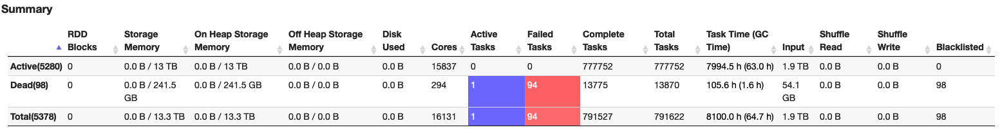

# Troubleshooting

## Potential resolutions for not-so-common errors

Following are some interesting resolutions for common (but not so common) errors faced by EMR customers. We will continue to update this list as and when we encounter new and unique issues and resolutions.

### Potential strategies to mitigate S3 throttling errors

For mitigating S3 throttling errors (503: Slow Down), consider increasing *`fs.s3.maxRetries`* in emrfs-site configuration. By default, it is set to 15 and you may need to increase it further based on your processing needs. You can also increase the multipart upload threshold in EMRFS. Default value at which MPU triggers is 128 MB.

```json
[
  {
    "classification": "emrfs-site",
    "properties": {
      "fs.s3.maxRetries": "20",
      "fs.s3n.multipart.uploads.split.size": "268435456"
    },
    "configurations": []
  }
]
```

Consider using Iceberg format [ObjectStoreLocationProvider](https://iceberg.apache.org/docs/latest/aws/#object-store-file-layout) to store data under S3 hash [0*7FFFFF] prefixes. This would help S3 scale traffic more efficiently as your job's processing requirements increase and thus help mitigate the S3 throttling errors.

```sql
 CREATE TABLE my_catalog.my_ns.my_table
 ( id bigint,
   data string,
   category string)
   USING iceberg OPTIONS
   ( 'write.object-storage.enabled'=true,
     'write.data.path'='s3://my-table-data-bucket')
     PARTITIONED BY (category);
```

Your S3 files will be arranged under MURMUR3 S3 hash prefixes like below.

```
 2021-11-01 05:39:24  809.4 KiB 7ffbc860/my_ns/my_table/00328-1642-5ce681a7-dfe3-4751-ab10-37d7e58de08a-00015.parquet
 2021-11-01 06:00:10    6.1 MiB 7ffc1730/my_ns/my_table/00460-2631-983d19bf-6c1b-452c-8195-47e450dfad9d-00001.parquet
 2021-11-01 04:33:24    6.1 MiB 7ffeeb4e/my_ns/my_table/00156-781-9dbe3f08-0a1d-4733-bd90-9839a7ceda00-00002.parquet
```

Please note that using Iceberg ObjectStoreLocationProvider is not a fail proof mechanism to avoid S3 503s. You would still need to set appropriate EMRFS retries to provide additional resiliency. You can refer to a detailed POC on Iceberg ObjectStoreLocationProvider[here](https://github.com/vasveena/IcebergPOC/blob/main/Iceberg-EMR-POC.ipynb).

If you have exhausted all the above options, you can create an AWS support case to partition your S3 prefixes for bootstrapping capacity. Please note that the prefix pattern needs to be known in advance for eg: `s3://bucket/000-fff/ or s3://bucket/<date fields from 2020-01-20 to 2030-01-20>/.`

### Precautions to take while running too many executors

If you are running Spark jobs on large clusters with many number of executors, you may have encountered dropped events from Spark driver logs.

```
ERROR scheduler.LiveListenerBus: Dropping SparkListenerEvent because no remaining room in event queue. This likely means one of the SparkListeners is too slow and cannot keep up with the rate at which tasks are being started by the scheduler.
WARN scheduler.LiveListenerBus: Dropped 1 SparkListenerEvents since Thu Jan 01 01:00:00 UTC 1970
```

For this issue, you can increase *`spark.scheduler.listenerbus.eventqueue.size`* from default of 10000 to 2x or more until you do not see dropped events anymore.

Running large number of executors may also lead to driver hanging since the executors constantly heartbeat to the driver. You can minimize the impact by increasing *`spark.executor.heartbeatInterval`* from 10s to 30s or so. But do not increase to a very high number since this will prevent finished or failed executors from being reclaimed for a long time which will lead to wastage cluster resources.

If you see the Application Master hanging while requesting executors from the Resource Manager, consider increasing *`spark.yarn.containerLauncherMaxThreads`* which is defaulted to 25. You may also want to increase *`spark.yarn.am.memory`* (default: 512 MB) and *`spark.yarn.am.cores`* (default: 1).

### Adjust HADOOP, YARN and HDFS heap sizes for intensive workflows

You can see the heap sizes of HDFS and YARN processes under /etc/hadoop/conf/hadoop-env.sh and /etc/hadoop/conf/yarn-env.sh on your cluster.

In hadoop-env.sh, you can see heap sizes for HDFS daemons.

```bash
export HADOOP_OPTS="$HADOOP_OPTS -server -XX:+ExitOnOutOfMemoryError"
export HADOOP_NAMENODE_HEAPSIZE=25190
export HADOOP_DATANODE_HEAPSIZE=4096
```

In yarn-env.sh, you can see heap sizes for YARN daemons.

```bash
export YARN_NODEMANAGER_HEAPSIZE=2048
export YARN_RESOURCEMANAGER_HEAPSIZE=7086
```

Adjust this heap size as needed based on your processing needs. Sometimes, you may see HDFS errors like "MissingBlocksException" in your job or other random YARN errors. Check your HDFS name node and data node logs or YARN resource manager and node manager logs to ensure that the daemons are healthy. You may find that the daemons are crashing due to OOM issues in .out files like below:

```
OpenJDK 64-Bit Server VM warning: INFO: os::commit_memory(0x00007f0beb662000, 12288, 0) failed; error='Cannot allocate memory' (errno=12)
#
# There is insufficient memory for the Java Runtime Environment to continue.
# Native memory allocation (mmap) failed to map 12288 bytes for committing reserved memory.
# An error report file with more information is saved as:
# /tmp/hs_err_pid14730.log
```

In this case, it is possible that your HDFS or YARN daemon was trying to grow its heap size but the OS memory did not have sufficient room to accommodate that. So, when you launch a cluster, you can define -Xms JVM opts to be same as -Xmx for the heap size of the implicated daemon so that the OS memory is allocated when the daemon is initialized. Following is an example for the data node process which can be extended to other daemons as well:

```json
[
  {
    "Classification": "hadoop-env",
    "Properties": {},
    "Configurations": [
      {
        "Classification": "export",
        "Properties": {
          "HADOOP_DATANODE_OPTS": "-Xms4096m -Xmx4096m $HADOOP_DATANODE_OPTS",
          "HADOOP_DATANODE_HEAPSIZE": "4096"
        },
        "Configurations": []
      }
    ]
  }
]
```

Additionally, you can also consider reducing *`yarn.nodemanager.resource.memory-mb`* by subtracting the heap sizes of HADOOP, YARN and HDFS daemons from *`yarn.nodemanager.resource.memory-mb`* for your instance types.

### Precautions to take for highly concurrent workloads

When you are running multiple Spark applications in parallel, you may sometimes encounter job or step failures due to errors like “Caused by: java.util.zip.ZipException: error in opening zip file” or hanging of the application or Spark client while trying to launch the Application Master container. Check the CPU utilization on the master node when this happens. If the CPU utilization is high, this issue could be because of the repeated process of zipping and uploading Spark and job libraries to HDFS distributed cache from many parallel applications at the same time. Zipping is a compute intensive operation. Your name node could also be bottlenecked while trying to upload multiple large HDFS files.

```
22/02/25 21:39:45 INFO Client: Preparing resources for our AM container
22/02/25 21:39:45 WARN Client: Neither spark.yarn.jars nor spark.yarn.archive is set, falling back to uploading libraries under SPARK_HOME.
22/02/25 21:39:48 INFO Client: Uploading resource file:/mnt/tmp/spark-b0fe28f9-17e5-42da-ab8a-5c861d81e25b/__spark_libs__3016570917637060246.zip -> hdfs://ip-172-31-45-211.ec2.internal:8020/user/hadoop/.sparkStaging/application_1645574675843_0003/__spark_libs__3016570917637060246.zip
22/02/25 21:39:49 INFO Client: Uploading resource file:/etc/spark/conf/hive-site.xml -> hdfs://ip-172-31-45-211.ec2.internal:8020/user/hadoop/.sparkStaging/application_1645574675843_0003/hive-site.xml
22/02/25 21:39:49 INFO Client: Uploading resource file:/usr/lib/spark/python/lib/pyspark.zip -> hdfs://ip-172-31-45-211.ec2.internal:8020/user/hadoop/.sparkStaging/application_1645574675843_0003/pyspark.zip
22/02/25 21:39:49 INFO Client: Uploading resource file:/usr/lib/spark/python/lib/py4j-0.10.9-src.zip -> hdfs://ip-172-31-45-211.ec2.internal:8020/user/hadoop/.sparkStaging/application_1645574675843_0003/py4j-0.10.9-src.zip
22/02/25 21:39:50 INFO Client: Uploading resource file:/mnt/tmp/spark-b0fe28f9-17e5-42da-ab8a-5c861d81e25b/__spark_conf__7549408525505552236.zip -> hdfs://ip-172-31-45-211.ec2.internal:8020/user/hadoop/.sparkStaging/application_1645574675843_0003/__spark_conf__.zip
```

To mitigate this, you can zip your job dependencies along with Spark dependencies in advance, upload the zip file to HDFS or S3 and set *`spark.yarn.archive`* to that location. Below is an example:

```bash
zip -r spark-dependencies.zip /mnt/jars/
hdfs dfs -mkdir /user/hadoop/deps/
hdfs dfs -copyFromLocal spark-dependencies.zip /user/hadoop/deps/
```

/mnt/jars location in the master node contains the application JARs along with JARs in /usr/lib/spark/jars. After this, set spark.yarn.archive or spark.yarn.jars in spark-defaults.

```
spark.yarn.archive  hdfs:///user/hadoop/deps/spark-dependencies.zip
```

You can see that this file size is large.

```bash
hdfs dfs -ls hdfs:///user/hadoop/deps/spark-dependencies.zip
-rw-r--r--   1 hadoop hdfsadmingroup  287291138 2022-02-25 21:51 hdfs:///user/hadoop/deps/spark-dependencies.zip
```

Now you will see that the Spark and Job dependencies are not zipped or uploaded when you submit the job saving a lot of CPU cycles especially when you are running applications at a high concurrency. Other resources uploaded to HDFS by driver can also be zipped and uploaded to HDFS/S3 prior but they are quite lightweight. Monitor your master node's CPU to ensure that the utilization has been brought down.

```
22/02/25 21:56:08 INFO Client: Preparing resources for our AM container
22/02/25 21:56:08 INFO Client: Source and destination file systems are the same. Not copying hdfs:/user/hadoop/deps/spark-dependencies.zip
22/02/25 21:56:08 INFO Client: Uploading resource file:/etc/spark/conf/hive-site.xml -> hdfs://ip-172-31-45-211.ec2.internal:8020/user/hadoop/.sparkStaging/application_1645574675843_0007/hive-site.xml
22/02/25 21:56:08 INFO Client: Uploading resource file:/usr/lib/spark/python/lib/pyspark.zip -> hdfs://ip-172-31-45-211.ec2.internal:8020/user/hadoop/.sparkStaging/application_1645574675843_0007/pyspark.zip
22/02/25 21:56:08 INFO Client: Uploading resource file:/usr/lib/spark/python/lib/py4j-0.10.9-src.zip -> hdfs://ip-172-31-45-211.ec2.internal:8020/user/hadoop/.sparkStaging/application_1645574675843_0007/py4j-0.10.9-src.zip
22/02/25 21:56:08 INFO Client: Uploading resource file:/mnt/tmp/spark-0fbfb5a9-7c0c-4f9f-befd-3c8f56bc4688/__spark_conf__5472705335503774914.zip -> hdfs://ip-172-31-45-211.ec2.internal:8020/user/hadoop/.sparkStaging/application_1645574675843_0007/__spark_conf__.zip
```

If you are using EMR Step API to submit your job, you may encounter another issue during the deletion of your Spark dependency zip file (which will not happen if you follow the above recommendation) and other conf files from /mnt/tmp upon successful YARN job completion. If there is a delay of over 30s during this operation, it leads to EMR step failure even if the corresponding YARN job itself is successful. This is due to the behavior of Hadoop’s [ShutdownHook](https://github.com/apache/hadoop/blob/branch-2.10.1/hadoop-common-project/hadoop-common/src/main/java/org/apache/hadoop/util/RunJar.java#L227). If this happens, increase *`hadoop.service.shutdown.timeout`* property from 30s to to a larger value.

Please feel free to contribute to this list if you would like to share your resolution for any interesting issues that you may have encountered while running Spark workloads on Amazon EMR.


## Spark Structured Streaming applications have high Connection Create Rate to Amazon MSK

**Symptom**: Amazon MSK cluster has high CPU usage and MSK metrics indicate high connection create rate to the cluster.

**Analysis**: By default, Spark Structured Streaming Kafka connector has a 1:1 mapping relation of MSK TopicPartitions to Spark tasks. Between micro batches, Spark tries to (best effort) assign the same MSK TopicPartitions to the same executors which in turn reuses the Kafka consumers and connections.

Spark Structured Streaming Kafka connector has an option `minPartitions` which can divide large TopicPartitions to smaller pieces. When `minPartitions` is set to a value larger than the number of TopicPartitions,  Spark creates tasks based on `minPartitions` to increase parallelism (the number of Spark tasks will be approximately `minPartition`).

* As 1:1 mapping doesn't exist anymore, Spark executors are randomly assigned to process any TopicPartition OffsetRanges. An executor processed TopicPartition X can be assigned to process TopicPartition Y in next micro batch.  A new Kafka consumer/connection needs to be created if Y is on another MSK broker.
* One Spark executor can be assigned to process multiple Spark tasks with the same MSK TopicPartition on different OffsetRanges.  And in Spark 2.x, Kafka consumer cache is disabled when multiple tasks in the same executor read the same TopicPartitions .

Setting `minPartitions` comes at a cost of initializing Kakfa consumers at each micro batch. This may impact performance especially when using SSL.

A test was run with following test environment:

**Kafka version 2.8.1**

* 3 kafka.m5.xlarge instances
* test kafka topic has 10 partitions
* only SASL/SCRAM authentication enabled

**EMR 5.36 (Spark 2.4.8)  cluster**

* 30 core nodes - EC2 m5.4xlarge

Spark Structured Streaming test application has 5 cores 5G memory for each executor.

Below figure shows the test result of different `minPartitions` values with MSK’s ConnectionCreationRate and CPUUser usages. As shown in the test result, higher ConnectionCreationRate is related to higher CPU usage.

Test1: 50 minPartitions 16:40-17:30  
Test2: 100 minPartitions 18:00-18:35  
Test3: 200 minPartitions 19:00-19:35  
Test4: no minPartitions 20:06 - 20:30  


**Recommendation**: 

1. Upgrade to the latest EMR version (spark 3.x) to use Sparks [consumer pool cache](https://spark.apache.org/docs/latest/structured-streaming-kafka-integration.html#consumer-caching) feature. This feature allows Spark to cache more than one Kafka consumer with same MSK TopicPartition at each executor, and reuse the consumers in later micro batches. This will allow you to set `minPartitions` while reduce the ConnectionCreationRate.

2. On EMR 5.x (Spark 2.x), only set min partitions when needed - for example, if you have data skew or if your stream is falling behind. Min partitions will allow you to increase parallelism and process records faster but at the expense of high connection rates and CPU.  

## spark.driver.maxResultSize error on an EMR heterogeneous cluster but the driver is not collecting data

**Symptom**: Spark jobs fail from time to time and below error is seen in the log:

22/08/22 14:14:24 ERROR FileFormatWriter: Aborting job f6913a46-d2d8-46f0-a545-2d2ba938b113. org.apache.spark.SparkException: Job aborted due to stage failure: Total size of serialized results of 179502 tasks (1024.0 MB) is bigger than spark.driver.maxResultSize (1024.0 MB) at org.apache.spark.scheduler.DAGScheduler.org$apache$spark$scheduler$DAGScheduler$$failJobAndIndependentStages(DAGScheduler.scala:2171)
`

By setting `spark.driver.maxResultSize` to 0(unlimited), the error is gone.  But the Spark job is not collecting data to driver, how can the result returning to driver exceed 1024MB? 

**Analysis**:  Each finished task sends a serialized `WriteTaskResult` object to driver. The object size is usually several kilobytes, e.g.

`22/09/06 22:24:18 INFO Executor: Finished task 0.0 in stage 3.0 (TID 3). 5192 bytes result sent to driver`

From the log, we can see there are 179502 (or more) tasks. For such a number of tasks, the total result size can exceed 1024MB for serialized `WriteTaskResult` objects only.

The job is reading parquet files from S3 and the input folder has 3.5K parquet files with average size ~116MB per file. As default `spark.sql.files.maxPartitionBytes` is 128M, so approximately one file to one Spark task.  The job's processing logic further splits one task to ~11 tasks. Total tasks should be 3.5K * 11 = 38.5K. But why there are 179502 (or more) tasks?

To find root cause, we need to understand how Spark SQL decides the max size of a partition for non-bucketed splittable files.

Spark2 is following below formula (Spark3 has a slightly different formula which is described later)

`maxSplitBytes = Math.min(defaultMaxSplitBytes, Math.max(openCostInBytes, bytesPerCore))`

`maxSplitBytes` is the max bytes per partition.

`defaultMaxSplitBytes` is from `spark.sql.files.maxPartitionBytes` whose default value is 128M.

`openCostInBytes`  is from `spark.sql.files.openCostInBytes` whose default value is 4M.

`bytesPerCore` = (Sum of all data file size + num of file * `openCostInBytes` ) / `defaultParallelism`

`defaultParallelism`’s default value is total number of virtual cores running the job.  It can also be set to a value by defining `spark.default.parallelism`.

When there are a large number of virtual cores allocated to the Spark job by Yarn, `maxSplitBytes` can be smaller than `defaultMaxSplitBytes`, i.e. more tasks will be created.  For this case, from Spark UI, we know total number of vcores is 15837, i.e. `defaultParallelism` is 15837


`bytesPerCore` = (116M * 3500 + 4M * 3500)/15837 = 26.5M

`maxSplitBytes` = min(128M, max(4M, 26.5M)) = 26.5M.  So one 116M parquet file is split into 4~5 Spark tasks.  3.5K * 11 * 5 = 192.5K -- that's why there were 179502 (or more) tasks.

Note that the vcore count is based on Yarn containers, not physical cores.  As Yarn’s default container allocation is based on available memory, this means there can be vcore over subscriptions in a heterogeneous EMR cluster.

For example, if we have a heterogeneous EMR cluster as below:

Core Node: c5.12xlarge(48cores/96GB) — Memory allocated to Yarn: 90112MB  
Task Node: r5.8xlarge(32cores/256GB) — Memory allocated to Yarn: 253952MB

The default EMR executor size is based on core node instance type. In this example, for c5.12xlarge, default executor size is 3 cores 4743M memory. Default `spark.yarn.executor.memoryOverheadFactor` is 0.1875.  A Yarn container has 3 cores, 4743MB*(1+0.1875)= 5632MB memory.

On c5.12xlarge, Yarn can allocate 16 conatainers with 48 vcores in total:  
90112MB/5632MB = 16 containers * 3 core = 48 vcores

While on r5.8xlarge, Yarn can allocate 45 containers with 135 vcores in total:  
253952MB/5632MB = 45 containers * 3 core = 135 vcores - 32cores = 103 vcore oversubscription

**Recommendation**: When Spark reads splittable files, `maxSplitBytes` can be smaller than `spark.sql.files.maxPartitionBytes` if there are a big number of vcores allocated to the job.  Use the formula described here to set `spark.default.parallelism` value properly and have a reasonable `maxSplitBytes`. 

**Spark 3**

Spark 3 provides more options to control`maxSplitBytes` as below 

```scala
  def maxSplitBytes(
      sparkSession: SparkSession,
      selectedPartitions: Seq[PartitionDirectory]): Long = {
    val defaultMaxSplitBytes = sparkSession.sessionState.conf.filesMaxPartitionBytes
    val openCostInBytes = sparkSession.sessionState.conf.filesOpenCostInBytes
    val minPartitionNum = sparkSession.sessionState.conf.filesMinPartitionNum
      .getOrElse(sparkSession.leafNodeDefaultParallelism)
    val totalBytes = selectedPartitions.flatMap(_.files.map(_.getLen + openCostInBytes)).sum
    val bytesPerCore = totalBytes / minPartitionNum

    Math.min(defaultMaxSplitBytes, Math.max(openCostInBytes, bytesPerCore))
  }
```

`filesMinPartitionNum` is from `spark.sql.files.minPartitionNum`. It is the suggested (not guaranteed) minimum number of split file partitions. If not set, the default value is `spark.default.parallelism`.

`leafNodeDefaultParallelism` is from `spark.sql.leafNodeDefaultParallelism`. It is the default parallelism of Spark SQL leaf nodes.

Setting either of the above two parameters has the same effect as `spark.default.parallelism` on `maxSplitBytes`.

## Issues related to Spark logs

### Spark events logs not getting pushed to S3

**Symptom**: This might be caused if the spark logs properties is configured with HDFS location, not with S3 location.

**Troubleshooting Steps:**:

1. Check the appusher logs of the cluster for the time of the issue where the app pusher log location on your 21EMR logs bucket is `<s3_log_bucket>/<prefix>/j- xxxxxxx>/daemons/apppusher.log.gz`
2. Look for error java.util.concurrent.ExecutionException: java.lang.IllegalArgumentException: Wrong FS: 23 s3://demo-bucket/testing-prod/spark/logs,expected: hdfs://ip-XX-XX-XXX-XXX.eu-west- 241.compute.internal:8020
 By default, Spark Structured Streaming Kafka connector has a 1:1 mapping relation of MSK TopicPartitions to Spark tasks. Between micro batches, Spark tries to (best effort) assign the same MSK TopicPartitions to the same executors which in turn reuses the Kafka consumers and connections. 
 3. Check the spark-defaults.conf file found in the location /etc/spark/conf.dist on the master node for the 26configurationsmentionedbelow: 27spark.eventLog.dir : The spark jobs themselves must be configured to log events, and to log them to the same 28shared,writabledirectory 29spark.history.fs.logDirectory: For the filesystem history provider, the URL to the directory containing 30application event logs to load.
4. Restart the spark history server to reflect the configuration changes. [Various EMR version have different 32command to restart the services](https://repost.aws/knowledge-center/restart-service-emr). Sudo systemctl restart spark-history-server

**Additional Reference:**

[Consideration and limitations of spark history UI](https://docs.aws.amazon.com/emr/latest/ManagementGuide/app-history-spark-UI.html#app-history-spark-UI-limitations)

[Spark monitoring and instrumentation](https://spark.apache.org/docs/latest/monitoring.html#monitoring-and-instrumentation)

### Spark History Server not opening up

**Symptom**: This issue occurs if the Spark history server memory is low. You may also have to [enable web UI access](https://docs.aws.amazon.com/emr/latest/ManagementGuide/emr-web-interfaces.html) to the [spark history server](https://www.youtube.com/watch?v=fpGAnXgBZe0)

**Troubleshooting Steps:**:

1. SSH in to the master node, go to the location /etc/spark/conf/spark-env.sh and set the parameter SPARK_DAEMON_MEMORY to an higher value, for example 4g (or more) You can manually edit the spark-env file at "/etc/spark/conf/spark-env.sh" on the master node

2. Restart the spark-history-server

3. You can confirm the memory increase with the given command below, in this parameter "-Xmx4g": Or you can reconfigure from EMR console select the primary instance group and click on reconfigure and add the json and while saving click on apply to all instance groups.

```
[
  {
    "Classification": "spark-env",
    "Properties": {
      "SPARK_DAEMON_MEMORY": "4g"
    }
]
```
*Note: In multimaster setup does not support persistent application user interface.*

**Additional Reference:**

[Why can’t I view the Apache Spark history events or logs from the Spark web UI in Amazon EMR?](https://repost.aws/knowledge-center/emr-view-spark-history-events)

[Web Interfaces](https://spark.apache.org/docs/latest/monitoring.html#spark-history-server-configuration-options)

[Configure Spark](https://docs.aws.amazon.com/emr/latest/ReleaseGuide/emr-spark-configure.html)

### Spark application failure or Spark streaming application failure with 137 error code

**Symptom**: There can be various reasons for a spark application failures, most common root causes are 
[stage failure spark EMR](https://repost.aws/knowledge-center/stage-failures-spark-emr), [Container killed on request. Exit code is 137](https://repost.aws/knowledge-center/container-killed-on-request-137-emr) and [ExecutorLostFailure "Slave lost".](https://repost.aws/knowledge-center/executorlostfailure-slave-lost-emr)

**Troubleshooting Steps:**

1. If you have submitted the application via step, check the step logs stderr to get the exception details.

2. In the step logs you will also find the application ID related to the step use the step ID logs to get the application ID and check the container logs stderr.gz to find the error In the above logs look for the information as mentioned on this article [EMR troubleshooting failed spark jobs](https://repost.aws/knowledge-center/emr-troubleshoot-failed-spark-jobs)

### Spark application event with incomplete logs

**Symptom**:You might encounter this error if in case of incorrect configuration of log aggregation for long running applications. Application logs from "/var/log/hadoop-yarn/apps" hdfs directory are deleted after every 2 days. Long-running Spark jobs such as Spark streaming, and large jobs, such as Spark SQL queries can generate [large event logs](https://docs.aws.amazon.com/emr/latest/ManagementGuide/app-history-spark-UI.html#app-history-spark-UI-large-event-logs). Large events logs, can rapidly deplete  disk space on compute instances and may result in OutOfMemory errors when loading persistent UIs. To avoid these issues, it is recommended that you turn on the Spark event log rolling and compaction feature. This feature is available on Amazon EMR versions emr-6.1.0 and later. [Check how to enable yarn log aggregation for spark jobs](https://guide.aws.dev/articles/AROsZtWyXQRSaEcknGWhpCGA/how-to-enable-yarn-log-aggregation-for-running-spark-job)

**Troubleshooting Steps:**

Check the instance state logs ```<s3_log_bucket>/<prefix>/<j-xxxxxxx>/deamon/instance-state/```(find the log as per the error time frame) of the your EMR instances and search for df -h and check for the /mnt usage for that particular instance. Below parameters can be configured.

-	```spark.eventLog.rolling.enabled``` – Turns on event log rolling based on size. This is deactivated by default.

-	```spark.eventLog.rolling.maxFileSize``` – When rolling is activated, specifies the maximum size of the event log file before it rolls over.

-	```spark.history.fs.eventLog.rolling.maxFilesToRetain``` – Specifies the maximum number of non-compacted event log files to retain. 

*Note: Instance-state logs are snapshots captured at the instance level every 15 min.*

### Access spark history server for old cluster

**Symptom**: To access your old EMR cluster logs, go to application history and relevant log files for active and terminated clusters. The logs are available for 30 days after the application ends. On the Application user interfaces tab or the cluster Summary page for your cluster in the old console for Amazon EMR 5.30.1 or 6.x, choose the YARN timeline server, Tez UI, or Spark history server link. Starting from EMR version 5.25.0, persistent application user interface (UI) links are available for Spark History Server, which doesn't require you to set up a web proxy through a SSH connection and can be directly accessed via the AWS EMR Web Console. Navigate to the terminated cluster whose logs you require, clicking on Application user interfaces tab (on old EMR console) or Applications tab and select Persistent application UIs (on new EMR console) and finally clicking on [Spark History Server link](https://docs.aws.amazon.com/emr/latest/ManagementGuide/app-history-spark-UI.html#app-history-spark-UI-event-logs)

## Issues Related to Spark session

### Spark session not getting generated with Missing std out
**Symptom**: You might encounter below listed spark session issues

-	Error when trying to run jupyter note book for spark.

-	```The code failed because of a fatal error: Invalid status code '500' from http://localhost:8998/sessions with error payload: "java.lang.NullPointerException".java.net.ConnectException: Connection refused```

- ```ERROR SparkContext: Error initializing SparkContext.org.apache.hadoop.util.DiskChecker$DiskErrorException: Could not find any valid local directory for s3ablock-0001-```

**Probable Root cause**

Spark code might lack spark session initialization. Make sure you follow the official [documentation of Spark](https://spark.apache.org/docs/latest/sql-getting-started.html) to build an spark session. ```Invalid status code '500'```is related  to a server-side error, check the livy server logs running on the EMR cluster.

### Spark session with livy is failing
**Symptom**: If you are seeing Error message :```The code failed because of a fatal error:Session 11 did not start up in 60 seconds```, you can try the below steps:

**Troubleshooting Steps:**

1. Make sure Spark has enough available resources for Jupyter to create a Spark context.
2. Contact your Jupyter administrator to make sure the Spark magics library is configured correctly.
3. Restart the kernel.
4. Check the following configuration are present on your EMR cluster, if not then please add the same

```
[
    {
        "Classification": "livy-conf",
        "Properties": {
            "livy.server.session.timeout-check": "true",
            "livy.server.session.timeout": "2h",
            "livy.server.yarn.app-lookup-timeout": "120s"
        }
    }
]

```
5. Restart the Livy server to apply the configuration
```
sudo systemctl stop livy-server
sudo systemctl start livy-server
```
To further troubleshoot the issue, you can find more information on the livy-livy-server.out found on the following location ```/var/log/livy```

**Additional resource:**

To know more about the livy we you can go over the following [resource](https://www.youtube.com/watch?v=C_3iEf_KNv8).

### Spark application failure due to Disk space or CPU Load
**Symptom**: You might encounter disk space/CPU related issues due to:

-	The log pusher service is not running or consuming high CPU, to know more check the [instance-state logs](https://docs.aws.amazon.com/emr/latest/ManagementGuide/emr-plan-debugging.html#emr-plan-debugging-logs) for the CPU, memory state, and garbage collector threads of the node.

-	Local disk of the node is getting full, as application logs might be stored on the nodes local disk where your application is running, so a long running application can fill in the local disk of a node

-	There might be another app which is running on the cluster at the same time could be filling up disk space/consuming CPU cycles.

-	High retention period of the spark event and the yarn container logs

*Note: Disk space or CPU load may not always cause an application failure, however could lead to performance regression*

**Troubleshooting Steps:**
1. If the logpusher is malfunctioning or taking up lot of CPU then, it can result disk usage climb up 
Check the log pusher server status by using the command
```systemctl status logpusher```
2. If the log pusher shows up near the top by running the below command in the instance-state logs, then it would benefit a restart
```
ps auxwww --sort -%cpu | head -20
sudo systemctl status logpushe
```
3. You can also check latest logs of the logpusher to find errors and exceptions to report to the AWS premium support to help you further. Logpusher logs can be found in the following location ```/emr/logpusher/log```
4. You can also proactively [manage the disk space](https://repost.aws/knowledge-center/core-node-emr-cluster-disk-space) by deleting old logs form the below mentioned location

```
Hdfs-site.xml
  <property>
    <name>dfs.datanode.data.dir</name>
    <value>file:///mnt/hdfs,file:///mnt1/hdfs</value>
  </property>
yarn-site.xml
 <property>
    <name>yarn.nodemanager.local-dirs</name>
    <value>/mnt/yarn,/mnt1/yarn</value>
    <final>true</final>
  </property>
<property>
    <description>Where to store container logs.</description>
    <name>yarn.nodemanager.log-dirs</name>
    <value>/var/log/hadoop-yarn/containers</value>
  </property>

```

5. You can  use the command ```sudo du -h /emr | sort -hr``` to find the files consuming space. Use this command repeatedly and backup the files and delete unwanted files.

6. You can also [Dynamically scale up storage on Amazon EMR clusters](https://aws.amazon.com/blogs/big-data/dynamically-scale-up-storage-on-amazon-emr-clusters/)

7. You add more EBS capacity if you encounter [no space left on device error in the spark job in Amazon EMR](https://repost.aws/knowledge-center/no-space-left-on-device-emr-spark)

8. [You can prevent hadoop and spark user cache consuming disk space](https://repost.aws/knowledge-center/user-cache-disk-space-emr)

## Spark application failure

### Spark app class not found exception
Refer to the the [blog post](https://repost.aws/knowledge-center/emr-spark-classnotfoundexception) to troubleshoot spark app class not found exception.

### Spark app failing to write to s3 or Spark job failure due access denied exception 
**Symptom**: You can encounter the error ```EmrOptimizedParquetOutputCommitter: EMR Optimized committer is not supported by this filesystem (org.apache.hadoop.hdfs.DistributedFileSystem)```
```Caused by: com.amazon.ws.emr.hadoop.fs.shaded.com.amazonaws.services .s3.model.AmazonS3Exception: Access Denied (Service: Amazon S3; Status Code: 403; Error Code: AccessDenied```

**Probable Root causes:**

-	Bucket policies and IAM policies related issue

-	AWS s3 ACL setting

-	S3 block Public Access setting

-	S3 object lock settings

-	VPC endpoint policy

-	AWS organization policies

-	Access point setting

**Troubleshooting Steps:**

-	Check the application logs to confirm the error Status Code: 403; Error Code:AccessDenied and check the probable root causes

- Generate [Amazon S3 request ID for AWS support to help in debugging the issue](https://docs.aws.amazon.com/AmazonS3/latest/userguide/get-request-ids.html)

**Best practices and Recommendations:**

-	Aws recommends using "s3://" instead of S3a:// S3n:// which is based on EMRFS as it is build and maintained by AWS and supports additional features.

-	[403 S3 Error troubleshooting](https://docs.aws.amazon.com/AmazonS3/latest/userguide/troubleshoot-403-errors.html)

-	[Cross Account Bucket Access](https://docs.aws.amazon.com/AmazonS3/latest/userguide/example-walkthroughs-managing-access-example2.html#access-policies-walkthrough-example2a)

### Cluster mode job failure

**Symptom**: In the absence of correct parameters and the dependencies installed before running a job in the cluster mode, you can encounter cluster mode job failures as below:

-	 ERROR Client: Application diagnostics message: User application exited with status 1

-	 exitCode: 13

-	 User application exited with status 1

**Troubleshooting Steps:**
1.	Inspect the container of application master logs containers/application_xx_0002/container_xx_0002_01_000001

2.	Look for the probable keywords like "exitCode: 13" or ```module not found error``` or ```User application exited with status 1```

3. Look into the application master container stdout and controller log of the Application master to get more information on the error.

4. Make sure to pass the right parameters with the dependencies  installed correctly before running the job in the cluster mode.

### Spark Troubleshooting Spark FetchFailedExceptions, Memory Issues and Scaling Problems in Applications

**Symptom**:

```org.apache.spark.shuffle.FetchFailedException: java.util.concurrent.TimeoutException: Timeout waiting for task.at org.```
```org.apache.spark.storage.ShuffleBlockFetcherIterator.throwFetchFailedException(ShuffleBlockFetcherIterator.scala:748 Caused by: java.io.IOException: Map_1: Shuffle failed with too many fetch failures and insufficient progress```

**Probable Root cause:**
1.	If the executors are busy or under high GC pressure, then executor cannot cater to the shuffle request. You can use the external shuffle service hosted on Yarn Node manager, which will help any shuffle state written by an executor to be served beyond the executor’s lifetime.

2.	NodeManager(NM) may have been killed and restarted multiple times while running your job, with   java.lang.OutOfMemoryError: GC overhead limit exceeded and  java.lang.OutOfMemoryError: Java heap space errors, indicating not enough heap space to address the shuffle request. As YarnShuffleService is launched by the Node Manager, insufficient memory allocated for the Node Manager can cause aggressive GC during the shuffle phase.Amazon EMR enables the External Shuffle Service by default, the shuffle output is written to local disk. Since LocalDiskEncryption is enabled, if thousands of blocks are being fetched from local disk, it could lead to higher memory utilization on Nodemanager JVM as well.

**Troubleshooting Steps:**
1.	Check the application logs, yarn resource manager logs and instance-controller logs to get more information on the error.
2.	Find the node which is causing the shuffle data loss and make note of the event timeline.
3.	Review the application logs of the Managed Scaling resize request cluster manager to identify the nodes included in the shrink policy. Verify whether the update to the EMR DB for writing the shrink policy was successful. 
4.	Check the Instance controller to exactly find new resize target and which instance being send by the cluster manager to Instance controller to keep and to Remove list
5.	If node is not in toKeep but toRemove list or if they are empty although it might have shuffle data, dig into Spark Shuffle enricher task how was it added in toRemove list for log.
6.	In some cases, the shuffle metrics may altogether be missing around the time of resize affecting toKeep and toRemove list.
7.	Check the spark metric collector logs to find out and share with the premium support if there was an issue collecting the metrics at cluster

*Note- Emr Managed scaling is shuffle aware*

**Configuration to consider:**

-	spark.reducer.maxBlocksInFlightPerAddress:  limits the number of remote blocks being fetched per reduce task from a given host port.

-	spark.reducer.maxSizeInFlight:  Maximum size of map outputs to fetch simultaneously from each reduce task.

-	spark.shuffle.io.retryWait (Netty only): How long to wait between retries of fetches. 

-	spark.shuffle.io.maxRetries (Netty only): Fetches that fail due to IO-related exceptions are automatically retried if this is set to a non-zero value.

-	spark.shuffle.io.backLog: Length of the accept queue for the shuffle service. 

-	Increasing the memory for NodeManager Deamon on EMR cluster startup ```
yarn-env = YARN_NODEMANAGER_HEAPSIZE": "10000"```

-	Tuning number of Partitions and Spark parallelism(```spark.default.parallelism```) for your cluster/job. This may limit the number of shuffles that's happening per job and consequently reduce the load on all NodeManager's.
Note that changing configuration can have performance impact.

-	Keep the EMR default ```spark.shuffle.service.enabled true(spark-defaults.conf)```
```spark.dynamicAllocation.enabled set to true (EMR default)```

**Additional resource:**

[Spark EMR configuration](https://docs.aws.amazon.com/emr/latest/ReleaseGuide/emr-spark-configure.html)

[Spark Shuffle Data Aware](https://aws.amazon.com/about-aws/whats-new/2022/03/amazon-emr-managed-scaling-shuffle-data-aware/)

[Container killed by Yarn for exceeding memory limit troubleshooting](https://repost.aws/knowledge-center/emr-spark-yarn-memory-limit)

[Optimize Spark performance](https://docs.aws.amazon.com/emr/latest/ReleaseGuide/emr-spark-performance.html)

## Spark SQL issue

### Spark Query failures for jupyter notebook Python 3 

**Symptom**: If EMR job fails with an error message [Exit status: -100. Diagnostics: Container released on a lost node](https://repost.aws/knowledge-center/emr-exit-status-100-lost-node), it might be because of 

-	A core or task node is terminated because of high disk space utilization. 

-	A node becomes unresponsive due to prolonged high CPU utilization or low available memory.

**Troubleshooting Steps:**

1.	Check the following [Cloudwatch Metrics](https://docs.aws.amazon.com/emr/latest/ManagementGuide/UsingEMR_ViewingMetrics.html#UsingEMR_ViewingMetrics_Access) for metrics MR unhealthy nodes and MR lost nodes to determine root cause. 

2.	Add more Amazon Elastic Block Store (Amazon EBS) capacity to the new EMR clusters. You can do this when you launch a new cluster or by modifying a running cluster. You can also add more core or task nodes. If larger EBS volumes don't resolve the problem, [attach more EBS volumes](https://docs.aws.amazon.com/AWSEC2/latest/UserGuide/ebs-attaching-volume.html) to the core and task nodes.

## Support Reach Out Best Practice

Try to troubleshoot your spark issues based on the above steps mentioned in the document and refer to additional [troubleshooting steps. Reach out to Support if needed by following the below best practices:](https://repost.aws/knowledge-center/emr-troubleshoot-failed-spark-jobs)

1. Make sure to open the Support Case using an IAM User / Role in the account(s) with affected resources. Cross Account Support is provided for some customers.
2. Open a support case with right severity level and clearly identify the business impact, urgency and add sufficient contact details in the ‘Description’ field in your ticket.
3. NEVER include keys, credentials, passwords, or other sensitive information.
4. Provide the system impact explanation and include necessary details such as logs, regions, AZ’s instance ID’s, Cluster Ids, resource ARNs, etc.
5. For a faster response use the Chat / Phone options, and use a dedicated resource on your end who will be the point of contact. Escalate to your Technical Account Manager (TAM) if needed.

Sample template that can be used while raising support case for AWS EMR service

```
Issue Details:

Cluster ID:

Error timeline:

Use case Description:

Similar/new occurrence
```

Please attach the logs as needed. Find the below logs and log location: 

| Log Name | Log Location |
|--------|---------------------------------------------------------------|
| Container logs | ```<s3_log_bucket>/<prefix>/<j-xxxxxxx>/containers ```|
| Step logs | ```<s3_log_bucket>/<prefix>/<j-xxxxxxx>/<Step-ID>/stederr``` | 
| Driver logs | S3 bucket → Container → ```/application_id/container_XXX_YYYY_00001``` In case of client mode → step id and check the step logs which will have driver logs.
 Executor logs| Container → ```/application_id/container_XXX_YYYY_0000X```
  YARN ResourceManager (Master Node) logs|node/application/yarn → yarn-resourcemanager-XXX.gz
   NodeManager Logs(Core Node) logs| ```sudo stop spark-history-server``` ```sudo start spark-history-server``` Amazon EMR 5.30.0 and later release versions ```systemctl stop spark-history-server``` ```systemctl start spark-history-server```