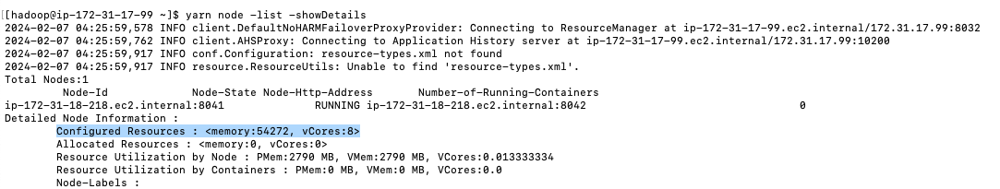
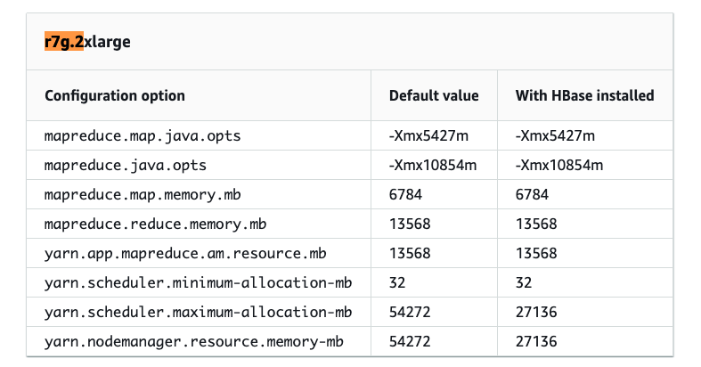

# Optimizing Resource Utilization

Cluster utilization in EMR refers to the effective use of computing resources, which include memory and CPU. The pricing structure for EMR on EC2 relies on resource usage such as CPU, memory, and disk. Ensuring optimal cluster utilization is crucial for getting the maximum value from the EMR cluster. To maintain high cluster utilization in EMR on EC2, it is essential to follow best practices. This includes configuring managed scaling, adjusting container sizes at the application level (requiring EMR observability setup), and selecting the right EC2 instance types, as explained in this document.

This document provides insights on cluster utilization, covering actual memory and CPU usage, monitoring cluster utilization using Amazon CloudWatch, identifying key factors to maximize utilization, and troubleshooting underutilized clusters.

## Actual EC2 Instance Resource Usage vs. YARN Allocated Resource Usage

Actual EC2 Instance Resource Usage refers to the actual CPU, memory, and disk utilized by the EC2 instances hosting the YARN ResourceManager/NodeManagers. YARN Allocated Resource Usage refers to the resources allocated to YARN applications by the ResourceManager and NodeManagers based on the resource requests specified by the applications.

When the ResourceManager receives an application from a client, it launches the ApplicationMaster on a node and sends the information for application execution. The ApplicationMaster, after resource allocation from ResourceManager, communicates with NodeManagers on each node, launches containers (which consist of memory and CPU) on these instances, and executes the application.

The allocation of resources to YARN containers is defined by configurations specific to the processing frameworks utilized, such as `spark.executor.memory` and `spark.executor.cores` for Spark, `hive.tez.container.size` for Hive on Tez, and `mapreduce.map.memory.mb` and `mapreduce.reduce.memory.mb` for Hadoop MapReduce. Each framework has its default configurations defining the container size for its tasks, which can be customized by the user.

You can refer to our documentation for insights into the default configured resource allocation settings for YARN based on instance type at [AWS EMR Task Configuration](https://docs.aws.amazon.com/emr/latest/ReleaseGuide/emr-hadoop-task-config.html).

Alternatively, to understand the YARN resource allocation on your cluster instances, you can use the following command after SSHing into the node:

```bash
$ yarn node -list -showDetails
```



For example, consider the `r7g.2xlarge` instance type, which has 64 GiB (65,536 MiB) of memory and 8 cores. Out of this, EMR allocates 54,272 MiB to YARN.



### Allocated vs. Utilized

If there is an overallocation of resources to YARN containers, such as allocating 4 GB to a YARN container while only 2 GB is actually used, the YARN cluster's resource utilization will appear high. However, the overall OS-level resource utilization could remain normal. In this scenario, resizing the containers based on actual usage is necessary. Proper EMR observability setup, as detailed in this GitHub repository, is essential for gaining insights into the cluster's state.

## Optimizing Cluster Utilization

To maintain high cluster utilization in EMR on EC2, follow best practices such as enabling managed scaling, configuring container sizes at the application level, leveraging heterogeneous executors when using instances with varying vCore-to-memory ratios, and choosing the right instance type.

### Enabling Managed Scaling

Managed scaling allows you to automatically increase or decrease the number of instances or units in your cluster based on workload. Amazon EMR continuously evaluates cluster metrics to make scaling decisions that optimize clusters for cost and speed. More details about cluster metrics can be found [here](https://docs.aws.amazon.com/emr/latest/ReleaseGuide/emr-managed-scaling.html). Managed scaling is available for clusters composed of either instance groups or instance fleets.

#### When to Use Managed Scaling

Managed Scaling is beneficial for clusters that meet the following criteria:

- **Periods of Low Demand**: Managed scaling is advantageous for clusters experiencing changes in demand. During low demand, it reduces resource allocation to avoid unnecessary consumption, optimizing resource utilization and cost efficiency.
  
- **Fluctuating Workload Patterns**: Clusters with dynamic or unpredictable workloads benefit from managed scaling as it adjusts resource capacity according to evolving needs.
  
- **Handling Multiple Jobs**: Managed scaling helps clusters running multiple jobs by automatically adjusting capacity based on workload intensity, ensuring efficient resource utilization and preventing bottlenecks.

**Note**: Managed Scaling is not recommended for clusters with steady-state resource usage, where the cluster’s resource consumption remains relatively stable and predictable.

#### How Managed Scaling Decides if a Scaling Action is Needed

Using high-resolution metrics with data at a one-minute granularity, such as `YARNMemoryAvailablePercentage`, `ContainersPendingRatio`, `CapacityRemainingGB`, `HDFSUtilization`, `AppsPending`, and cluster size, the Managed Scaling algorithm decides whether to scale the cluster up or down. The EMR team consistently enhances and refines this algorithm.

Managed Scaling collects these metrics from the cluster to observe resource utilization and additional demands. It estimates the number of YARN containers that fit on a typical node in your cluster, called `ContainerPerUnit`. When the cluster is low on memory and applications are waiting for containers, Managed Scaling adds additional nodes based on the `ContainerPerUnit` and cluster configuration.

### Optimizing Resource Utilization through Managed Scaling Adjustments

#### 1. Keep Core Nodes Constant and Scale with Only Task Nodes

Scaling with only task nodes improves the time for nodes to scale in and out because task nodes do not coordinate storage as part of HDFS. During scale-up, task nodes do not need to install data node daemons, and during scale-down, they do not need to rebalance HDFS blocks. This improvement reduces cost and improves performance. Keeping a static fleet of core nodes also avoids saturating the remaining nodes' disk volume during HDFS rebalance.

#### 2. Selecting the Appropriate Min and Max Managed Scaling Configuration

Review your existing jobs or conduct a sample run to understand application usage patterns. Analyze resource utilization, including memory and CPU, and identify any bottlenecks during peak loads. This analysis will help determine the maximum and minimum values for Managed Scaling. For cost efficiency, set a smaller `maxCapacity` to distribute the workload over a longer runtime of a smaller cluster. For performance improvement, a higher `maxCapacity` avoids extended pending states for containers. Experiment with both `maxCapacity` and `minCapacity` to balance job runtime and cost/utilization.

#### 3. AM Exclusivity to On-Demand/Core Nodes

The Application Master (AM) requests, launches, and monitors application-specific resources. If the AM container fails, the whole job fails. To mitigate the risk of Spot instance reclamation, allocate AMs on On-Demand nodes. Non-AM containers, such as executors, can be placed on Spot nodes to reduce costs. EMR 5.19 and later uses node labels to assign AMs to core nodes. For EMR 6.x, configure node labels to specify the market type as either On-Demand or Spot, and update `yarn-site` configuration to ensure AMs are assigned to the "on_demand" label.

Starting with EMR 7.2, Amazon EMR on EC2 introduced Application Master (AM) Label Awareness. Enable YARN node labeling to allocate AM containers exclusively to On-Demand nodes:

```json
[
   {
     "Classification": "yarn-site",
     "Properties": {
      "yarn.node-labels.enabled": "true",
      "yarn.node-labels.am.default-node-label-expression": "ON_DEMAND"
     }
   }
]
```

#### 4) Spot Instance Usage Considerations

Consider using Spot instances for tasks that can be interrupted and resumed (interruption rates are extremely low) or for workloads that can exceed an SLA. Spot instances are also a good choice for testing and development workloads or when testing new applications.

**Avoid using Spot instances if:**

- Your workload requires predictable completion time or has strict SLA requirements.
- Your workload has zero fault tolerance or recomputing tasks are expensive.

To mitigate the effects of Spot interruptions, reserve core nodes exclusively for application masters. Use On-Demand instances for core nodes and Spot instances for task nodes. Use Instance Fleet with an allocation strategy for Spot usage to diversify across many different instances. Ensure that all Availability Zones within your VPC are configured and selected for your workload. Although the EMR cluster is provisioned in a single AZ, it will look across all for the initial provisioning.

**Note:**

1. Amazon EMR managed scaling only works with YARN applications, such as Spark, Hadoop, Hive, and Flink. It does not support applications that are not based on YARN, such as Presto and HBase. This also implies it won’t work as expected if you are using external tools to consume all EC2 memory outside of YARN. YARN metrics play a critical role in determining managed scaling events.
2. To evaluate Managed Scaling effectiveness specifically, assess utilization for periods when `YARNMemoryAllocated` or `AppsRunning` is above zero.

### Tailored Optimization Strategies for Specific Use-Cases

#### 1) Use Cases Involving Peak and Non-Peak Hours in a Long-Running Cluster

In use cases with distinct peak and non-peak hours, a uniform configuration for both maximum and minimum resources may not be effective. During peak hours, it might be beneficial to elevate the managed scaling minimum to reduce the time required for the cluster to scale up, which could be approximately 4 minutes or more. During non-peak hours, reduce the managed scaling minimum. This adjustment can be implemented using a custom script.

#### 2) Use Cases with Spiky Workloads

In scenarios with spiky workloads (characterized by sudden spikes in resource requirements for a short time), clusters frequently scale to their maximum capacity, even when the job may not need all the provisioned resources. This inefficiency arises because instances are provisioned after a substantial portion of the job is already completed. By the time these instances are up and running, the job no longer requires the new scaled-up resources. Use the MS Dampener script for a gradual and configurable scaling approach, ensuring more efficient resource utilization.

#### 3) Use Cases with Recurring Jobs

Evaluate whether Managed Scaling aligns with your workload’s characteristics. Consider factors such as the predictability of resource usage and the potential cost savings versus the overhead (including the time it takes for a node to become available and accept resources when scaling up) of managing scaling policies. If your workload has consistent resource requirements, disabling Managed Scaling may be appropriate. However, if your workload experiences fluctuations in resource demand, enabling Managed Scaling with appropriate minimum and maximum values is recommended.

### Adjusting Container Sizes at the Application Level

#### Spark

As previously mentioned, configuration settings for resource allocation to YARN containers are specific to processing frameworks such as Spark. Generally, default configurations set by EMR are sufficient for most workloads. A YARN container represents a collection of resources, including CPU and memory. Each Spark executor operates within a YARN container. Spark applications consist of tasks executed by these executors, which are JVM processes running on cluster nodes.

To achieve optimal utilization initially, ensure that the total number of executors capable of running on a node can fully utilize the resources allocated to the YARN NodeManager. It is recommended to set `spark.executor.cores` to 4 or 5 and adjust `spark.executor.memory` accordingly. When calculating `spark.executor.memory`, consider the executor overhead, which defaults to 0.1875 (i.e., 18.75% of `spark.executor.memory`).

For more details on tuning Spark applications, refer to the [EMR Best Practices Guide for Spark Applications](../Applications/Spark/best_practices).

If you are diversifying instance types, ensure that you set the configuration parameter `spark.yarn.heterogeneousExecutors.enabled` to `true` (which is the default). If you are using the same instance types or a combination with similar vCPUs to memory ratios, you can set it to `false`.

### Selecting the Right EC2 Instance Type

To optimize cluster utilization, conduct benchmarking to identify the ideal instance type that aligns with your application's requirements. Start with general instance types like `m6gs` or `m7gs` and monitor the OS and YARN metrics from CloudWatch to determine system bottlenecks at peak load, including CPU, memory, storage, and I/O. Determine the optimal vCPUs to memory ratio for your workload, identifying whether CPU-intensive, memory-intensive, or general-purpose instances best suit your use case.

For I/O intensive workloads, use storage-optimized instance types like `i3ens` or `d2`. For Spark ML and intensive analytical workloads, such as image processing, use GPU instances like `p3`.

Choosing a larger instance type offers advantages like increased efficiency in data shuffling due to fewer nodes but may be less efficient for single-task long-running stages. Conversely, small nodes are advantageous for scenarios with small tasks but employing many small nodes may be inefficient for shuffling large volumes of data.

Once you identify the most suitable instance type, for memory/CPU-intensive workloads (common in many big data use cases), consider using the latest generation EC2 Graviton instance types for better compute performance and price performance. Note that experience may differ with Spot instances due to potential high demand and increased spot prices.

When using instance fleets, select all instance types with similar vCPUs to memory ratios to ensure higher utilization even when diversifying instance types, contributing to better cluster utilization.

Typically, a smaller instance type is sufficient for the primary node of an EMR cluster, as its role is to serve clients, orchestrate tasks, and distribute them among core and task nodes.
