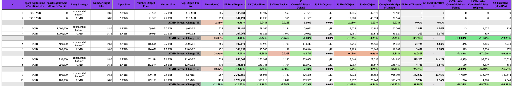
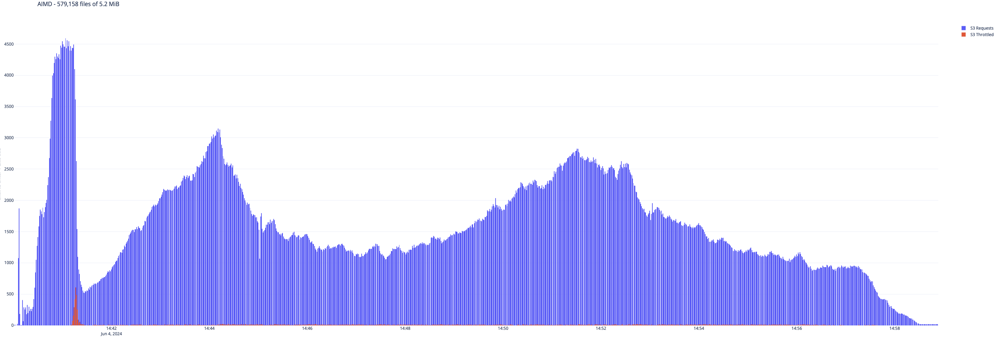
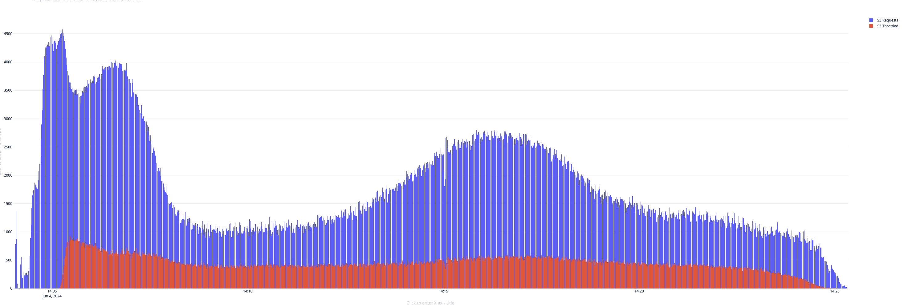

# AIMD Retry Strategy for Amazon S3 Requests in EMRFS

Amazon EMR File System (EMRFS) is a feature that allows Amazon EMR clusters to directly access data stored in Amazon S3. However, in large clusters, the high volume of S3 requests can sometimes lead to throttling exceptions from S3. To address this issue, starting with Amazon EMR release 6.4.0, EMRFS supports an alternative retry strategy based on the Additive Increase/Multiplicative Decrease (AIMD) algorithm.

The AIMD retry strategy is designed to dynamically adjust the request rate to S3 based on the success or failure of recent requests. This approach helps reduce the number of throttled requests and the total number of attempts required per request, ultimately improving the overall performance and efficiency of S3 interactions. The AIMD algorithm works as follows:

1. Additive Increase: When consecutive requests to S3 are successful, the request rate is gradually increased in small increments. This allows EMRFS to probe for available bandwidth without overwhelming S3.
2. Multiplicative Decrease: If S3 returns a 503 (Slow Down) response, indicating throttling, the request rate is reduced multiplicatively by a larger factor. This rapid reduction helps alleviate congestion and prevent further throttling.

By default, the AIMD retry strategy is disabled in EMRFS, as it can potentially degrade performance in some scenarios, especially if other accounts or jobs are causing the high load on the S3 bucket used by the cluster. However, for large Amazon EMR clusters that frequently encounter throttling exceptions, enabling the AIMD retry strategy can significantly improve the overall performance and reliability of S3 interactions.

To enable the AIMD retry strategy, users need to set the fs.s3.aimd.enabled property to true in their emrfs-site configuration. Additionally, EMRFS provides several advanced configuration properties to fine-tune the AIMD behavior, such as [adjusting the rate of increase and decrease, setting minimum and maximum request rates, and controlling the frequency of rate adjustments.](https://docs.aws.amazon.com/emr/latest/ReleaseGuide/emr-spark-emrfs-retry.html#emr-spark-emrfs-retry-advanced-properties)

While the AIMD retry strategy may result in slightly lower throughput compared to more aggressive approaches (default [exponential backoff strategy](https://docs.aws.amazon.com/emr/latest/ReleaseGuide/emr-spark-emrfs-retry.html#emr-spark-emrfs-retry-exponential-backoff)), it strikes a balance between achieving reasonable performance and maintaining network stability and fairness. By dynamically adjusting the request rate based on network conditions, AIMD helps prevent congestion collapse and promotes better overall performance for large Amazon EMR clusters heavily interacting with Amazon S3.

## When to Enable the AIMD Retry Strategy

To determine when to enable the AIMD strategy, we need to first understand the main factors contributing to S3 throttling. Typically, if a single application is generating S3 throttled requests, excluding third-party interactions (other jobs or accounts reading/writing to the bucket), the throttling is primarily driven by the number of concurrent S3 requests generated by each container, which is typically influenced by the number of vCores used in the container.

The number of S3 requests can vary significantly depending on the characteristics of the files being read or written during the job. S3 has different rate limits for different API requests ([3,500 PUT/COPY/POST/DELETE or 5,500 GET/HEAD requests per second](https://docs.aws.amazon.com/AmazonS3/latest/userguide/optimizing-performance.html)), so certain job phases might be more prone to throttling depending on the operations being performed.

It's important to note that bucket [owners aren't billed for HTTP 5XX server error responses](https://docs.aws.amazon.com/AmazonS3/latest/userguide/ErrorCodeBilling.html), such as HTTP 503 Slow Down errors. From a cost perspective, the advantage of using the AIMD retry strategy can be significant if it can reduce job duration in the event of S3 throttled requests compared to the default exponential backoff retry strategy.

Having discussed the factors contributing to S3 throttling, we can highlight some guidelines that can help determine when to consider enabling the AIMD retry strategy:

1. Large Cluster Size: If you have a cluster with a total number of vCores greater than the S3 request limits (e.g., 4,000 vCores exceeding the 3,500 PUT request limit per second), it is highly likely to generate throttled requests, especially if the data size and shape allow for it.
2. Write-Intensive Jobs on Medium-Sized Clusters: For write-intensive jobs running on medium-sized clusters (more than 1,500 vCores) that generate a high number of small files (less than 10 MiB), enabling the AIMD strategy may be beneficial.
3. Significant Throttling: If more than 20% of the total S3 calls generated by a single job are throttled, considering the AIMD retry strategy could be advantageous.

Enabling the AIMD strategy can be particularly useful when dealing with large clusters or write-intensive workloads involving numerous small files. In these scenarios, the default exponential backoff strategy may not be efficient in handling the high volume of throttled requests, leading to prolonged job duration.

## When Not to Enable the AIMD Retry Strategy

While the AIMD retry strategy is beneficial for large clusters with dedicated S3 buckets facing severe throttling issues, it may not be necessary or even harmful in certain situations. For smaller clusters, enabling the AIMD retry strategy may degrade performance if the throttled requests are caused by other clusters or applications external to your cluster. In this case, you might end up sacrificing throughput on the small cluster even though it is not the primary cause of the issue.

Besides, overall the AIMD can increase the processing time of a job, thus increasing the overall compute costs, so AIMD should be enabled only whenever required and shouldn't be used as a default retry strategy unless strictly required. If the number of throttling events is not significant, the overhead of dynamically adjusting the request rate may outweigh the benefits of reduced throttling. Therefore, it's crucial to evaluate the trade-off between improved reliability and potential performance impact before enabling AIMD.

## Benchmark

For these tests, we used a simple Spark application to read and write an input dataset from S3. We then tuned some Spark configurations to increase the chances of triggering S3 throttled requests using the same job during the write operation. Below is an example of the scripts used to create and submit the Spark jobs:

```bash
script_path="/tmp/spark-s3-throttle.py"
input_path="s3://ripani.dub.tests/store_sales/"
output_path="s3://ripani.dub.tests/emrfs_default/"

cat << EOF > $script_path
import sys
from pyspark.sql import SparkSession

input_path = sys.argv[1]
output_path = sys.argv[2]

spark = SparkSession.builder.getOrCreate()
df = spark.read.parquet(input_path)
df.write.mode('overwrite').parquet(output_path)
EOF
```

We used various spark-submit commands to trigger the tests with different configurations:

```bash
## standard configurations
spark-submit --deploy-mode cluster \
--conf spark.yarn.maxAppAttempts=1 \
$script_path $input_path $output_path

# 1M max records per file
spark-submit --deploy-mode cluster --conf spark.yarn.maxAppAttempts=1 \
--conf spark.sql.files.maxPartitionBytes="1GB" \
--conf spark.sql.files.maxRecordsPerFile="1000000" \
$script_path $input_path $output_path

# 500k max records per file
spark-submit --deploy-mode cluster \
--conf spark.yarn.maxAppAttempts=1 \
--conf spark.sql.files.maxPartitionBytes="1GB" \
--conf spark.sql.files.maxRecordsPerFile="500000" \
$script_path $input_path $output_path

# 250k max records per file
spark-submit --deploy-mode cluster \
--conf spark.yarn.maxAppAttempts=1 \
--conf spark.sql.files.maxPartitionBytes="1GB" \
--conf spark.sql.files.maxRecordsPerFile="250000" \
$script_path $input_path $output_path

# 100k max records per file
spark-submit --deploy-mode cluster \
--conf spark.yarn.maxAppAttempts=1 \
--conf spark.sql.files.maxPartitionBytes="1GB" \
--conf spark.sql.files.maxRecordsPerFile="100000" \
$script_path $input_path $output_path
```

To run the tests, we used a 200 m5d.2xlarge EMR cluster (for a total of 1600 vCores) running emr-7.1.0. As evident from the Python script, we wrote all the data to a single bucket prefix with no partitioning to increase the chances of throttled requests during write operations.

Below a table summarizing data collected during the tests:



The benchmark tested different configurations of spark.sql.files.maxPartitionBytes and spark.sql.files.maxRecordsPerFile to produce various output file shapes and sizes, ranging from a standard 133 MiB files per partition up to 579,158 small 5.2 MiB files. The input dataset consisted of 1486 files totaling 2.7 TiB of compressed parquet data.

Across these workloads, enabling the AIMD retry strategy provided substantial benefits in reducing S3 throttling and improving job duration when throttling was a major bottleneck:

* For the most throttling-prone case writing 579,158 small 5.2 MiB files (row 9), the default strategy experienced 23.5% throttled S3 requests. With AIMD (row 10), this dropped to just 0.56% while decreasing runtime by 11.6%.
* Writing 232,594 small 12.6 MiB files (rows 7-8), AIMD reduced throttling from 14.6% to 0.67, but  improved runtime by 10.4%.
* Similar to the previous entry in rows 5-6, AIMD cut throttling from 14.62% to 0.67% but increased of a 29% the overall job runtime.

The results demonstrate AIMD's effectiveness at mitigating severe throttling scenarios caused by highly parallel, write-intensive workloads on large EMR clusters. While providing substantial reliability and performance gains in these cases, AIMD can slightly degrade performance when throttling pressure is low. For the above reasons, we recommend to benchmark your cluster before enabling the AIMD retry strategy in a production job, if costs is your main concerns.

## Analyzing Job S3 Requests and Throttling

To analyze the S3 requests generated by an EMR job, you can choose from the methods listed in the Logging options for Amazon S3 available in the AWS Documentation (https://docs.aws.amazon.com/AmazonS3/latest/userguide/logging-with-S3.html). Please note that Logging Amazon S3 API calls using AWS CloudTrail can deliver the logs faster in the S3 bucket for analysis (around 5 minutes) but has some additional costs.

To analyze the S3 request logs, you can follow these steps:

1. Enable S3 logging the S3 buckets used by your cluster (https://docs.aws.amazon.com/AmazonS3/latest/userguide/enable-cloudtrail-logging-for-s3.html)
2. Create a CloudTrail Athena Table to analyze the S3 requests using SQL queries (https://docs.aws.amazon.com/athena/latest/ug/cloudtrail-logs.html#create-cloudtrail-table-partition-projection)
3. Query the data.

## S3 Request / Counts

```sql
-- Get S3 Requests counts by S3 API name
WITH app AS (
  SELECT
    date_parse('2024-06-04T14:39:56Z', '%Y-%m-%dT%H:%i:%sZ') AS start_time,
    date_parse('2024-06-04T14:58:54Z', '%Y-%m-%dT%H:%i:%sZ') AS end_time,
    'arn:aws:iam::YOUR_ACCOUNT_ID:role/EMR_EC2_DefaultRole' AS ec2_role
)
SELECT
  eventname,
  count(*) AS request_count
FROM "SCHEMA"."YOUR_CT_TABLE_NAME", app
WHERE date_parse(eventtime, '%Y-%m-%dT%H:%i:%sZ') >= app.start_time
  AND date_parse(eventtime, '%Y-%m-%dT%H:%i:%sZ') < app.end_time
  AND useridentity.sessioncontext.sessionissuer.arn = app.ec2_role
GROUP BY eventname
ORDER BY request_count DESC;

-- Get S3 Throttled Requests counts by S3 API name
WITH app AS (
  SELECT
    date_parse('2024-06-04T14:39:56Z', '%Y-%m-%dT%H:%i:%sZ') AS start_time,
    date_parse('2024-06-04T14:58:54Z', '%Y-%m-%dT%H:%i:%sZ') AS end_time,
    'arn:aws:iam::YOUR_ACCOUNT_ID:role/EMR_EC2_DefaultRole' AS ec2_role
)
SELECT
  eventname,
  count(*) AS request_count
FROM "SCHEMA"."YOUR_CT_TABLE_NAME", app
WHERE date_parse(eventtime, '%Y-%m-%dT%H:%i:%sZ') >= app.start_time
  AND date_parse(eventtime, '%Y-%m-%dT%H:%i:%sZ') < app.end_time
  AND useridentity.sessioncontext.sessionissuer.arn = app.ec2_role
  AND errorcode = 'SlowDown'
GROUP BY eventname
ORDER BY request_count DESC;
```

These SQL queries are designed to analyze S3 requests and throttled requests from CloudTrail logs stored in an Athena table. Here's a breakdown of what each query does:

* Get S3 Requests counts by S3 API name:
    * This query retrieves the count of S3 events or API calls grouped by the eventname (which represents the S3 API operation name).
    * It filters the events based on the following conditions:
        * eventtime (the time when the event occurred) falls within a specific time range defined by the date_parse functions.
        * useridentity.sessioncontext.sessionissuer.arn matches the provided IAM role ARN used as EC2 Instance Role by the cluster analyzed (in this case, 'arn:aws:iam::YOUR_ACCOUNT_ID:role/EMR_EC2_DefaultRole').
    * The GROUP BY eventname clause groups the results by the S3 API operation name, allowing you to see the count of requests for each operation.
* Get S3 Throttled Requests counts by S3 API name:
    * This query is similar to the first one, but it specifically looks for throttled or rate-limited S3 requests by adding an additional filter condition: errorcode = 'SlowDown'.
    *  The SlowDown error code indicates that the request was throttled due to excessive rates.
    *  Like the previous query, it groups the results by the eventname (S3 API operation name) and counts the number of throttled requests for each operation.

Both queries use the Athena table specified by "SCHEMA"."YOUR_CT_TABLE_NAME", which should be replaced with the actual schema and table name where your CloudTrail logs are stored.

Additionally, you need to replace 'YOUR_ACCOUNT_ID' with your actual AWS account ID in the IAM role ARN.

These queries can help you analyze S3 usage patterns, identify frequently used S3 API, and detect potential bottlenecks or performance issues caused by throttled requests. By adjusting the time range and filtering conditions, you can analyze the data for different periods or specific roles/resources as needed.

## S3 requests visualization

The following queries are designed to extract data points from AWS CloudTrail logs, which can be used to generate visualizations and dashboards for monitoring and analyzing S3 requests made by a job running on EMR. By aggregating the request counts per second, you can gain insights into the patterns and potential bottlenecks in S3 access during the execution of an EMR job.

```sql
-- Get S3 request count aggregated per second
WITH app AS (
  SELECT
    date_parse('2024-06-04T14:39:56Z', '%Y-%m-%dT%H:%i:%sZ') AS start_time,
    date_parse('2024-06-04T14:58:54Z', '%Y-%m-%dT%H:%i:%sZ') AS end_time,
    'arn:aws:iam::YOUR_ACCOUNT_ID:role/EMR_EC2_DefaultRole' AS ec2_role
)
SELECT
  eventtime,
  count(*) AS request_count
FROM "SCHEMA"."YOUR_CT_TABLE_NAME", app
WHERE date_parse(eventtime, '%Y-%m-%dT%H:%i:%sZ') >= app.start_time
  AND date_parse(eventtime, '%Y-%m-%dT%H:%i:%sZ') < app.end_time
  AND useridentity.sessioncontext.sessionissuer.arn = app.ec2_role
GROUP BY eventtime
ORDER BY eventtime;

-- Get S3 throttled request count aggregated per second
WITH app AS (
  SELECT
    date_parse('2024-06-04T14:39:56Z', '%Y-%m-%dT%H:%i:%sZ') AS start_time,
    date_parse('2024-06-04T14:58:54Z', '%Y-%m-%dT%H:%i:%sZ') AS end_time,
    'arn:aws:iam::YOUR_ACCOUNT_ID:role/EMR_EC2_DefaultRole' AS ec2_role
)
SELECT
  eventtime,
  count(*) AS request_count
FROM "SCHEMA"."YOUR_CT_TABLE_NAME", app
WHERE date_parse(eventtime, '%Y-%m-%dT%H:%i:%sZ') >= app.start_time
  AND date_parse(eventtime, '%Y-%m-%dT%H:%i:%sZ') < app.end_time
  AND useridentity.sessioncontext.sessionissuer.arn = app.ec2_role
  AND errorcode = 'SlowDown'
GROUP BY eventtime
ORDER BY eventtime;
```

The first query retrieves the total count of S3 requests made by the EMR cluster within a specific time range, grouped by the event time (aggregated by second). This data can be used to create a line chart or time-series visualization, showing the overall S3 request volume over time.

The second query focuses specifically on throttled S3 requests, where the error code 'SlowDown' was encountered. This query provides insights into periods when the EMR cluster experienced S3 throttling, which can occur when the request rate exceeds the service limits imposed by Amazon S3. By visualizing the throttled request counts over time, you can identify potential bottlenecks and take steps to adjust the S3 access patterns.

To illustrate a practical example, consider the following visualization that depicts the behavior of job runs 9 and 10, highlighting the difference in how the respective EMRFS retry algorithms react to throttling events.


Figure 1. Exponential Backoff


Figure 2. AIMD Retry

## Alternative Approach - S3 analysis using YARN Container Logs

As an alternative approach, you can enable Spark Debug Logs when launching an EMR cluster to include S3 call details in the YARN container logs. This can be achieved by setting the Spark rootLogger.level to debug and the logger.http.level to off in the spark-log4j2 classification.

After running your Spark job, you can use the provided spark_s3_analyze.sh script to analyze the YARN container logs and retrieve various S3 metrics. The script downloads and decompresses the logs, calculates the application's elapsed time, counts the S3 requests by type, lists the input and output S3 paths with their sizes and displays the top 10 S3 requests per second.

## EMR Cluster Classification

```json
[
  {
    "Classification": "spark",
    "Properties": {
      "maximizeResourceAllocation": "true"
    }
  },
  {
    "Classification": "spark-log4j2",
    "Properties": {
      "rootLogger.level": "debug",
      "logger.http.name": "com.amazon.ws.emr.hadoop.fs.shaded.org.apache.http.wire",
      "logger.http.level": "off"
    }
  }    
]
```

## spark_s3_analyze.sh - Script to analyze YARN Container logs for S3 details

```bash
#!/bin/bash
#===============================================================================
#!# script: spark_s3_analyze.sh
#!# version: v0.1
#!#
#!# Process Spark (YARN container's logs) to retrieve S3 metrics
#===============================================================================
#?#
#?# usage: ./spark_s3_analyze.sh <S3_LOG> <S3_INPUT> <S3_OUTPUT>
#?#
#?#   S3_LOG              Amazon EMR S3 Log Path
#?#   S3_INPUT            S3 path of the input data
#?#   S3_OUTPUT           S3 path of the output data
#?#
#===============================================================================
RED='\033[0;31m'
NC='\033[0m'

s3_logs="$1"
input_path="$2"
output_path="$3"

# dowload and decompress logs
tmp_path=$(mktemp -d)
cd $tmp_path && aws s3 sync $s3_logs . 
gzip -d */*.gz

echo -e "# ${RED}Application Time${NC}\n"
completed=$(
  grep -Ri "Final app status" *001/stderr | awk '{split($0,a," "); print a[2]}'
)
started=$(
  grep -Ri "ApplicationAttemptId:" *001/stderr | awk '{split($0,a," "); print a[2]}'
)

start=$(echo $started | awk -F: '{ print ($1 * 3600) + ($2 * 60) + $3 }')
end=$(echo $completed | awk -F: '{ print ($1 * 3600) + ($2 * 60) + $3 }')
duration=$(($end - $start))
elapsed=$(TZ=UTC0 printf '%(%H:%M:%S)T\n' $duration)

echo "Started   : $started"
echo "Completed : $completed"
echo "Elapsed   : $elapsed ($duration sec)"
echo

echo -e "# ${RED}Get S3 requests count${NC}\n"
grep -Rh "Executing request" * | awk '{split($0,a," "); print a[7]}' | \
  sort | uniq -c
echo

echo -e "# ${RED}S3 Input Path${NC}\n"
echo -e "Path: $input_path\n"
aws s3 ls $input_path --recursive --summarize --human-readable | grep "Total" | \
  sed 's/^ *//; s/ *$//; /^$/d'
echo
echo -e "# ${RED}S3 Output Path${NC}\n"
echo -e "Path: $output_path\n"
aws s3 ls $output_path --recursive --summarize --human-readable | grep "Total" | \
  sed 's/^ *//; s/ *$//; /^$/d'
echo

echo -e "# ${RED}S3 Requests x second (${NC}Top 10${RED})${NC}\n"
grep -Rh "Executing request" * | awk '{split($0,a," "); print a[2]}' | \
  sort | uniq -c | sort -n | tail -n 10
  
cd 
rm -rf $tmp_path
```
