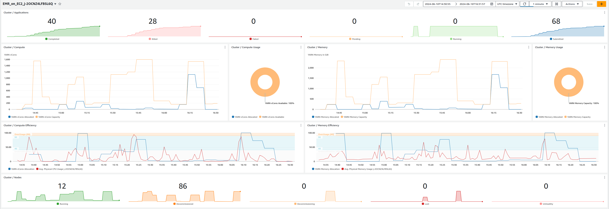
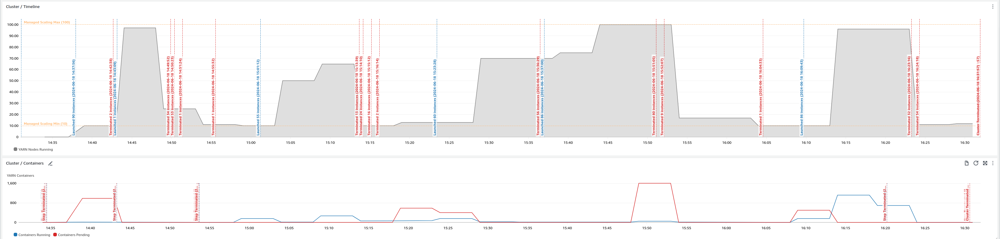

# Monitor Cluster Performance with CloudWatch

Amazon EMR allows you to process vast amounts of data quickly and cost-effectively. However, monitoring the performance of your EMR clusters is crucial to ensure optimal resource utilization and efficient job execution. One powerful tool for monitoring EMR clusters is Amazon CloudWatch, a monitoring and observability service provided by AWS.

The script `emr-cw_dashboard.sh` streamlines the process of creating a CloudWatch dashboard, enabling you to monitor the performance of your EMR cluster. This dashboard offers insights into various Hadoop metrics, such as resource utilization, container management, and overall cluster health. It displays cluster resource utilization metrics, including memory and virtual core usage, allowing you to identify potential bottlenecks and evaluate scaling actions taken by Managed Scaling.

By analyzing these metrics, you can gain insights into whether your cluster can run more efficiently with different instance families or if you can reduce the cluster size while maintaining the same level of performance. Additionally, the dashboard provides visibility into the overall cluster health by monitoring active, decommissioned, lost, and unhealthy nodes. Notably, the script leverages data generated by the EMR API to create annotations within the graphs, visually indicating when EC2 instances were launched or terminated, as well as the execution time of EMR steps. This comprehensive view enables you to correlate your cluster's performance with operational events, facilitating better decision-making and optimizing resource utilization.

## Getting Started

1. **Configure EMR Cluster** Ensure that your EMR cluster has the [CloudWatch Agent](https://docs.aws.amazon.com/emr/latest/ReleaseGuide/AmazonCloudWatchAgent-config-710.html) installed and configured to publish the Hadoop metrics in CloudWatch (please note that metrics published by the CloudWatch agent will incur in additional costs). You can reference the following EMR Configuration to publish the required Hadoop metrics in CloudWatch:

```json
{
  "Classification": "emr-metrics",
  "Properties": {},
  "Configurations": [
    {
      "Classification": "emr-hadoop-yarn-resourcemanager-metrics",
      "Properties": {
        "Hadoop:service=ResourceManager,name=ClusterMetrics": "CapabilityMB,CapabilityVirtualCores,UtilizedMB,UtilizedVirtualCores,NumActiveNMs,NumDecommissionedNMs,NumDecommissioningNMs,NumLostNMs,NumUnhealthyNMs",
        "Hadoop:service=ResourceManager,name=QueueMetrics,q0=root": "AppsCompleted,AppsFailed,AppsKilled,AppsPending,AppsRunning,AppsSubmitted,AllocatedContainers,AllocatedMB,AllocatedVCores,AvailableMB,AvailableVCores,PendingContainers,PendingMB,PendingVCores",
        "otel.metric.export.interval": "30000"
      }
    }
  ]
}
```

2. **Run the Script** Once your cluster is configured, you can run the `emr-cw_dashboard.sh` script either as an EMR step or externally, providing the cluster ID and AWS region as input parameters. The script will automatically create the CloudWatch dashboard, enabling you to visualize and monitor the performance of your EMR cluster in real-time.

Please note that events related to instances and EMR steps start / termination times are generated by the bash script. You might want to run the script only when the cluster is terminated to generate all the annotation events that will be displayed in the dashboard.

## Resources

[emr-cw_dashboard.sh](Assets/emr-cw_dashboard.sh)

## Sample View


