# Resource contention 

## ****Overview****

This structured guide provides strategies to maintain peak performance and reliability in EMR with steps to help you identify, diagnose, and resolve common EMR cluster problems stemming from performance issues related to disk space, CPU utilization, and memory usage. Throughout the guide, you'll find preventive measures to implement for long-term cluster health and application resilliency and information about additional tools and resources.

## Getting Started

Begin by reviewing common errors and known issues, including how to locate and analyze EMR/Hadoop logs. This initial section introduces key resources: AWS re:Post for community-driven solutions, existing AWS documentation for official guidance, and Amazon Q, which provides assistance for EMR-related queries and troubleshooting. Next, navigate to the specific section that addresses your cluster's symptoms, whether they're related to disk space, CPU utilization, or memory usage. For each of these areas, you'll find resource-specific diagnostics, including relevant commands, metrics, and log analysis techniques to apply as you progress. 

To enhance your troubleshooting capabilities even further, review the provided automation tools such as SAW (Support Automation Workflow) for EMR log analysis, and leverage Knowledge Center (KC) articles for efficient log searching and querying. The guide also covers how to interpret and use node-level monitoring solutions for proactive issue detection.  

## Addressing Common EMR Cluster Errors and Known Issues

You can troubleshoot common EMR cluster issues using EMR [troubleshooting documentation](https://docs.aws.amazon.com/emr/latest/ManagementGuide/emr-troubleshoot.html) and using solutions on AWS [re:Post](https://repost.aws/). These resources provide comprehensive guidance for resolving known EMR problems efficiently and information on available EMR tools for effective cluster troubleshooting. Subsequent sections cover using Amazon Q for EMR troubleshooting and analyzing Hadoop and EMR logs to investigate issues.  

### Amazon Q for EMR troubleshooting  

You can ask Amazon Q about AWS architecture, best practices, support, and documentation. Amazon Q can provide you answer from the related AWS documentation or resources. Please review the provided information and determine if it helps to troubleshoot issue you are facing. If it is not helpful, you can rephrase the question. 

To chat with Amazon Q Developer in the AWS Management Console, choose the Amazon Q icon in the right sidebar. To chat on the AWS website or any AWS service’s documentation page, choose the Amazon Q icon in the bottom right corner. You can refer [Working with Amazon Q on AWS websites](https://docs.aws.amazon.com/amazonq/latest/qdeveloper-ug/chat-with-q.html#working-with-q) for more information. Below examples shows the sample questions. 

Examples:  

        1. My EMR cluster is terminated with the error `NO_SLAVE_LEFT`. Can you please help me to troubleshoot the error?
        2. My EMR cluster failed with the error `EC2 QUOTA EXCEEDED`. Can you please help to troubleshoot it?


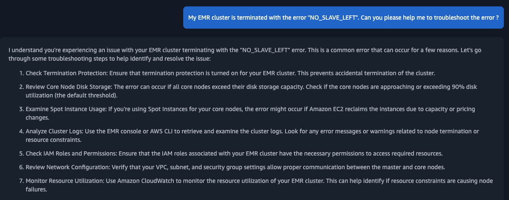

### Troubleshot logs on EMR

Amazon EMR and Hadoop both produce log files that report status on the cluster. By default, these are written to the primary node in the `/mnt/var/log/` directory. Depending on how you configured your cluster when you launched it, these logs may also be archived to Amazon S3 and may be viewable through the graphical debugging tool. To understand how different type of logs are stored in EMR, please refer the details in [View log files](https://docs.aws.amazon.com/emr/latest/ManagementGuide/emr-manage-view-web-log-files.html) and under [Configure Amazon EMR cluster logging and debugging](https://docs.aws.amazon.com/emr/latest/ManagementGuide/emr-plan-debugging.html). The log location where logs are stored may contain multiple files for the specific log type as the logs would be rotated. Example: Instance state logs folder may contain multiple files with the format `instance-state.log-YYYY-MM-DD-HH-MM` format. Based on timeline of issue, review the relevant logs. Subsequent sections covers how Hadoop daemon logs and EMR Instance state logs are stored on EMR and view them.

* **Viewing logs files for namenode and datanode logs in EMR**

    * **Namenode logs:**
        * Namenode logs are written to  `/mnt/var/log/` directory on the primary node or logs archived to Amazon S3.
        * Example: 
            * From primary node you can find the namenode logs under the `/mnt/var/log/hadoop-hdfs` path.
            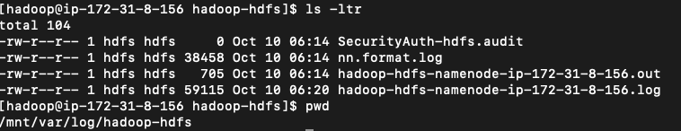
            * From logs that are archived to Amazon S3, you can find the namenode logs under path `s3://myBucket/elasticmapreduce/j-xxxxxxxxxxx/node/i-xxxxxxxxxxxxxxxxx/applications/hadoop-hdfs/`.  The instance id here is primary node instance id. 

    * **Datanode logs:**
        * Datanode logs are written to  `/mnt/var/log/` directory on the core node or logs archived to Amazon S3.
        * Example:
            * From core node, you can find the data node logs are written to `/mnt/var/log/hadoop-hdfs` path.
            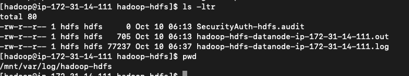
            * From logs that are archived to Amazon S3, you can find the datanode logs under path `s3://myBucket/elasticmapreduce/j-xxxxxxxxxxx/node/i-xxxxxxxxxxxxxxxxx/applications/hadoop-hdfs/`.  The instance id here is core node instance id. 

* **Viewing logs files for resourcemanager and nodemanager** 
    *  **Resourcemanager logs:**
        * Resourcemanager logs are written to `/mnt/var/log/` directory on the primary node or logs archived to Amazon S3.
        * Example:
            * From primary node you can find the resource manager logs under the `/mnt/var/log/hadoop-yarn` path. 
            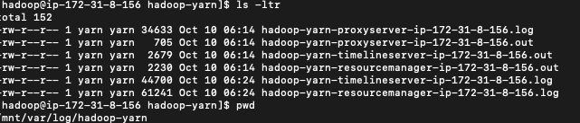
            * From logs that are archived to Amazon S3, you can find the resource manager logs under path  `s3://myBucket/elasticmapreduce/j-xxxxxxxxxxx/node/i-xxxxxxxxxxxxxxxxx/applications/hadoop-yarn/`. The instance id here is primary node instance id. 

    * **Nodemanager logs:**
        * Nodemanager logs are written to  `/mnt/var/log/` directory on the core(and task node if present) node or logs archived to Amazon S3.
        * Example:
            * You can check the node manager logs on the core node (and task node if present). From core or task node you can find the nodemanager logs under the `/mnt/var/log/hadoop-yarn` path.
            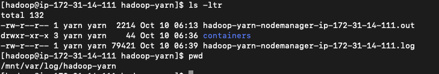
            * From logs that are archived to Amazon S3, you can find the datanode under path `s3://myBucket/elasticmapreduce/j-xxxxxxxxxxx/node/i-xxxxxxxxxxxxxxxxx/applications/hadoop-yarn/`.  The instance id here is core node instance id. 

* **Viewing application logs:**
    * You can check the relevant application logs from container folder from the logs that are archived to Amazon S3. Example bucket path - `s3://myBucket/elasticmapreduce/j-xxxxxxxxxxx/containers/` 
    * Example application logs: 
        * Application container logs. The container logs that ends with `_00001` is the application master log. Example `container_1728540895407_0001_01_000001`. If it is the spark job which is submitted in `cluster` mode the driver would run in the application master container.

            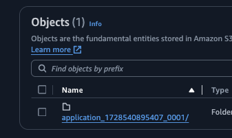

        * Other containers are the containers which would execute the task allocated by Application Master(AM). If it is the spark job the non AM container will run the executors.

            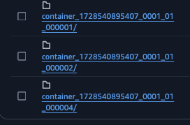

    * You can find the logs for specific application using [Yarn command](https://hadoop.apache.org/docs/stable/hadoop-yarn/hadoop-yarn-site/YarnCommands.html) by running it on cluster node.
         ```
         Example: yarn logs -applicationId (application_no)
         ```

    * Review the log using  persistent application user interfaces to troubleshoot the logs based on the application you used. Example: Spark, TEZ etc. [View persistent application user interfaces](https://docs.aws.amazon.com/emr/latest/ManagementGuide/app-history-spark-UI.html)
    * For detailed spark application troubleshooting, please refer the [article](https://repost.aws/knowledge-center/spark-driver-logs-emr-cluster). It shows how to troubleshoot the Spark application on EMR when spark job is submitted in different deployment modes. 

* **Viewing instance state logs**
    * You can check the instance state logs for primary or core or task node from path `/mnt/var/log/instance-state` . These contain information about the CPU, memory state, and garbage collector threads of the node. 
    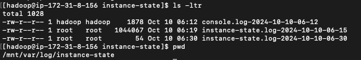
    * From logs that are archived to Amazon S3, you can find the instant state logs under path `s3://myBucket/elasticmapreduce/j-xxxxxxxxxxx/node/i-xxxxxxxxxxxxxxxxx/daemons/instance-state/`. Here the instance can be primary or core or task node.  

## Troubleshooting Disk space related issues on EMR 

EMR service emits events and metrics to CloudWatch service to track the activity and health of an Amazon EMR cluster.  Metrics are useful to monitor a specific value - for example, the percentage of available disk space that HDFS is using within a cluster. For detailed list of metrics emitted by EMR service, please refer [Metrics reported by Amazon EMR in CloudWatch](https://docs.aws.amazon.com/emr/latest/ManagementGuide/UsingEMR_ViewingMetrics.html#UsingEMR_ViewingMetrics_MetricsReported). Subsequent section shows how monitoring specific EMR cluster CloudWatch metrics - HDFSUtilization, MissingBlocks, CorruptBlocks and CapacityRemainingGB can assist with HDFS health and usage related issues. 

### Check the cluster level HDFS related metrics to understand if there is a cluster level space issue [](https://docs.aws.amazon.com/emr/latest/ManagementGuide/UsingEMR_ViewingMetrics.html)and how to troubleshoot it. 

* **How is HDFS setup in EMR?**
    * HDFS replication factor(dfs.replication) in EMR.  
        * In HDFS, the replication factor is the number of copies of each data block that are stored in HDFS for redundancy. The replication factor increases with the number of nodes in the EMR cluster ([default setup](https://docs.aws.amazon.com/emr/latest/ReleaseGuide/emr-hdfs-config.html)): there are 3 copies of each data block for a cluster with 10 or more nodes, 2 copies of each block for a cluster with 4 to 9 nodes, and 1 copy (no redundancy) for clusters with 3 or fewer nodes. The total HDFS space available is divided by the replication factor. 
        * Example: 
            * For example, a cluster with ten core nodes of type m1.large would have 2833 GB of space available to HDFS ((10 nodes X 850 GB per node)/replication factor of 3). 

* **Why does HDFS show high consumption?**
    * There can be different common reasons why HDFS might fill up: 
        * User manually terminate cluster’s data node. This reduces overall available free space to the HDFS.
        * Specific job is writing data continuously to the HDFS and filling up space. 
        * In some cases, such as increasing the number of nodes from 9 to 10, the increase in replication factor can actually cause the amount of available HDFS space to decrease.
        * In some cases, decreasing number of core nodes, for example from 10 to 5 considering replication factor setting to 3 or 2, will also lead to filling up of HDFS and cause unhealthy node related issues.
        * Data node is running in a cluster but not able to communicate to the namenode. 
            * It can be due to:
                * Networking issue between namenode and datanode. 
                * Due to high resource usage on data node which makes it unresponsive. 
                * Infrastructure issue on the data node. 

* **What are the commands or utility to check HDFS filesystem, health and usage?**
    * By executing HDFS `dfsadmin` and `fsck` command you can get the details of the HDFS filesystem, health and usage. Based on output of command, you can further dive deep. Monitor the CloudWatch metrics HDFSUtilisation,  MissingBlocks, CorruptBlocks and CapacityRemainingGB. 
    * **HDFS filesystem checking utility [fsck](https://hadoop.apache.org/docs/current/hadoop-project-dist/hadoop-hdfs/HDFSCommands.html#fsck)**
    * It helps to review HDFS filesystem health. fsck can be run on the whole file system or on a subset of files. It is designed for reporting problems with various files, for example, missing blocks for a file or under-replicated blocks. `hdfs fsck` command when executed from the cluster node, will show the possible options that can be passed to `fsck` command. 
        * Example: 
            * Run `hdfs fsck /` command on one of the node in cluster. It will generate the report on the overall HDFS filesystem status under the HDFS path `hdfs fsck /`. Sample output from EMR primary node would look like below. 
                * Output: 
                
                    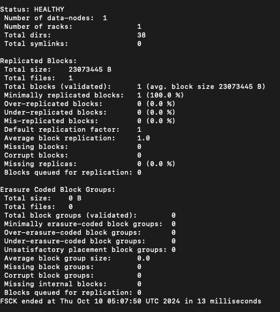

    * **HDFS admin command “[dfsadmin](https://hadoop.apache.org/docs/current/hadoop-project-dist/hadoop-hdfs/HDFSCommands.html#dfsadmin)“**
    * It helps to generate HDFS usage report and perform HDFS admin level task. `hdfs dfsadmin` command when executed from the cluster node, will show the possible options that can be passed to `dfsadmin` command. `-report` option reports basic statistics of HDFS usage. 
        * Example: 
            * Run `hdfs dfsadmin -report` on one of the node in cluster. It will generate the report on the overall HDFS health and usage. Sample output from EMR primary node would look like below.
                * Output:

                    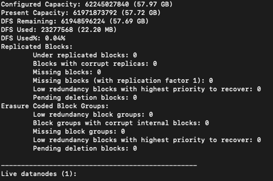

* **Mitigate HDFS related issues**
    * Review below common errors which cluster can report when HDFS usage is high and how to resolve it. HDFS related errors can be reported under the namenode logs on primary node, datanode logs on the core nodes and in the application logs. Please check the relevant logs for the error based on the issue timeline. For log review, please check the section [Troubleshot logs on EMR](#troubleshot-logs-on-emr).
        * [HDFS insufficient space error](https://docs.aws.amazon.com/emr/latest/ManagementGuide/emr-hdfs-insufficient-space.html)
        * [File could only be replicated to 0 nodes instead of 1](https://docs.aws.amazon.com/emr/latest/ManagementGuide/emr-troubleshoot-error-resource-2.html)
        * [Cannot replicate block, only managed to replicate to zero nodes.](https://docs.aws.amazon.com/emr/latest/ManagementGuide/enough-hdfs-space.html)
        * [HDFS replication factor error](https://docs.aws.amazon.com/emr/latest/ManagementGuide/emr-hdfs-insufficient-replication.html)

    * If HDFSUtilization metric is above the threshold you have set for your cluster, please review below points to troubleshoot further. 
        * Scale up the number of core nodes in your Amazon EMR cluster. If you use managed scaling or autoscaling, increase the minimum capacity of your core nodes.
        * Use larger EBS volumes for your core nodes when you create your EMR cluster.
        * Delete unneeded HDFS data in your EMR cluster. 
        * If your cluster is one that can be stopped and restarted, you may consider using core nodes of a larger Amazon EC2 instance type. 
        * You might also consider adjusting the replication factor. Be aware, though, that decreasing the replication factor reduces the redundancy of HDFS data and your cluster's ability to recover from lost or corrupted HDFS blocks

    * **Review HDFS MissingBlocks, CorruptBlocks and CapacityRemainingGB metrics**
        * MissingBlocks metric indicates the number of blocks in which HDFS has no replicas. 
        * CorruptBlocks metrics indicates the number of blocks that HDFS reports as corrupted. 
        * CapacityRemainingGB indicates the available amount of remaining HDFS disk capacity. 
            * If there are MissingBlocks reported, review the files for which blocks are missing. 
            * If there are CorruptBlocks reported, review the cluster further for the data loss. 
                * Run `hdfs fsck /` command on one of the node in cluster. It will generate the report on the overall HDFS filesystem status under the HDFS path `hdfs fsck /`
                * Run `hdfs dfsadmin -report` on one of the node in cluster. It will generate the report on the overall HDFS health and usage. 
                * Run `hdfs hdfs fsck / -files -blocks -locations` command. It should list all files and their blocks, including information about the corrupt replicas
                * Based on output of above commands, review the blocks those are reported as a missingblocks or corruptblocks.
                    * If they are part of specific data node, please check if the data node is running or not. Check if data node is able to communicate with the name node or not. 
                    * If the replication factor is set to 1 and If core node is of type spot and due to spot interruption, there is chances of missing and corrupted block issues. 
                    * Review the cause and resolution for one of the known issue in Hadoop 
                        * [File could only be replicated to 0 nodes instead of 1](https://docs.aws.amazon.com/emr/latest/ManagementGuide/emr-troubleshoot-error-resource-2.html)

### Check the cluster level metrics to understand if there is a disk related issue at node level and how to troubleshoot it. 

#### Why nodes are considered unhealthy?
    * Nodes that have at least one Amazon Elastic Block Store (Amazon EBS) volume attached are considered unhealthy if they hit more than 90% disk utilization.
    * In Hadoop, NodeManager periodically checks the Amazon Elastic Block Store (Amazon EBS) volumes that are attached to the cluster's nodes. If disk utilization on a node that has one volume attached is greater than the YARN property yarn.nodemanager.disk-health-checker.max-disk-utilization-per-disk-percentage (default value 90%), then the node is considered unhealthy. When a node is unhealthy, ResourceManager kills all containers running on that node. ResourceManager doesn't schedule new containers on unhealthy nodes. You can review and set the property as per your use case. For more information, see [NodeManager in the Hadoop documentation](https://hadoop.apache.org/docs/current/hadoop-yarn/hadoop-yarn-site/NodeManager.html) and yarn-site properties in [Amazon EMR cluster terminates with NO_SLAVE_LEFT and core nodes FAILED_BY_MASTER](https://docs.aws.amazon.com/emr/latest/ManagementGuide/emr-cluster-NO_SLAVE_LEFT-FAILED_BY_MASTER.html). 

#### How do I track lost nodes and unhealthy nodes?
    * The MRLostNodes metric tracks when one or more core or task nodes is unable to communicate with the primary node. For example, the core or task node is unreachable by the primary node. 
    * The MRUnhealthyNodes metric tracks when one or more core or task nodes run out of local disk storage and transition to an UNHEALTHY YARN state. For example, core or task nodes are running low on disk space and will not be able to run tasks. 

#### How do I identify the unhealthy nodes?
    * If ResourceManager kills multiple executors because of unhealthy nodes, then the application fails with a "slave lost" error. To confirm that a node is unhealthy, review the NodeManager logs or the instance controller logs:
    * The location of the NodeManager logs is defined in the YARN_LOG_DIR variable in yarn-env.sh.
    * The instance controller logs are stored at /emr/instance-controller/log/instance-controller.log on the primary node. The instance controller logs provide an aggregated view of all the nodes of the cluster.
    * If a node is unhealthy, the logs show an entry that looks like this Y:U (U state Unhealthy),
        ```
        * INFO Poller: InstanceJointStatusMap contains 40 entries (R:40):
        *   i-006baxxxxxx  1829s R   1817s ig-3B ip-xxx-xx-xx-xxx I:    7s Y:U    11s c: 0 am:    0 H:R  0.0%Yarn unhealthy Reason : 1/1 local-dirs are bad: /mnt/yarn; 1/1 log-dirs are bad: /var/log/hadoop-yarn/containers
        *   i-00979xxxxxx  1828s R   1817s ig-3B ip-xxx-xx-xx-xxx I:    7s Y:R     9s c: 3 am: 2048 H:R  0.0%
        *   i-016c4xxxxxx  1834s R   1817s ig-3B ip-xxx-xx-xx-xxx I:   13s Y:R    14s c: 3 am: 2048 H:R  0.0%
        *   i-01be3xxxxxx  1832s R   1817s ig-3B ip-xxx-xx-xx-xxx I:   10s Y:U    12s c: 0 am:    0 H:R  0.0%Yarn unhealthy Reason : 1/1 local-dirs are bad: /mnt/yarn; 1/1 log-dirs are bad: /var/log/hadoop-yarn/containers
        ```

#### How to troubleshoot the unhealthy nodes?
    * You can find the details related to unhealthy nodes or high disk usage, 
        * In the instance-controller.log, 
        * In the node manager logs, 
        * By executing `df -h` command on the marked as unhealthy node.  
        * By checking the instance state logs for the `df -h` command output. Check for the directories that contain the `mnt` keyword in output. 
    * Common errors which cluster can report when UNHEALTHY node state is reported due to high disk usage and how to troubleshoot it: 
        * [Why is the core node in my Amazon EMR cluster running out of disk space?](https://repost.aws/knowledge-center/core-node-emr-cluster-disk-space)
        * [Cluster terminates with NO_SLAVE_LEFT and core nodes FAILED_BY_MASTER](https://docs.aws.amazon.com/emr/latest/ManagementGuide/emr-cluster-NO_SLAVE_LEFT-FAILED_BY_MASTER.html)
        * [How do I resolve ExecutorLostFailure "Slave lost" errors in Spark on Amazon EMR?](https://repost.aws/knowledge-center/core-node-emr-cluster-disk-space)
        * [How do I resolve "no space left on device" stage failures in Spark on Amazon EMR?](https://repost.aws/knowledge-center/no-space-left-on-device-emr-spark)
        * [How do I stop a Hadoop or Spark job's user cache so that the cache doesn't use too much disk space in Amazon EMR?](https://repost.aws/knowledge-center/user-cache-disk-space-emr)

#### Review additional steps
    * Remove unnecessary local and temporary files from the disk with high usage. 
    * Add more Amazon Elastic Block Store (Amazon EBS) capacity for new cluster or running cluster([reference](https://repost.aws/knowledge-center/no-space-left-on-device-emr-spark)).
    * Dynamically scale up storage on Amazon EMR clusters.([reference](https://aws.amazon.com/blogs/big-data/dynamically-scale-up-storage-on-amazon-emr-clusters/))
    * Check if the log files are consuming the space. Remove unnecessary log files and reduce retention period(reference)
    * Review and consider to enable property [Replacing unhealthy nodes](https://docs.aws.amazon.com/emr/latest/ManagementGuide/emr-plan-node-replacement.html) for the EMR cluster. 
        * If unhealthy node replacement is on, Amazon EMR will terminate the unhealthy core node and provision a new instance based on the number of instances in the instance group or the target capacity for instance fleets

    * Check the container logs to understand if the job is failed due to space issue and how to troubleshoot it. 
        * Check the container logs from the s3 bucket where cluster saves the application logs. You can check the relevant application logs from container folder from the logs that are archived to Amazon S3. Example bucket path - `s3://myBucket/elasticmapreduce/j-xxxxxxxxxxx/containers/` 
        * You can find the logs for specific application using [Yarn command](https://hadoop.apache.org/docs/stable/hadoop-yarn/hadoop-yarn-site/YarnCommands.html) by running it on cluster node.
            * Example: yarn logs -applicationId (application_no) 
        * Review the log using  persistent application user interfaces to troubleshoot the logs based on the application you used. Example: Spark, TEZ etc. [View persistent application user interfaces](https://docs.aws.amazon.com/emr/latest/ManagementGuide/app-history-spark-UI.html)

    * Review common errors which jobs can report in the logs related to disk space. 
        * Check If job log shows that the job failed with the `The application fails with a "no space left on device"` error.
            * Troubleshoot using [How do I resolve "no space left on device" stage failures in Spark on Amazon EMR?](https://repost.aws/knowledge-center/no-space-left-on-device-emr-spark) 
        * Check if job logs shows the job failed with error `Reason: Slave lost`
            * Troubleshoot using [How do I resolve ExecutorLostFailure "Slave lost" errors in Spark on Amazon EMR ?](https://repost.aws/knowledge-center/executorlostfailure-slave-lost-emr)

## Troubleshooting CPU related issues on EMR  

Review the cluster level and node level metrics to understand if there is a CPU resource contention at node level or cluster level which is resulting in cluster and application slowness or failure. 

### Review the node level logs and metrics to understand the CPU usage
    * The log and metric shall help to understand if specific process on the node is using high CPU or what is the overall CPU usage of node over specific time interval. 
    * Refer - [Decoding Instance-State log in EMR](https://repost.aws/articles/AR77wVn54aSQSjLzJGTQsKEQ/decoding-instance-state-log-in-emr)
    * Instance state logs. 
        * These log contain information about the overall cpu usage, top cpu consuming users and garbage collector threads of the node. 
            * Search `#Top CPU users` in the log files to see the top memory consuming processes. 
            * Search `load average` in the log files to see the load average metric.
            * Search `iostat` in the log files to see the overall cpu related metrics with the diskio for the specific period. 
        * Log contains information about the system messages. 
            * Search `dmesg` in the log files to see the logged messages.

### Review `load average` metric to understand the CPU usage
    * **What does output of `load average` indicate about CPU usage?**
        * System load averages is the average number of processes that are either in a  runnable  or  uninterruptable  state. A process  in  a runnable state is either using the CPU or waiting to use the CPU.  A process in uninterruptable state is waiting for some I/O access, eg waiting for disk.  The averages are taken over the three time intervals.  Load averages are  not  normalized for the number of CPUs in a system, so a load average of 1 means a single CPU system is loaded all the time while on a 4 CPU system it means it was idle 75% of the time.
    * **How do I find the number of cores my instance has?**
        * Check the [instance type](https://docs.aws.amazon.com/AWSEC2/latest/UserGuide/cpu-options-supported-instances-values.html) page to find out the default number of vCPU.
        * Execute command on instance - `grep 'model name' /proc/cpuinfo | wc -l`. This will return number of cpus your instance have. 
    * **Look for the load average metric in the Instance**
        * How do I find the load average of the instance.
            * Look for keyword `load average` in the instance state logs of instance to find the load average command output. 
            * Execute the command `uptime` or `top` in instance to capture the output of load average. 

                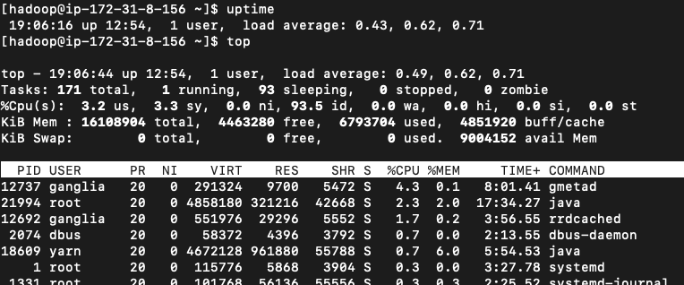
            * If your instance has 4 cpus and the output load average 0.43, 0.62, 0.71 - it suggest that CPU system is not overloaded. 
            * If your instance has 4 cpus, If the output load average is 3.3, 3.8, 3,9 - it suggest that the CPU system is nearly loaded all the times and require attention. 

### Review diskio metric to understand the CPU usage
    * **Look for the diskio metric.**
        * Execute `iostat` command in the instance to collect the output.
          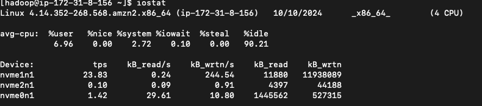

    * **What does output of `iostat` shows?**
      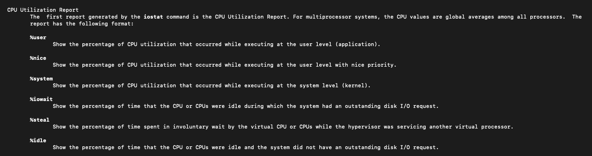

    * **What does output of diskio metric indicate?**
        * Please monitor the %iowait parameter to understand the CPU wait time while it wait for the pending diskio operation to complete. It can indicate the slow storage performance. However to understand what is the normal value of %iowait for workload please monitor system over the time. consider to use SAR command to gather the historical data. 

    * **Troubleshoot service or node level unresponsiveness due to high CPU usage.**
        * **Review AppsPending and AppsCompleted to understand number of applications submitted to YARN that are in a pending state and that are getting completed.**
        * You can check the metrics from CloudWatch console, from Yarn RM UI or using Yarn commands `yarn application -appStates ALL`.
        * If AppsPending metric is increasing over a period and AppsCompleted metric is not increasing over a period. This indicate that new applications are going in a queue and existing application are not completing for some reason. There can be resource contention. Identify timeline since issue started. 
            * Instance state logs. These contain information about the CPU, memory state, and garbage collector threads of the node. [View log files](https://docs.aws.amazon.com/emr/latest/ManagementGuide/emr-manage-view-web-log-files.html).  [Decoding Instance-State log in EMR](https://repost.aws/articles/AR77wVn54aSQSjLzJGTQsKEQ/decoding-instance-state-log-in-emr)
                * Check the instance state logs on the primary nodes to understand that if any of the primary service or application is using the high CPU over a period and have become unresponsive due to high CPU utilisation and resulting in primary instance becoming unresponsive.
                * Check the instance level metrics to understand if due to high CPU usage instance has become unresponsive or not. [Instance level CloudWatch metrics](https://docs.aws.amazon.com/AWSEC2/latest/UserGuide/viewing_metrics_with_cloudwatch.html).
                    *  Look for keyword `#Top CPU users` in instance state logs and identify the top processes which is using high CPU. 
                        * Investigate process further to understand if the specific application, Hadoop daemon or container is using high CPU.

        * **Review LiveDataNode to understand percentage of data nodes that are receiving work from Hadoop.** 
        * You can check the metrics from CloudWatch console or using `hdfs dfsadmin -report` command.
        * If only some of the DataNodes are active, There can be resource contention. Identify timeline since issue started. 
                * Check the Instance state logs of primary or other cluster node types based on the timeline identified since the issue started. These contain information about the CPU, memory state, and garbage collector threads of the node. [View log files](https://docs.aws.amazon.com/emr/latest/ManagementGuide/emr-manage-view-web-log-files.html). 
                * Check if any of service or application is using the high CPU over a period and have become unresponsive due to high CPU utilisation and resulting in  instance becoming unresponsive. 
                    * Look for keyword `#Top CPU users` in instance state logs and identify the top processes which is using high CPU. 
                        * Investigate process further to understand if the specific application, Hadoop daemon or container is using high CPU. 
                * Check the instance level metrics as well to understand if due to high CPU usage instance has become unresponsive or not.  [Instance level CloudWatch metrics](https://docs.aws.amazon.com/AWSEC2/latest/UserGuide/viewing_metrics_with_cloudwatch.html).
                    * Check CPU usage related metric and instance health status related metrics.  

## Troubleshooting memory related issues on EMR  

This section helps to Identify and resolve the memory related issues for the the service or application. The memory related errors can be reported into the hadoop daemon logs, application logs or EMR logs. Following section shows how you can use the node level instance state logs to find the CPU usage for specific time period. Additionally section also shows how to check the service status and troubleshoot the memory related issue with specific hadoop deamon, application and container failure. 

### Reviewing memory usage
    * Check the node level logs to understand if specific process on the node is using high memory or failing with memory related issue. Refer - [Decoding Instance-State log in EMR](https://repost.aws/articles/AR77wVn54aSQSjLzJGTQsKEQ/decoding-instance-state-log-in-emr)
    * Instance state logs: 
        * These log contain information about the overall memory usage, top memory consuming users and garbage collector threads of the node. 
            * Search `#Top memory users` in the log files to see the top memory consuming processes. 
            * Search `free -m` in the log files to see the overall free and used memory of node. 
            * Search `vmstat` in the log files to see the overall memory stats over specific period. 
        * Log contains information about the system messages: 
            * Search `dmesg` in the log files to see the logged messages. 

### Troubleshooting a memory related issue
    * Hadoop daemon, EMR service or application container can report the memory related error in the logs or can fail/stop with the memory related error. Identify the Hadoop service or application container that reports the error. Check the relevant logs to investigate the out of memory error. 
        * Check the current service or application status to understand if the service is down or to create the timeline.  Refer the document [How do I restart a service in Amazon EMR?](https://repost.aws/knowledge-center/restart-service-emr) to identify service status. 
        * Following examples show how to troubleshot the out of memory issue with the Hive application, Namenode hadoop daemon and Spark application. It also demonstrate troubleshooting topics - logs to check to identify the memory errors for specific service, how to increase the heap memory of specific daemon to optimise memory usage, changing garbage collector method for optimisation and monitoring GC usage. 
            * Example: Troubleshooting memory related error in Hive. 
                * [How do I resolve "OutOfMemoryError" Hive Java heap space exceptions on Amazon EMR that occur when Hive outputs the query results?](https://repost.aws/knowledge-center/emr-hive-outofmemoryerror-heap-space)
            * Example: Troubleshooting memory related error in Namenode. 
                * [How do I resolve the "java.lang.OutOfMemoryError: GC overhead limit exceeded" exception in Amazon EMR?](https://repost.aws/knowledge-center/emr-outofmemory-gc-overhead-limit-error) 
            * Example: Handling memory related error in the Spark application,
                * [How do I resolve the error "Container killed by YARN for exceeding memory limits" in Spark on Amazon EMR?](https://repost.aws/knowledge-center/emr-spark-yarn-memory-limit)
                * [How do I resolve "no space left on device" stage failures in Spark on Amazon EMR?](https://repost.aws/knowledge-center/no-space-left-on-device-emr-spark)
                * [Check for the GC usage from Spark UI.](https://spark.apache.org/docs/latest/web-ui.html)

## Automations to troubleshoot the EMR related errors automatically or by querying logs

* **[Query Amazon EMR logs](https://docs.aws.amazon.com/athena/latest/ug/emr-logs.html)**
    * Amazon EMR and big data applications that run on Amazon EMR produce log files. Log files are written to the [primary node](https://docs.aws.amazon.com/emr/latest/ManagementGuide/emr-master-core-task-nodes.html), and you can also configure Amazon EMR to archive log files to Amazon S3 automatically. You can use Amazon Athena to query these logs to identify events and trends for applications and clusters.

* **[How do I use Amazon Athena to troubleshoot when my Amazon EMR Spark jobs fail?](https://repost.aws/knowledge-center/emr-spark-failure-troubleshoot-athena)**
    * Article shows the step by step process to query the Spark applications logs on EMR using Athena. 

* **[AWSSupport-AnalyzeEMRLogs](https://docs.aws.amazon.com/systems-manager-automation-runbooks/latest/userguide/automation-awssupport-analyzeemrlogs.html)**
    * This runbook helps identify errors while running a job on an Amazon EMR cluster. The runbook analyzes a list of defined logs on the file system and looks for a list of predefined keywords. These log entries are used to create Amazon CloudWatch Events events so you can take any needed actions based on the events. Optionally, the runbook publishes log entries to the Amazon CloudWatch Logs log group of your choosing. This runbook currently looks for the following errors and patterns in log files: 
    * Error list
        * `container_out_of_memory`: YARN container ran out of memory, running job may fail.
        * `yarn_nodemanager_health`: CORE or TASK node is running low on disk space and will not be able to run tasks.
        * `node_state_change`: CORE or TASK node is unreachable by the primary node.
        * `step_failure`: An EMR Step has failed.
        * `no_core_nodes_running`: No CORE nodes are currently running, cluster is unhealthy.
        * `hdfs_missing_blocks`: There are missing HDFS blocks which could lead to data loss.
        * `hdfs_high_util`: HDFS Utilization is high, which may affect jobs and cluster health.
        * `instance_controller_restart`: Instance-Controller process has restarted. This process is essential for cluster health.
        * `instance_controller_restart_legacy`: Instance-Controller process has restarted. This process is essential for cluster health.
        * `high_load`: High Load Average detected, may affect node health reporting or result in timeouts or slowdowns.
        * `yarn_node_blacklisted`: CORE or TASK node has been blacklisted by YARN from running tasks.
        * `yarn_node_lost`: CORE or TASK node has been marked as LOST by YARN, possible connectivity issues.
        

* **[AWSSupport-DiagnoseEMRLogsWithAthena](https://docs.aws.amazon.com/systems-manager-automation-runbooks/latest/userguide/awssupport-diagnose-emr-logs-with-athena.html)**
    * The AWSSupport-DiagnoseEMRLogsWithAthena runbook helps diagnose Amazon EMR logs using Amazon Athena in integration with AWS Glue Data Catalog. Amazon Athena is used to query the Amazon EMR log files for containers, node logs, or both, with optional parameters for specific date ranges or keyword-based searches.
    * The runbook can automatically retrieve the Amazon EMR log location for an existing cluster, or you can specify the Amazon S3 log location. 

## Enable node level custom monitoring on the EMR cluster for troubleshooting 

* You can consider to enable the detailed monitoring on EMR cluster based on specific EMR version and Spark version as below. 
    * [Monitor Apache Spark applications on Amazon EMR with Amazon Cloudwatch](https://aws.amazon.com/blogs/big-data/monitor-apache-spark-applications-on-amazon-emr-with-amazon-cloudwatch/)
* You can consider to enable the node level monitoring for the cpu, memory and disk usage on the EMR cluster using the article  [How can I collect custom metrics from Amazon EMR cluster instances and then monitor them in CloudWatch?](https://repost.aws/knowledge-center/emr-custom-metrics-cloudwatch)  After implementing the solution, you can view the node level metrics using the CloudWatch console. You can setup the [CloudWatch alarm](https://docs.aws.amazon.com/AmazonCloudWatch/latest/monitoring/ConsoleAlarms.html) on cpu, memory and disk level metric as per use case. Following are examples from sample setup.
    * **Monitor memory usage using the CloudWatch.**
        * Monitor the memory usage metrics on the cluster nodes. 
            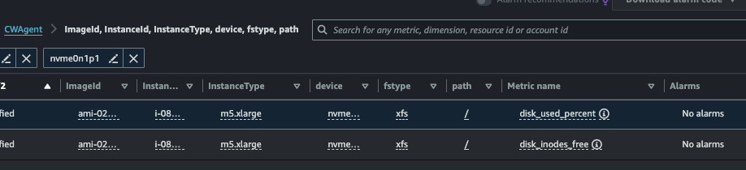
        * Example: EMR primary node shows increasing memory usage as new pyspark application are launched using the pyspark CLI and sample applications are executed. 
            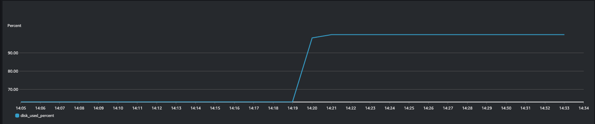

    * **Monitor the CPU usage using CloudWatch.**
        * Monitor the CPU usage metrics on the cluster nodes.

            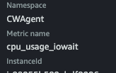

            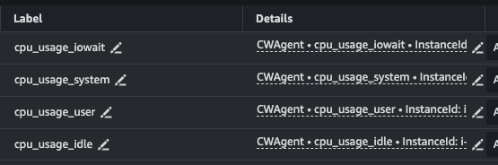
        * Example: EMR primary node shows increasing CPU usage when user runs CPU bound application on the primary node. Following graphs shows continuous reduction in “cpu_usage_idle“ and increased in ”cpu_usage_user“ metrics due to the higher user application usage. 
            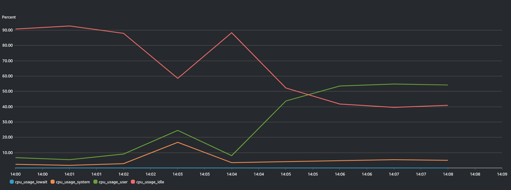

    * **Monitor the disk usage using CloudWatch.**
        * Monitor the disk usage metrics on the cluster nodes. You can filter the disk usage based on the file system.
            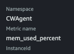
        * Example: EMR primary node shows increasing disk usage as disks are being filled for the filesystem “nvme0n1p1”. 
           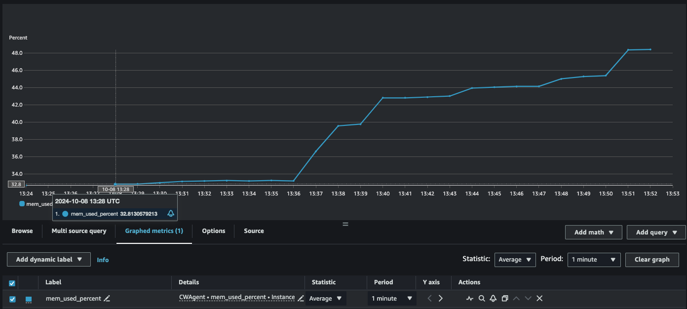
        * Example: Primary node disk usage. 
            ```
            $ df -h 
            Filesystem      Size  Used Avail Use% Mounted on
            /dev/nvme0n1p1   15G   15G   20K 100% 
            ```

## Additional steps to troubleshoot

If issues persist after following the steps mentioned in this guide, contact AWS Support for further assistance, ensuring you include all relevant logs and diagnostic information gathered during your troubleshooting process to expedite resolution. You can reference the section [Troubleshot logs on EMR](#troubleshot-logs-on-emr) to identify relevant logs or reference to share with the AWS Support. 
