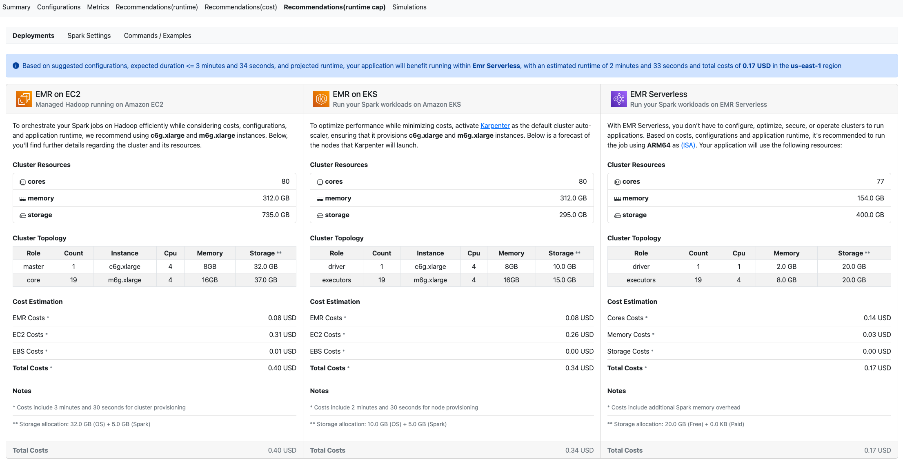

# Amazon EMR

## EMR Utilities

https://github.com/aws-samples/aws-emr-utilities

This repository contains sample code and utilities for using Amazon EMR on EC2. This package is structured based on the following directories:

- applications - application specific patches, plugins, etc.
- utilities - administrative and maintenance utilities for working with EMR

## EMR Advisor

https://github.com/aws-samples/aws-emr-advisor

This repository provides a tool to analyze Spark Event Logs to generate insights and costs recommendations using different deployment options for Amazon EMR. The tool generates an HTML report that can be stored locally or on Amazon S3 bucket for a quick review.

## EMR Trino Autoscale

https://github.com/aws-samples/emr-trino-autoscale

This project provides a custom auto-autoscaling for Amazon EMR on EC2 clusters running with Trino. The package support out of the box Instance Groups and Instance Fleets clusters with On Demand / SPOT instances.

